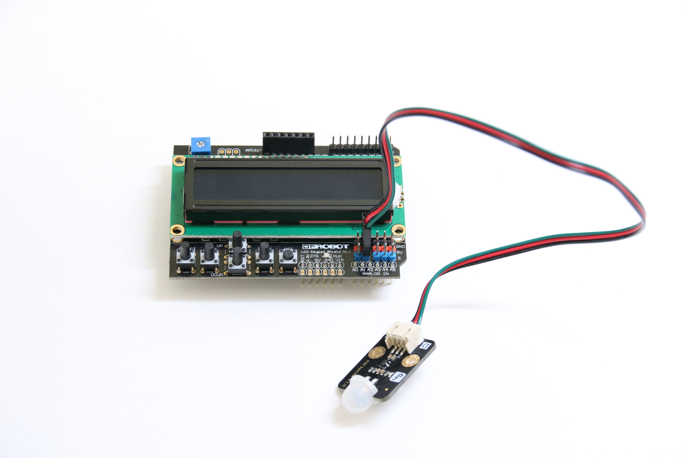

# Access control

## Introduction

This access control system application is part of a series of how-to Internet of Things (IoT) code sample exercises using the Intel® IoT Developer Kit and a compatible Intel-based platform, cloud platforms, APIs, and other technologies.

From this exercise, developers will learn how to: 

- Interface with sensors using MRAA and UPM from the Intel® IoT Developer Kit, a complete hardware and software solution to help developers explore the IoT and implement innovative projects. 
- Set up a web application server to let users enter the access code to disable the alarm system and store this alarm data using Azure Redis Cache\* from Microsoft Azure\*, Redis Store\* from IBM Bluemix\*, or Elasticache\* using Redis\* from Amazon Web Services (AWS)\*, different cloud services for connecting IoT solutions including data analysis, machine learning, and a variety of productivity tools to simplify the process of connecting your sensors to the cloud and getting your IoT project up and running quickly.
- Connect to a server using IoT Hub from Microsoft Azure\*, IoT from IBM Bluemix\*, IoT from Amazon Web Services (AWS)\*, AT&T M2X\*, Predix\* from GE, or SAP Cloud Platform\* IoT, different cloud-based IoT platforms for machine to machine communication.

Available in:  
  
  
  
    

## What it is

Using a compatible Intel-based platform, this project lets you create a smart access control system that: 
- monitors a motion sensor to detect when a person is in an area that requires authorization. 
- can be accessed with your mobile phone via the built-in web interface to disable the alarm. 
- keeps track of access, using cloud-based data storage.

## How it works

This access control system provides the following user flow:

1. Passive infrared (PIR) motion sensor looks for motion.
2. User sets off the motion detector and has 30 seconds to enter the correct code in the browser.
3. If the user fails to enter the code in the given time, the alarm goes off.
4. If the user enters the correct code, the system waits for 30 seconds before allowing the user to pass.

Additionally, various events (`looking-for-motion`, `motion-detected`, `invalid-code`, etc.) are logged.

Optionally, data can be stored using your own Microsoft Azure\*, IBM Bluemix\*, AT&T M2X\*, AWS\*, Predix\*, or SAP\* account.

## First time setup  
For all the samples in this repository, see the  for supported boards and libraries.

## Hardware requirements

In addition to using a compatible platform listed in , here is additional hardware you will need to run this example

This sample can be used with either Grove or DFRobot components.

Grove:

1. [Grove\* Base Shield V2](https://www.seeedstudio.com/Base-Shield-V2-p-1378.html)
2. [Grove\* PIR Motion Sensor](http://iotdk.intel.com/docs/master/upm/node/classes/biss0001.html)
3. [Grove\* RGB LCD](http://iotdk.intel.com/docs/master/upm/node/classes/jhd1313m1.html)

DFRobot:

1. [PIR (Motion) Sensor](http://iotdk.intel.com/docs/master/upm/node/classes/biss0001.html).
2. [LCD Keypad Shield](http://iotdk.intel.com/docs/master/upm/node/classes/sainsmartks.html)

### Connecting the Grove\* sensors

You need to have a Grove\* Shield connected to an Arduino\* compatible breakout board to plug all the Grove devices into the Grove\* Shield. Make sure you have the tiny VCC switch on the Grove\* Shield set to **5V**.

Sensor | Pin
--- | ---
PIR Motion Sensor | D4
Grove RGB LCD | I2C

### Connecting the DFRobot\* sensors

You need to have a LCD Display Shield connected to an Arduino\*-compatible breakout board to plug all the DFRobot\* devices into the LCD Display Shield.

Sensor | Pin
--- | ---
PIR (Motion) Sensor | A2

### Disabling the alarm

The alarm is disabled using a single-page web interface served directly from the the target platform while the sample program is running.

The web server runs on port `3000`, so if your target platform is connected to Wi-Fi on `192.168.1.13`, the address to browse to if you are on the same network is `http://192.168.1.13:3000`.

IMPORTANT NOTICE: This software is sample software. It is not designed or intended for use in any medical, life-saving or life-sustaining systems, transportation systems, nuclear systems, or for any other mission-critical application in which the failure of the system could lead to critical injury or death. The software may not be fully tested and may contain bugs or errors; it may not be intended or suitable for commercial release. No regulatory approvals for the software have been obtained, and therefore software may not be certified for use in certain countries or environments.
