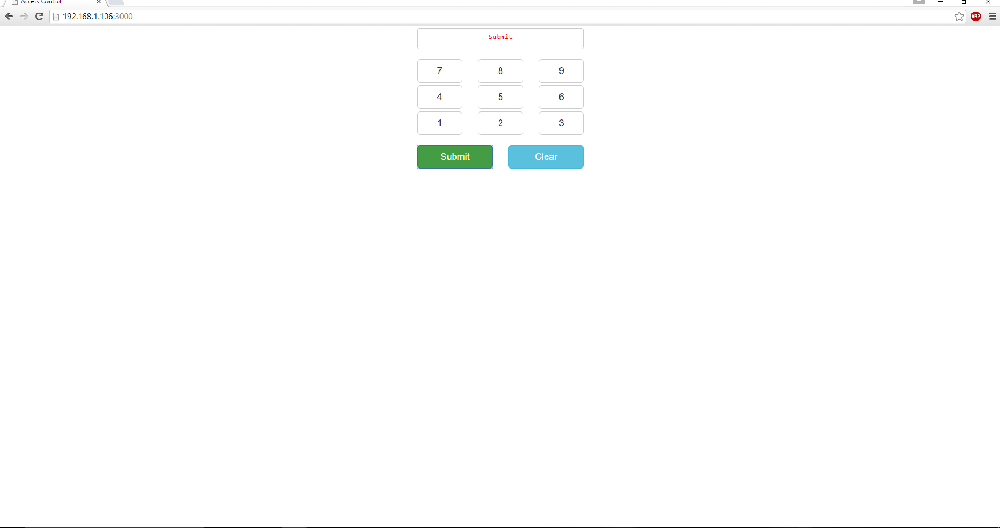

# Access control in Java*

## What it is

Using a compatible Intel-based platform, this project lets you create a smart access control system that:<br>
- monitors a motion sensor to detect when a person is in an area that requires authorization.<br>
- can be accessed with your mobile phone via the built-in web interface to disable the alarm.<br>
- keeps track of access, using cloud-based data storage.

More information about this sample, how to set it up, and how it works can be found in the 

## First time setup
For all the samples in this repository, see the  for required boards and libraries.

## Hardware requirements
### Grove
Sensor | Pin
--- | ---
PIR Motion Sensor | D4
Grove RGB LCD | I2C

### DRFobot
You need to have a LCD Display Shield connected to an Arduino\*-compatible breakout board to plug all the DFRobot\* devices into the LCD Display Shield.

Sensor | Pin
--- | ---
PIR (Motion) Sensor | A2

More details on the hardware requirements can be found in the 

## Software requirements

1. [Java](https://software.intel.com/en-us/java-for-iot-reference)
2.  and  
3. Microsof Azure\*, IBM Bluemix\*, AT&T M2X\*, AWS\*, Predix\*, or SAP\* account (optional)

## Configuring the example

To configure the example for the specific hardware kit that you are using, either Grove\* or DFRobot\* you will need to change the `INTEL_IOT_KIT` key in the `config.properties` file to either **GROVEKIT** (this is the default) or **DFROBOTKIT**, depending on which hardware kit you wish to use. For example:

```

  INTEL_IOT_KIT=GROVEKIT

```

### Configuring the access key

To configure the required access code to be used for the example app, change the `CODE` key in the `config.properties` file to whatever you want to use. For example:

```

  CODE=4321

```

## Running the program from the command line  
For this to work you will need to have Maven installed, a guide can be found on the Maven website: <a href="https://maven.apache.org/install.html">https://maven.apache.org/install.html</a>

### Running the program directly on the target  
If you have copied the source files from Git directly on the board and already installed Maven, then you can compile and run the program directly onto the target.
Log in to the board using ssh and navigate to the location of the `pom.xml` file.

First you will need to compile the source files:

	# mvn compile

Then you can execute the program. The following command will run the `main` file in a separate Java process:

	# mvn exec:exec

### Compiling on host machine and deploying to target
If you want to compile the project on your local PC and then deploy it to the target you need to run `mvn package` at the location where the `pom.xml` file exists, or you can specify the file location using the `-f` parameter:

	$ mvn package -f <path_to_pom_file>

This will compile the source files and pack them in `.jar` archives. It will create a folder called `target` where you will find two jars, `AccessControl-1.0-SNAPSHOT.jar` and `AccessControl-1.0-SNAPSHOT-shaded.jar`. The first one contains only the classes from the current module, while the `shaded` version contains the classes from the current module and its dependencies, so running the program using the second jar will be easier since you don't have to worry about adding all the dependency jars to the classpath.

Next step is to copy the generated jar on the target using `scp`. The following command will copy the file to the `home` folder of user `root` on the target:

	$ scp target/AccessControl-1.0-SNAPSHOT-shaded.jar root@<target_ip>:

Then log in on the target using ssh:

	$ ssh root@<target_ip>

Next step is to run the program using `java`, providing the path to the copied jar file and the name of the `main` class:

	# java -cp AccessControl-1.0-SNAPSHOT-shaded.jar howToCodeSamples.AccessControl
 
### Disabling the alarm  
The alarm is disabled using a single-page web interface served directly from the target while the sample program is running.<br>


The web server runs on port `8080`, so if the target is connected to WiFi on `192.168.1.13` the address to browse to if you are on the same network is `http://192.168.1.13:8080`.

### IoT cloud setup (optional)

You can optionally store the data generated by this sample program using cloud-based IoT platforms from Microsoft Azure\*, IBM Bluemix\*, AT&T M2X\*, AWS\*, Predix\*, or SAP\*.

For information on how to connect to your own cloud server, go to:

[https://github.com/intel-iot-devkit/iot-samples-cloud-setup](https://github.com/intel-iot-devkit/iot-samples-cloud-setup)


### Data store server setup (optional)

Optionally, you can store the data generated by this sample program in a backend database deployed using Microsoft Azure\*, IBM Bluemix\*, or AWS\*, along with Node.js\*, and a Redis\* data store.

For information on how to set up your own cloud data server, go to:

[https://github.com/intel-iot-devkit/intel-iot-examples-datastore](https://github.com/intel-iot-devkit/intel-iot-examples-datastore)


#### Running the example with the cloud server

To run the example with the optional back-end data store, you need to change the `SERVER` and `AUTH_TOKEN` keys in the `config.properties` file to the server URL and authentication token that correspond to your own data store server setup. For example:

```

  SERVER=http://intel-examples.azurewebsites.net/logger/air-quality
  AUTH_TOKEN="YOURTOKEN"

```
Now, when you run your program using the **Run** button, it should be able to call your server to save the data right from the target

After running the program, you should see output similar to the output below.<br>

```
11:27:35 **** Rebuild of configuration Debug for project access-control ****
Info: Interal Builder is used for build
i586-poky-linux-g++ -std=c++1y "-IC:\\Users\\jlsti_000\\Desktop\\<ip-adddress>\\iotdk-ide-win\\devkit-x86\\sysroots\\i586-poky-linux/usr/include/upm" "-IC:\\Users\\jlisti_000\\Documents\\Git..."
 i586-poky-linux-g++ -std=c++1y "-IC:\\Users\\jlsti_000\\Desktop\\<ip-adddress>\\iotdk-ide-win\\devkit-x86\\sysroots\\i586-poky-linux/usr/include/upm" "-IC:\\Users\\jlisti_000\\Documents\\Git..."
 i586-poky-linux-g++ -std=c++1y "-IC:\\Users\\jlsti_000\\Desktop\\<ip-adddress>\\iotdk-ide-win\\devkit-x86\\sysroots\\i586-poky-linux/usr/include/upm" "-IC:\\Users\\jlisti_000\\Documents\\Git..."
 i586-poky-linux-g++ -std=c++1y "-IC:\\Users\\jlsti_000\\Desktop\\<ip-adddress>\\iotdk-ide-win\\devkit-x86\\sysroots\\i586-poky-linux/usr/include/upm" "-IC:\\Users\\jlisti_000\\Documents\\Git..."
 i586-poky-linux-g++ -std=c++1y "-IC:\\Users\\jlsti_000\\Desktop\\<ip-adddress>\\iotdk-ide-win\\devkit-x86\\sysroots\\i586-poky-linux/usr/include/upm" "-IC:\\Users\\jlisti_000\\Documents\\Git..."
 i586-poky-linux-g++ "--sysroot=C:\\Users\\jlsti_000\\Desktop\\<ip-adddress>\\iotdk-ide-win\\devkit-x86\\sysroots\\i586-poky-linux" -lmraa -o access-control "src\\access-control.o" "lib\\twilio-cplu"...

 
 11:27:40 Build Finished (took 5s.378ms)
  ```

IMPORTANT NOTICE: This software is sample software. It is not designed or intended for use in any medical, life-saving or life-sustaining systems, transportation systems, nuclear systems, or for any other mission-critical application in which the failure of the system could lead to critical injury or death. The software may not be fully tested and may contain bugs or errors; it may not be intended or suitable for commercial release. No regulatory approvals for the software have been obtained, and therefore software may not be certified for use in certain countries or environments.
