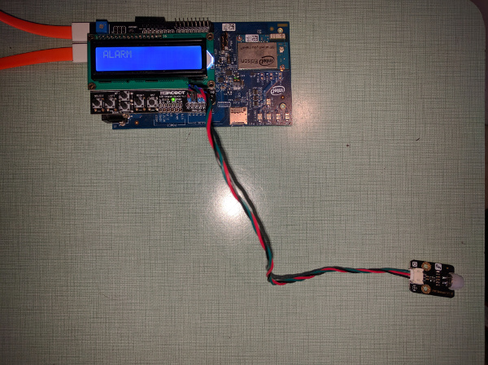
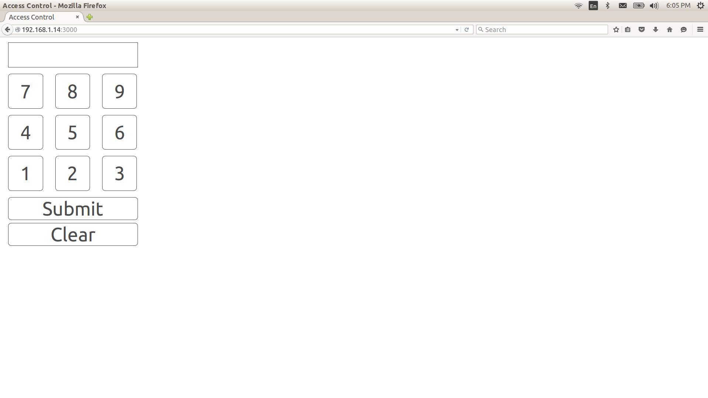

# Access control in JavaScript*

## Introduction

This access control system application is part of a series of how-to Internet of Things (IoT) code sample exercises using the Intel® IoT Developer Kit and a compatible Intel® IoT Platform, cloud platforms, APIs, and other technologies.

From this exercise, developers will learn how to:<br>

- Interface with and sensors using MRAA and UPM from the Intel® IoT Developer Kit, a complete hardware and software solution to help developers explore the IoT and implement innovative projects.<br>
- Set up a web application server to let users enter the access code to disable the alarm system and store this alarm data using Azure Redis Cache\* from Microsoft Azure\*, Redis Store\* from IBM Bluemix\*, or Elasticache\* using Redis\* from Amazon Web Services (AWS)\*, different cloud services for connecting IoT solutions including data analysis, machine learning, and a variety of productivity tools to simplify the process of connecting your sensors to the cloud and getting your IoT project up and running quickly.
- Connect to a server using IoT Hub from Microsoft Azure\*, IoT from IBM Bluemix\*, IoT from Amazon Web Services (AWS)\*, AT&T M2X\*, Predix\* from GE, or SAP Cloud Platform\* IoT, different cloud-based IoT platforms for machine to machine communication.

## What it is

Using a compatible Intel® IoT Platform, this project lets you create a smart access control system that:<br>
- monitors a motion sensor to detect when a person is in an area that requires authorization.<br>
- can be accessed with your mobile phone via the built-in web interface to disable the alarm.<br>
- keeps track of access, using cloud-based data storage.

## How it works

This access control system provides the following user flow:

1. Passive infrared (PIR) motion sensor looks for motion.
2. User sets off the motion detector and has 30 seconds to enter the correct code in the browser.
3. If the user fails to enter the code in the given time, the alarm goes off.
4. If the user enters the correct code, the system waits for 30 seconds before allowing the user to pass.

Additionally, various events (`looking-for-motion`, `motion-detected`, `invalid-code`, etc.) are logged.

Optionally, data can be stored using your own Microsoft Azure\*, IBM Bluemix\*, AT&T M2X\*, AWS\*, Predix\*, or SAP\* account.

## First time setup  
For the samples in this repository, see the general setup instructions for compatible boards, operating systems, and libraries.

<link to top-most readme>

## Hardware requirements

This sample can be used with either Grove or DFRobot components.

Grove\* Transportation and Safety Kit, containing:

1. [Grove\* Base Shield V2](https://www.seeedstudio.com/Base-Shield-V2-p-1378.html)
2. [Grove\* PIR Motion Sensor](http://iotdk.intel.com/docs/master/upm/node/classes/biss0001.html)
3. [Grove\* RGB LCD](http://iotdk.intel.com/docs/master/upm/node/classes/jhd1313m1.html)

DFRobot\* Starter Kit for Intel® Edison, containing:

1. [PIR (Motion) Sensor](http://iotdk.intel.com/docs/master/upm/node/classes/biss0001.html).
2. [LCD Keypad Shield](http://iotdk.intel.com/docs/master/upm/node/classes/sainsmartks.html)

## Software requirements

1. Node.js with the following packages: ***
2. MRAA & UPM
2. Microsoft Azure\*, IBM Bluemix\*, AT&T M2X\*, AWS\*, Predix\*, or SAP\* account (optional)

### Clone the repository

To begin, clone the **How-To Code Samples** repository with Git\* on your computer as follows:

    $ git clone https://github.com/intel-iot-devkit/how-to-code-samples.git

To download a .zip file, in your web browser go to <a href="https://github.com/intel-iot-devkit/how-to-code-samples">https://github.com/intel-iot-devkit/how-to-code-samples</a> and click the **Download ZIP** button at the lower right. Once the .zip file is downloaded, uncompress it, and then use the files in the directory for this example.

## 

## Setting up a JavaScript editor

There are multiple ways to run the JavaScript code found in this sample.  See the document on JavaScript IDE Options for IoT for more info.

### Installing the program manually on the target system

Alternatively, you can set up the code manually on your system.

Clone the **How-To Code Samples** repository to your board:

    $ git clone https://github.com/intel-iot-devkit/how-to-code-samples.git

Navigate to the directory with this example.

***To run simply enter: node ???

### Connecting the Grove\* sensors


You need to have a Grove\* Shield connected to an Arduino\* compatible breakout board to plug all the Grove devices into the Grove\* Shield. Make sure you have the tiny VCC switch on the Grove\* Shield set to **5V**.

1. Plug one end of a Grove\* cable into the Grove\* PIR Motion Sensor, and connect the other end to the D4 port on the Grove\* Shield.

2. Plug one end of a Grove\* cable into the Grove RGB LCD, and connect the other end to any of the I2C ports on the Grove\* Shield.

### Connecting the DFRobot\* sensors



You need to have a LCD Display Shield connected to an Arduino\*-compatible breakout board to plug all the DFRobot\* devices into the LCD Display Shield.

1. Plug one end of a DFRobot\* cable into the PIR (Motion) Sensor, and connect the other end to the A2 port on the LCD Display Shield.

### Installing Depdencies

Make sure MRAA and UPM is installed, here's how to check if it's already installed, here's how to install if not installed , here's how to update.

If you have an Arduino 101 board, you'll be using the imraa feature, which depends on firmatta being flashed to the Arduino 101. See <> for setup.

You will also need to configure the `config.json` in the example to use the Arduino\*/Genuino\* 101. See the section "Configuring the example" below.

### IoT cloud setup (optional)

You can optionally store the data generated by this sample program using cloud-based IoT platforms from Microsoft Azure\*, IBM Bluemix\*, AT&T M2X\*, AWS\*, Predix\*, or SAP\*.

For information on how to connect to your own cloud server, go to:

[https://github.com/intel-iot-devkit/iot-samples-cloud-setup](https://github.com/intel-iot-devkit/iot-samples-cloud-setup)

### Data store server setup (optional)

Optionally, you can store the data generated by this sample program in a back-end database deployed using Microsoft Azure\*, IBM\* Bluemix\*, or AWS, along with Node.js\*, and a Redis\* data store.

For information on how to set up your own cloud data server, go to:

[https://github.com/intel-iot-devkit/intel-iot-examples-datastore](https://github.com/intel-iot-devkit/intel-iot-examples-datastore)

## Configuring the example

To configure the example for the Grove\* kit, just leave the `kit` key in the `config.json` set to `grove`. To configure the example for the DFRobot\* kit, change the `kit` key in the `config.json` to `dfrobot` as follows:

```
{
  "kit": "dfrobot",
  "CODE": "4321"
}
```

To configure the example for the optional Microsoft Azure\*, IBM Bluemix\*, or AWS data store, add the `SERVER` and `AUTH_TOKEN` keys in the `config.json` file below the "CODE" key as follows:

```
{
  "kit": "grove",
  "CODE": "4321",
  "SERVER": "http://intel-examples.azurewebsites.net/logger/access-control",
  "AUTH_TOKEN": "s3cr3t"
}
```

For information on how to configure the example for an optional Microsoft Azure\*, IBM Bluemix\*, AT&T M2X\*, AWS\*, Predix\*, or SAP\* IoT cloud server, go to:

[https://github.com/intel-iot-devkit/iot-samples-cloud-setup](https://github.com/intel-iot-devkit/iot-samples-cloud-setup)

## Running the program 


### Disabling the alarm



The alarm is disabled using a single-page web interface served directly from the Intel® Edison board while the sample program is running.

The web server runs on port `3000`, so if the Intel® Edison board is connected to Wi-Fi on `192.168.1.13`, the address to browse to if you are on the same network is `http://192.168.1.13:3000`.

### Determining your platform's IP Address

You can find the instructions for determining your platform's IP Address in the Finding your IP Address document.


IMPORTANT NOTICE: This software is sample software. It is not designed or intended for use in any medical, life-saving or life-sustaining systems, transportation systems, nuclear systems, or for any other mission-critical application in which the failure of the system could lead to critical injury or death. The software may not be fully tested and may contain bugs or errors; it may not be intended or suitable for commercial release. No regulatory approvals for the software have been obtained, and therefore software may not be certified for use in certain countries or environments.
