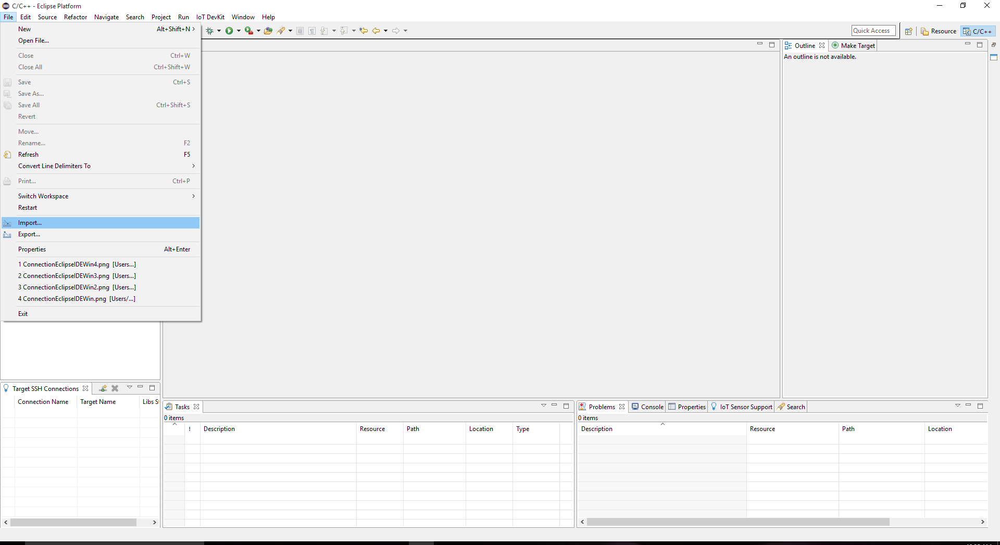
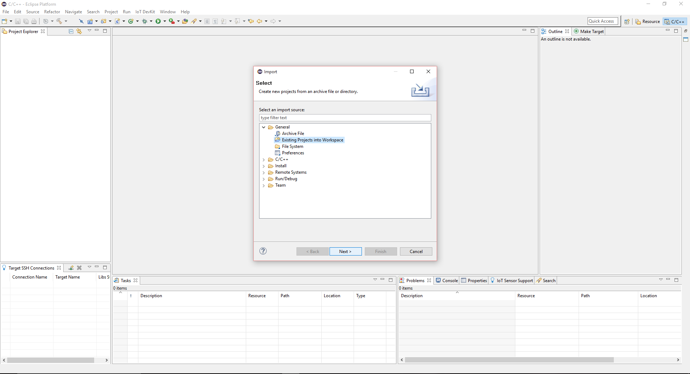
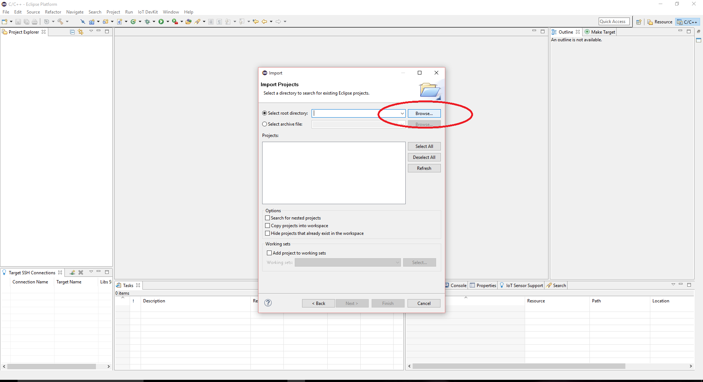
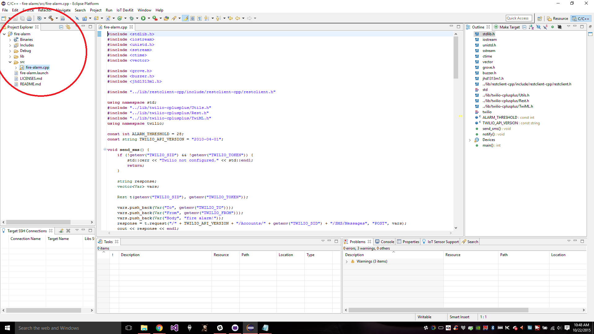
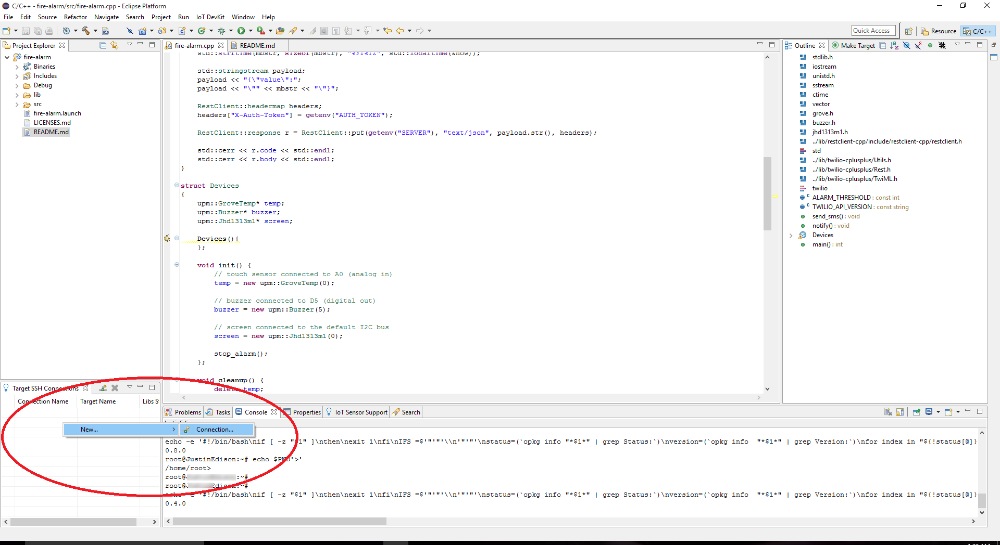
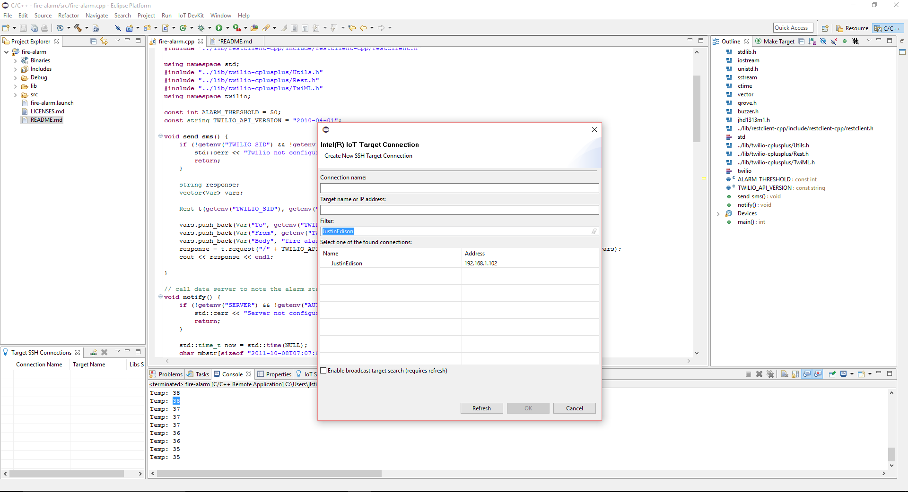
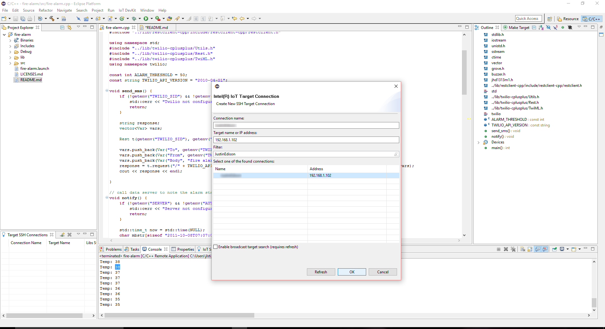
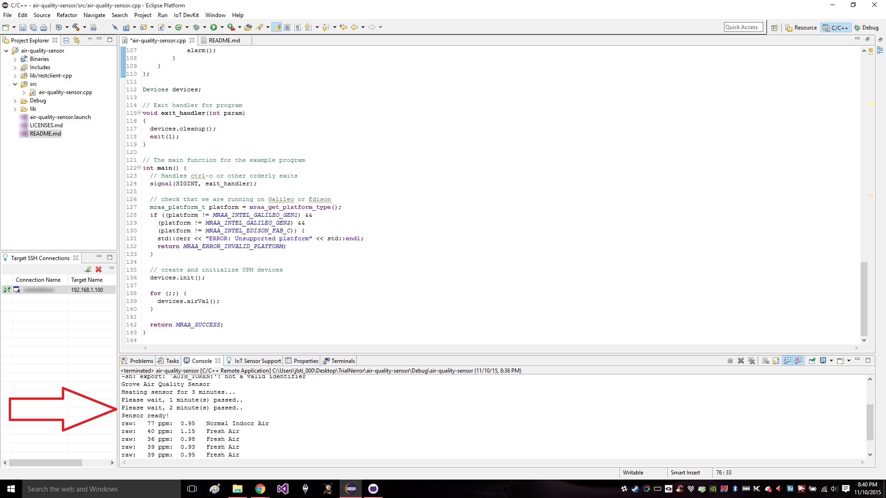

# Air quality sensor in C++

This air quality monitor application is part of a series of how-to Intel IoT code sample exercises using the Intel® IoT Developer Kit, Intel® Edison board, cloud platforms, APIs, and other technologies.

From this exercise, developers will learn how to:

- Connect the Intel® Edison board, a computing platform designed for prototyping and producing IoT and wearable computing products.
- Interface with the Intel® Edison board IO and sensor repository using MRAA and UPM from the Intel® IoT Developer Kit, a complete hardware and software solution to help developers explore the IoT and implement innovative projects.
- Run these code samples in the Intel® System Studio IoT Edition (Eclipse\* IDE for C/C++ and Java\* development) for creating applications that interact with sensors and actuators, enabling a quick start for developing software for the Intel® Edison or Intel® Galileo board.
- Store air quality data using Azure Redis Cache\* from Microsoft\* Azure\*, Redis Store\* from IBM\* Bluemix\*, or ElastiCache\* using Redis\* from Amazon\* Web Services\* (AWS\*), different cloud services for connecting IoT solutions including data analysis, machine learning, and a variety of productivity tools to simplify the process of connecting your sensors to the cloud and getting your IoT project up and running quickly.

## What it is

Using an Intel® Edison board, this project lets you create an air quality monitor that:

- continuously monitors the air quality for airborne contaminants;
- sounds an audible warning when the air quality is unhealthful;
- stores a record of each time the air quality sensor detects contaminants, using cloud-based data storage.

## How it works

This shop air quality monitor uses the sensor to constantly keep track of the airborne contaminants.

If the sensor detects one of several different gases, and the detected level crosses a predefined threshold, it  makes a sound through the speaker to indicate a warning.

Optionally, the monitor also stores the air quality data using the Intel IoT Examples Datastore running in your own Microsoft\* Azure\*, IBM\* Bluemix\*, or AWS\* account.

## Hardware requirements

Grove* Home Automation Kit containing:

1. Intel® Edison board with an Arduino* breakout board
2. Grove* Base Shield V2
3. [Grove* Air Quality Sensor](http://iotdk.intel.com/docs/master/upm/node/classes/tp401.html)
4. [Grove* Speaker](http://iotdk.intel.com/docs/master/upm/node/classes/grovespeaker.html)

### Software requirements

1. [Intel® System Studio IoT Edition (Eclipse* IDE for C/C++ and Java* development)](https://software.intel.com/en-us/eclipse-getting-started-guide)
2. Microsoft\* Azure\*, IBM\* Bluemix\*, or AWS\* account

## How to set up

To begin, clone the **How-To Intel IoT Code Samples** repository with Git* on your computer as follows:

    $ git clone https://github.com/intel-iot-devkit/how-to-code-samples.git

Want to download a .zip file? In your web browser, go to [https://github.com/intel-iot-devkit/how-to-code-samples](https://github.com/intel-iot-devkit/how-to-code-samples) and click the **Download ZIP** button at the lower right. Once the .zip file is downloaded, uncompress it, and then use the files in the directory for this example.

### Adding the program to Eclipse*

In Eclipse\*, select **Import Wizard** to import an existing project into the workspace as follows:

1. From the main menu, select **File > Import**. 

2. The **Import Wizard** dialog box opens. Select **General > Existing Project into Workspace** and click **Next**. 

3. Click **Select root directory** and then the associated **Browse** button to locate the directory that contains the project files. 

4. Under **Projects**, select the directory with the project files you'd like to import and click **OK** and then **Finish** to import the files into Eclipse*. 

5. Your main .cpp program is now displayed in your workspace under the **src** folder. 

### Connecting the Grove* sensors

You need to have a Grove* Base Shield V2 connected to an Arduino\*-compatible breakout board to plug all the Grove* devices into the Grove* Base Shield V2. Make sure you have the tiny VCC switch on the Grove* Base Shield V2 set to **5V**.

1. Plug one end of a Grove* cable into the Grove* TP401 Air Quality Sensor, and connect the other end to the A0 port on the Grove* Base Shield V2. 

2. Plug one end of a Grove* cable into the Grove* Speaker, and connect the other end to the D5 port on the Grove* Base Shield V2.

### Intel® Edison board setup

This example uses the **restclient-cpp** library to perform REST calls to the remote data server. The code can be found in the **lib** directory. The **restclient-cpp** library requires the **libcurl** package, which is already installed on the Intel® Edison board by default.

### Datastore server setup

Optionally, you can store the data generated by this sample program in a backend database deployed using Microsoft\* Azure\*, IBM\* Bluemix\*, or AWS\* along with Node.js\*, and a Redis\* data store.

For information on how to set up your own cloud data server, go to:

[https://github.com/intel-iot-devkit/intel-iot-examples-datastore](https://github.com/intel-iot-devkit/intel-iot-examples-datastore)

### Connecting your Intel® Edison board to Eclipse*

1. In the bottom left corner, right-click anywhere on the **Target SSH Connections** tab and select **New > Connection**. 

2. The **Intel(R) IoT Target Connection** window appears. In the **Filter** field, type the name of your board. 

3. In the **Select one of the found connections** list, select your device name and click **OK**. 

4. On the **Target SSH Connections** tab, right-click your device and select **Connect**. 

If prompted for the username and password, the username is **root** and the password is whatever you specified when configuring the Intel® Edison board.

### Running the example with the cloud server

To run the example with the optional backend data store, you need to set the `SERVER` and `AUTH_TOKEN` environment variables. You can do this in Eclipse* as follows:

1. From the **Run** menu, select **Run Configurations**.  The **Run Configurations** dialog box is displayed.
2. Under **C/C++ Remote Application**, click **doorbell**.  This displays the information for the application.
3. In the **Commands to execute before application** field, add the environment variables so it looks like this, except using the server and authentication token that correspond to your own setup: 

        chmod 755 /tmp/air-quality; export SERVER="http://intel-iot-example-data.azurewebsites.net/logger/air-quality"; export AUTH_TOKEN="Enter Auth Token Here"

4. Click **Apply** to save your new environment variables.

Now, when you run your program using the **Run** button, it should be able to call your server to save the data right from the Intel® Edison board.

### Running the code on the Intel® Edison board

When you're ready to run the example, click **Run** at the top menu bar in Eclipse*. 

This compiles the program using the Cross G++ Compiler, links it using the Cross G++ Linker, transfers the binary to the Intel® Edison board, and then executes it on the board itself.

After running the program, you should see output similar to the one in the image below. 

After running the program you should have output similar to the one in the image below. 

