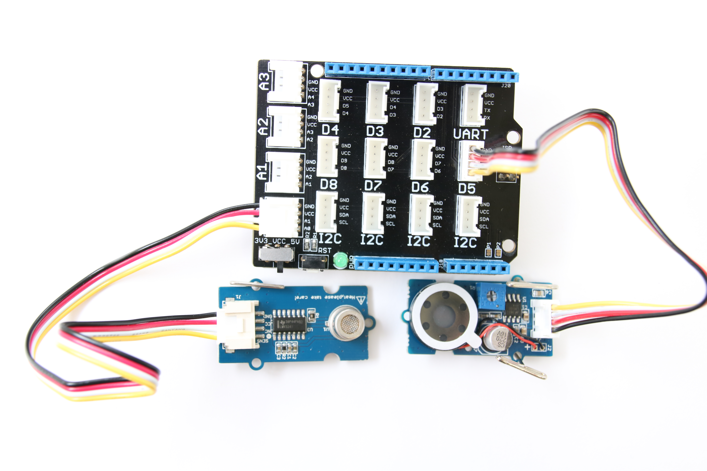

# Air quality sensor in JavaScript*

## Introduction

This air quality monitor application is part of a series of how-to Internet of Things (IoT) code sample exercises using the Intel® IoT Developer Kit and a compatible Intel® IoT Platform, cloud platforms, APIs, and other technologies.

From this exercise, developers will learn how to:<br>

- Interface with sensors using MRAA and UPM from the Intel® IoT Developer Kit, a complete hardware and software solution to help developers explore the IoT and implement innovative projects.<br>
- Set up a web application server to let users enter the access code to disable the alarm system and store this alarm data using Azure Redis Cache\* from Microsoft Azure\*, Redis Store\* from IBM Bluemix\*, or Elasticache\* using Redis\* from Amazon Web Services (AWS)\*, different cloud services for connecting IoT solutions including data analysis, machine learning, and a variety of productivity tools to simplify the process of connecting your sensors to the cloud and getting your IoT project up and running quickly.
- Connect to a server using IoT Hub from Microsoft Azure\*, IoT from IBM Bluemix\*, IoT from Amazon Web Services (AWS)\*, AT&T M2X\*, Predix\* from GE, or SAP Cloud Platform\* IoT, different cloud-based IoT platforms for machine to machine communication.

## What it is

Using a compatible Intel® IoT Platform, this project lets you create an air quality monitor that:<br>
- continuously checks the air quality for airborne contaminants.<br>
- sounds an audible warning when the air quality is unhealthy.<br>
- stores a record of each time the air quality sensor detects contaminants, using cloud-based data storage.

## How it works

This shop air quality monitor uses the sensor to constantly keep track of airborne contaminants.

If the sensor detects one of several different gases and the detected level exceeds a defined threshold, it makes a sound through the speaker to indicate a warning.

Optionally, data can be stored using your own Microsoft Azure\*, IBM Bluemix\*, AT&T M2X\*, AWS\*, Predix\*, or SAP\* account.

## First time setup  
For all the samples in this repository, see the  for supported boards and libraries.

### Hardware requirements

In addition to using a compatible platform listed in , here is additional hardware you will need to run this example

This sample can be used with either Grove or DFRobot components.

Grove\* Home Automation Kit, containing:

1. [Grove\* Base Shield V2](https://www.seeedstudio.com/Base-Shield-V2-p-1378.html)
2. [Grove\* Air Quality Sensor](http://iotdk.intel.com/docs/master/upm/node/classes/tp401.html)
3. [Grove* Speaker](http://iotdk.intel.com/docs/master/upm/node/classes/grovespeaker.html)

DFRobot\* Starter Kit for Intel® Edison, containing:

2. [Analog Gas Sensor](http://www.dfrobot.com/wiki/index.php?title=Analog_Gas_Sensor_SKU:SEN0127).
3. [Buzzer](http://www.dfrobot.com/wiki/index.php?title=Digital_Buzzer_Module_(SKU:_DFR0032)).
4. [LCD Keypad Shield](http://iotdk.intel.com/docs/master/upm/node/classes/sainsmartks.html)

### Software requirements

1. Node.js 
2. MRAA and UPM Node.js bindings <link to mraa and upm install docs>
3. Packages as listed in the package.json file in this example 
4. Microsoft Azure\*, IBM Bluemix\*, AT&T M2X\*, AWS\*, Predix\*, or SAP\* account (optional)

### Connecting the Grove\* sensors



You need to have a Grove\* Shield connected to an Arduino\* compatible breakout board to plug all the Grove\* devices into the Grove\* Shield. Make sure you have the tiny VCC switch on the Grove\* Shield set to **5V**.

Sensor | Pin
--- | ---
Grove\* Air Quality Sensor | AO
Grove\* Speaker | D5

### Connecting the DFRobot\* sensors


You need to have a DFRobot\* LCD Keypad Shield connected to an Arduino\* compatible breakout board to plug all the DFRobot\* devices into the DFRobot\* LCD Keypad Shield.

Sensor | Pin
--- | ---
Buzzer | A1
Air Quality Sensor | A3

### IoT cloud setup (optional)

You can optionally store the data generated by this sample program using cloud-based IoT platforms from Microsoft Azure\*, IBM Bluemix\*, AT&T M2X\*, AWS\*, Predix\*, or SAP\*.

For information on how to connect to your own cloud server, go to:

[https://github.com/intel-iot-devkit/iot-samples-cloud-setup](https://github.com/intel-iot-devkit/iot-samples-cloud-setup)

### Data store server setup (optional)

Optionally, you can store the data generated by this sample program in a back-end database deployed using Microsoft Azure\*, IBM Bluemix\*, or AWS, along with Node.js\*, and a Redis\* data store.

For information on how to set up your own cloud data server, go to:

[https://github.com/intel-iot-devkit/intel-iot-examples-datastore](https://github.com/intel-iot-devkit/intel-iot-examples-datastore)

## Configuring the example

To configure the example for the Grove\* kit, just leave the `kit` key in the `config.json` set to `grove`. To configure the example for the DFRobot\* kit, change the `kit` key in the `config.json` to `dfrobot` as follows:

```
{
  "kit": "dfrobot",
  "THRESHOLD": 50
}
```

To configure the example for the Arduino 101, add a `platform` key with the value `firmata` to the `config.json`, as follows:

```
{
  "kit": "grove",
  "platform": "firmata",
  "THRESHOLD": 50
}
```

To configure the example for the optional Microsoft Azure\*, IBM Bluemix\*, or AWS data store, add the `SERVER` and `AUTH_TOKEN` keys in the `config.json` file below the "THRESHOLD" value as follows:

```
{
  "kit": "grove",
  "THRESHOLD": 50,
  "SERVER": "http://intel-examples.azurewebsites.net/logger/access-control",
  "AUTH_TOKEN": "s3cr3t"
}
```

For information on how to configure the example for an optional Microsoft Azure\*, IBM Bluemix\*, AT&T M2X\*, AWS\*, Predix\*, or SAP\* IoT cloud server, go to:

[https://github.com/intel-iot-devkit/iot-samples-cloud-setup](https://github.com/intel-iot-devkit/iot-samples-cloud-setup)

## Running the program 

To run this example on the board, simply enter

    $ npm install
    $ npm run

### Determining your platform's IP Address

See the section on Finding Your Board's IP Address at the bottom of the Setup Instructions readme . 

IMPORTANT NOTICE: This software is sample software. It is not designed or intended for use in any medical, life-saving or life-sustaining systems, transportation systems, nuclear systems, or for any other mission-critical application in which the failure of the system could lead to critical injury or death. The software may not be fully tested and may contain bugs or errors; it may not be intended or suitable for commercial release. No regulatory approvals for the software have been obtained, and therefore software may not be certified for use in certain countries or environments.
