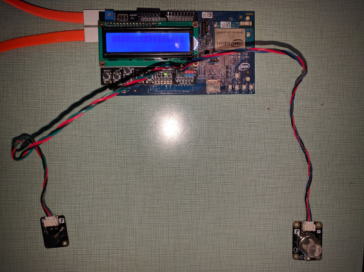

# Air quality sensor in JavaScript*

## Introduction

This air quality monitor application is part of a series of how-to Internet of Things (IoT) code sample exercises using the Intel® IoT Developer Kit, Intel® Edison board, Intel® IoT Gateway, cloud platforms, APIs, and other technologies.

From this exercise, developers will learn how to:<br>

- Connect the Intel® Edison board or Intel® IoT Gateway, computing platforms designed for prototyping and producing IoT and wearable computing products.<br>
- Interface with the Intel® Edison board or Arduino 101\* (branded Genuino 101\* outside the U.S.) board IO and sensor repository using MRAA and UPM from the Intel® IoT Developer Kit, a complete hardware and software solution to help developers explore the IoT and implement innovative projects.<br>
- Run this code sample in Intel® XDK IoT Edition, an IDE for creating applications that interact with sensors and actuators, enabling a quick start for developing software for the Intel® Edison board or Intel® IoT Gateway.<br>
- Set up a web application server to let users enter the access code to disable the alarm system and store this alarm data using Azure Redis Cache\* from Microsoft Azure\*, Redis Store\* from IBM Bluemix\*, or Elasticache\* using Redis\* from Amazon Web Services (AWS)\*, different cloud services for connecting IoT solutions including data analysis, machine learning, and a variety of productivity tools to simplify the process of connecting your sensors to the cloud and getting your IoT project up and running quickly.
- Connect to a server using IoT Hub from Microsoft Azure\*, IoT from IBM Bluemix\*, IoT from Amazon Web Services (AWS)\*, AT&T M2X\*, Predix\* from GE, or SAP\* Cloud Platform IoT, different cloud-based IoT platforms for machine to machine communication.

## What it is

Using an Intel® Edison board or Intel® IoT Gateway, this project lets you create an air quality monitor that:<br>
- continuously checks the air quality for airborne contaminants.<br>
- sounds an audible warning when the air quality is unhealthy.<br>
- stores a record of each time the air quality sensor detects contaminants, using cloud-based data storage.

## How it works

This shop air quality monitor uses the sensor to constantly keep track of airborne contaminants.

If the sensor detects one of several different gases and the detected level exceeds a defined threshold, it makes a sound through the speaker to indicate a warning.

Optionally, data can be stored using your own Microsoft Azure\*, IBM Bluemix\*, AT&T M2X\*, AWS\*, Predix\*, or SAP\* account.

### Hardware requirements

This sample can be used with either the Grove\* Home Automation Kit from Seeed Studio, or else the DFRobot\* Edison Starter Kit.

Grove\* Home Automation Kit, containing:

1. Intel® Edison module with an Arduino\* breakout board or Intel® IoT Gateway with Arduino 101
2. [Grove\* Air Quality Sensor](http://iotdk.intel.com/docs/master/upm/node/classes/tp401.html)
3. [Grove* Speaker](http://iotdk.intel.com/docs/master/upm/node/classes/grovespeaker.html)

DFRobot\* Starter Kit for Intel® Edison, containing:

1. Intel® Edison module with an Arduino\* breakout board or Intel® IoT Gateway with Arduino 101
2. [Analog Gas Sensor](http://www.dfrobot.com/wiki/index.php?title=Analog_Gas_Sensor_SKU:SEN0127).
3. [Buzzer](http://www.dfrobot.com/wiki/index.php?title=Digital_Buzzer_Module_(SKU:_DFR0032)).
4. [LCD Keypad Shield](http://iotdk.intel.com/docs/master/upm/node/classes/sainsmartks.html)

### Software requirements

1. Intel® XDK IoT Edition
2. Microsoft Azure\*, IBM Bluemix\*, AT&T M2X\*, AWS\*, Predix\*, or SAP\* account (optional)

### How to set up

To begin, clone the **How-To Code Samples** repository with Git\* on your computer as follows:

    $ git clone https://github.com/intel-iot-devkit/how-to-code-samples.git

To download a .zip file, in your web browser go to <a href="https://github.com/intel-iot-devkit/how-to-code-samples">https://github.com/intel-iot-devkit/how-to-code-samples</a> and click the **Download ZIP** button at the lower right. Once the .zip file is downloaded, uncompress it, and then use the files in the directory for this example.

## Adding the program to Intel® XDK IoT Edition

In Intel® XDK IoT Edition, select **Import Your Node.js Project**:


On the **New Project** screen, click on the folder icon:


Then, navigate to the directory where the example project exists, and select it:


Choose a name for the project and click on the **Create** button. Then click on the **Continue** button to finish creating your project:


You need to connect to your Intel® Edison board from your computer to send code to it.


Click the **IoT Device** menu at the bottom left. If your Intel® Edison is automatically recognized, select it.


Otherwise, select **Add Manual Connection**.
In the **Address** field, type `192.168.2.15`.
In the **Port** field, type `58888`.
Click **Connect** to save your connection.

### Installing the program manually on the Intel® Edison board

Alternatively, you can set up the code manually on the Intel® Edison board.

Clone the **How-To Code Samples** repository to your Intel® Edison board after you establish an SSH connection to it, as follows:

    $ git clone https://github.com/intel-iot-devkit/how-to-code-samples.git

Then, navigate to the directory with this example.

To install Git\* on the Intel® Edison board (if you don’t have it yet), establish an SSH connection to the board and run the following command:

    $ opkg install git

### Connecting the Grove\* sensors


You need to have a Grove\* Shield connected to an Arduino\* compatible breakout board to plug all the Grove\* devices into the Grove\* Shield. Make sure you have the tiny VCC switch on the Grove\* Shield set to **5V**.

Sensor | Pin
--- | ---
Grove\* Air Quality Sensor | AO
Grove\* Speaker | D5

### Connecting the DFRobot\* sensors



You need to have a DFRobot\* LCD Keypad Shield connected to an Arduino\* compatible breakout board to plug all the DFRobot\* devices into the DFRobot\* LCD Keypad Shield.

Sensor | Pin
--- | ---
Buzzer | A1
Air Quality Sensor | A3

### Installing the program manually on the Intel® Edison board

If you're running this code on your Intel® Edison manually, you need to install some dependencies.

To obtain the Node.js\* modules needed for this example to execute on the Intel® Edison board, run the following command:

```
npm install
```

### Intel® IoT Gateway setup

You can run this example using an Intel® IoT Gateway connected to an Arduino 101.

Make sure your Intel® IoT Gateway is setup using Intel® IoT Gateway Software Suite, by following the directions on the web site here:

https://software.intel.com/en-us/getting-started-with-intel-iot-gateways-and-iotdk

You must install the Intel® XDK on the Intel® IoT Gateway, by following the directions on the above link, under the section "Connecting to the Intel® XDK".

The Arduino 101 needs to have the Firmata\* firmware installed. If you have IMRAA installed on your gateway, this will be done automatically. Otherwise, install the StandardFirmata or ConfigurableFirmata sketch manully on to your Arduino 101.

You will also need to configure the `config.json` in the example to use the Arduino 101. See the section "Configuring the example" below.

### IoT cloud setup

You can optionally store the data generated by this sample program using cloud-based IoT platforms from Microsoft Azure\*, IBM Bluemix\*, AT&T M2X\*, AWS\*, Predix\*, or SAP\*.

For information on how to connect to your own cloud server, go to:

[https://github.com/intel-iot-devkit/iot-samples-cloud-setup](https://github.com/intel-iot-devkit/iot-samples-cloud-setup)

### Data store server setup

Optionally, you can store the data generated by this sample program in a backend database deployed using Microsoft Azure\*, IBM Bluemix\*, or AWS, along with Node.js\*, and a Redis\* data store.

For information on how to set up your own cloud data server, go to:

[https://github.com/intel-iot-devkit/intel-iot-examples-datastore](https://github.com/intel-iot-devkit/intel-iot-examples-datastore)

## Configuring the example

To configure the example for the Grove\* kit, just leave the `kit` key in the `config.json` set to `grove`. To configure the example for the DFRobot\* kit, change the `kit` key in the `config.json` to `dfrobot` as follows:

```
{
  "kit": "dfrobot",
  "THRESHOLD": 50
}
```

To configure the example for the Arduino 101, add a `platform` key with the value `firmata` to the `config.json`, as follows:

```
{
  "kit": "grove",
  "platform": "firmata",
  "THRESHOLD": 50
}
```

To configure the example for the optional Microsoft Azure\*, IBM Bluemix\*, or AWS data store, add the `SERVER` and `AUTH_TOKEN` keys in the `config.json` file below the "THRESHOLD" value as follows:

```
{
  "kit": "grove",
  "THRESHOLD": 50,
  "SERVER": "http://intel-examples.azurewebsites.net/logger/access-control",
  "AUTH_TOKEN": "s3cr3t"
}
```

For information on how to configure the example for an optional Microsoft Azure\*, IBM Bluemix\*, AT&T M2X\*, AWS\*, Predix\*, or SAP\* IoT cloud server, go to:

[https://github.com/intel-iot-devkit/iot-samples-cloud-setup](https://github.com/intel-iot-devkit/iot-samples-cloud-setup)

## Running the program using Intel® XDK IoT Edition

When you're ready to run the example, make sure you saved all the files.


Click the **Upload** icon to upload the files to the Intel® Edison board.


Click the **Run** icon at the bottom of Intel® XDK IoT Edition. This runs the code on the Intel® Edison board.


If you made changes to the code, click **Upload and Run**. This runs the latest code with your changes on the Intel® Edison board.


You will see output similar to the above when the program is running.

### Determining the Intel® Edison board IP address

You can determine what IP address the Intel® Edison board is connected to by running the following command:

    ip addr show | grep wlan

You will see output similar to the following:

    3: wlan0: <BROADCAST,MULTICAST,UP,LOWER_UP> mtu 1500 qdisc pfifo_fast qlen 1000
        inet 192.168.1.13/24 brd 192.168.1.255 scope global wlan0

The IP address is shown next to `inet`. In the example above, the IP address is `192.168.1.13`.

IMPORTANT NOTICE: This software is sample software. It is not designed or intended for use in any medical, life-saving or life-sustaining systems, transportation systems, nuclear systems, or for any other mission-critical application in which the failure of the system could lead to critical injury or death. The software may not be fully tested and may contain bugs or errors; it may not be intended or suitable for commercial release. No regulatory approvals for the software have been obtained, and therefore software may not be certified for use in certain countries or environments.
