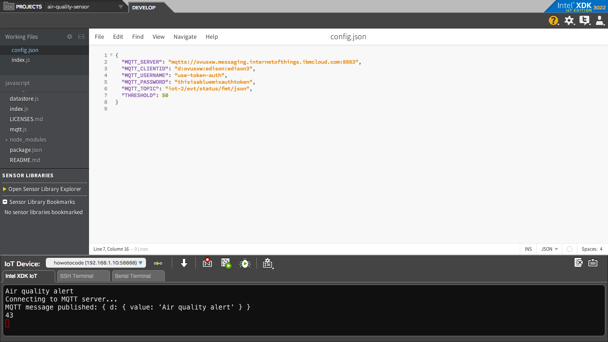

## What it is

Using a compatible Intel-based platform, this project lets you create an air quality monitor that:<br>
- continuously checks the air quality for airborne contaminants.<br>
- sounds an audible warning when the air quality is unhealthy.<br>
- stores a record of each time the air quality sensor detects contaminants, using cloud-based data storage.

## First time setup  
For all the samples in this repository, see the [General Setup Instructions](./../../README.md#setup) for required boards and libraries. You need either Grove or DFRobot sensors but not both.

## Hardware requirements

### Grove\* 

You need to have a Grove\* Shield connected to an Arduino\* compatible breakout board to plug all the Grove\* devices into the Grove\* Shield. Make sure you have the tiny VCC switch on the Grove\* Shield set to **5V**.

Sensor | Pin
--- | ---
Grove\* Air Quality Sensor | AO
Grove\* Speaker | D5

### DFRobot\*

You need to have a DFRobot\* LCD Keypad Shield connected to an Arduino\* compatible breakout board to plug all the DFRobot\* devices into the DFRobot\* LCD Keypad Shield.

Sensor | Pin
--- | ---
Buzzer | A1
Air Quality Sensor | A3

More details on the hardware requirements can be found in the [project README](./../README.md)

## Software requirements

1. [MRAA](https://github.com/intel-iot-devkit/mraa) and [UPM](https://upm.mraa.io) 
1. Node.js 
2. [MRAA and UPM Node.js bindings](https://github.com/intel-iot-devkit/upm/blob/master/docs/installing.md)
3. Packages as listed in the package.json file in this example 
4. Microsoft Azure\*, IBM Bluemix\*, AT&T M2X\*, AWS\*, Predix\*, or SAP\* account (optional)

## Configuring the example

To configure the example for the Grove\* kit, just leave the `kit` key in the `config.json` set to `grove`. To configure the example for the DFRobot\* kit, change the `kit` key in the `config.json` to `dfrobot` as follows:

```
{
  "kit": "dfrobot",
  "THRESHOLD": 50
}
```

To configure the example for the Arduino 101, add a `platform` key with the value `firmata` to the `config.json`, as follows:

```
{
  "kit": "grove",
  "platform": "firmata",
  "THRESHOLD": 50
}
```

To configure the example for the optional Microsoft Azure\*, IBM Bluemix\*, or AWS data store, add the `SERVER` and `AUTH_TOKEN` keys in the `config.json` file below the "THRESHOLD" value as follows:

```
{
  "kit": "grove",
  "THRESHOLD": 50,
  "SERVER": "http://intel-examples.azurewebsites.net/logger/access-control",
  "AUTH_TOKEN": "s3cr3t"
}
```

For information on how to configure the example for an optional Microsoft Azure\*, IBM Bluemix\*, AT&T M2X\*, AWS\*, Predix\*, or SAP\* IoT cloud server, go to:

[https://github.com/intel-iot-devkit/iot-samples-cloud-setup](https://github.com/intel-iot-devkit/iot-samples-cloud-setup)

## Running the program 

To run this example on the board, simply enter

    $ npm install
    $ npm run
    $ ./air-quality-sensor
    
You will see output similar to below when the program is running.



Refer to [How it Works](./../README.md#how-it-works) for details on the functionality.

After running the program you should have output similar to:
```
Grove Air Quality Sensor
Heating sensor for 3 minutes…
Please wait, 1 minute(s) passed..
Please wait, 2 minute(s) passed..
Sensor ready!
raw: 	77ppm: 	0.95	Normal Indoor Air
raw: 	40ppm: 	01.15	Fresh Air
raw: 	36ppm: 	0.98	Fresh Air
```

### IoT cloud setup (optional)

You can optionally store the data generated by this sample program using cloud-based IoT platforms from Microsoft Azure\*, IBM Bluemix\*, AT&T M2X\*, AWS\*, Predix\*, or SAP\*.

For information on how to connect to your own cloud server, go to:

[https://github.com/intel-iot-devkit/iot-samples-cloud-setup](https://github.com/intel-iot-devkit/iot-samples-cloud-setup)

### Data store server setup (optional)

Optionally, you can store the data generated by this sample program in a back-end database deployed using Microsoft Azure\*, IBM Bluemix\*, or AWS, along with Node.js\*, and a Redis\* data store.

For information on how to set up your own cloud data server, go to:

[https://github.com/intel-iot-devkit/intel-iot-examples-datastore](https://github.com/intel-iot-devkit/intel-iot-examples-datastore)


IMPORTANT NOTICE: This software is sample software. It is not designed or intended for use in any medical, life-saving or life-sustaining systems, transportation systems, nuclear systems, or for any other mission-critical application in which the failure of the system could lead to critical injury or death. The software may not be fully tested and may contain bugs or errors; it may not be intended or suitable for commercial release. No regulatory approvals for the software have been obtained, and therefore software may not be certified for use in certain countries or environments.
