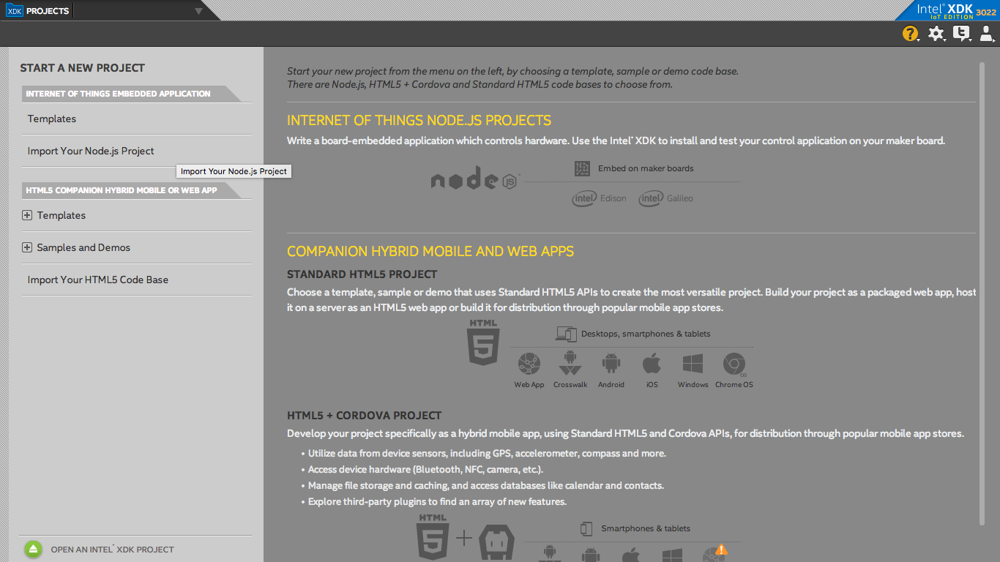
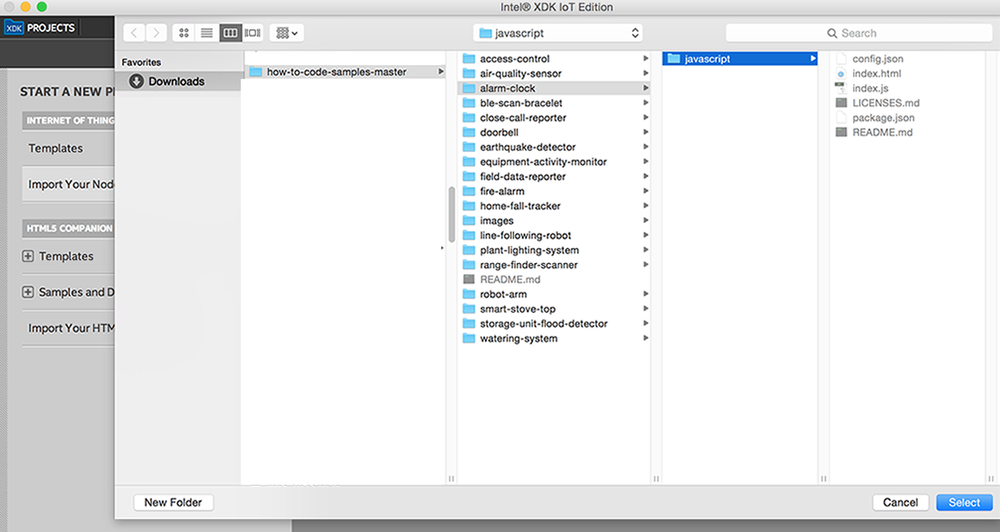
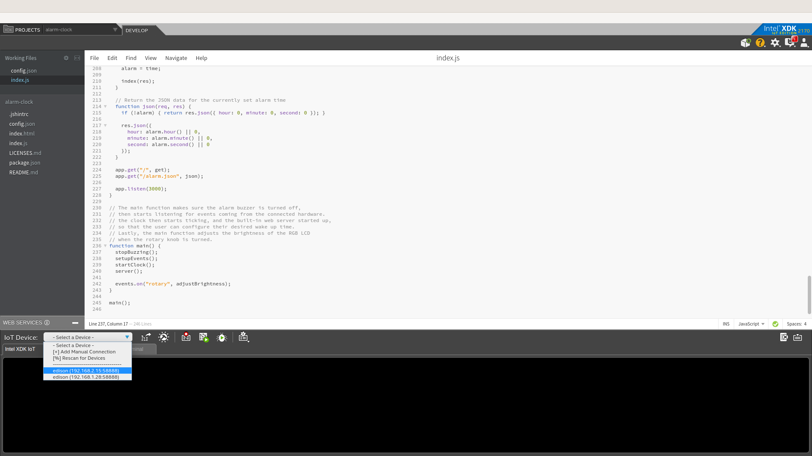
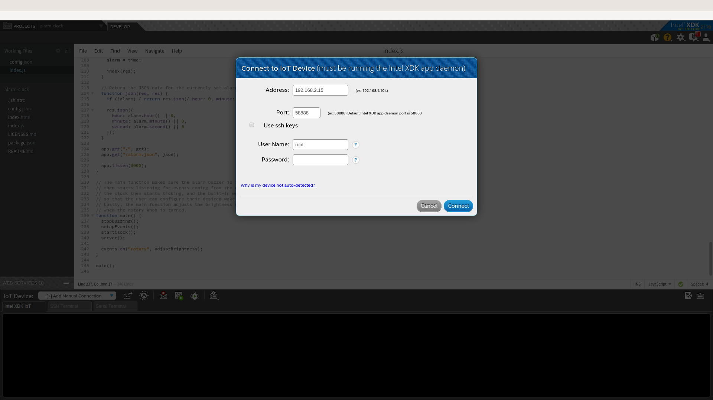
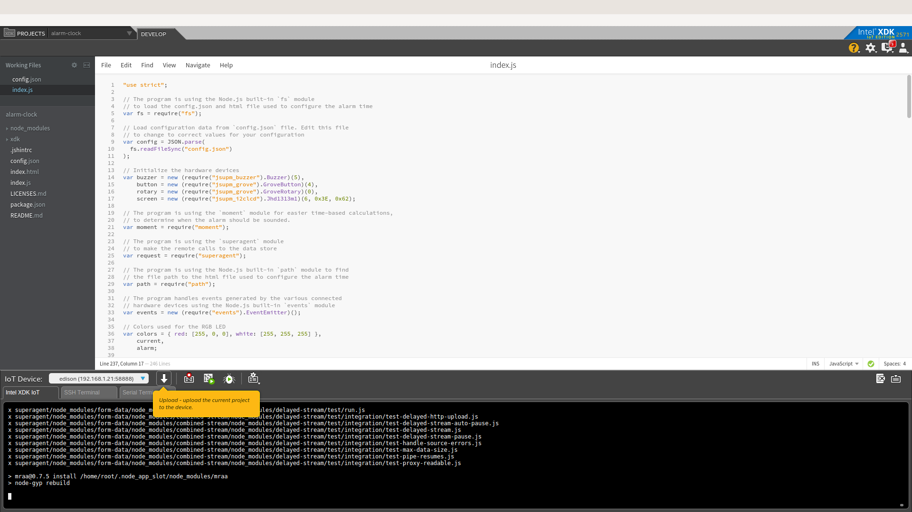
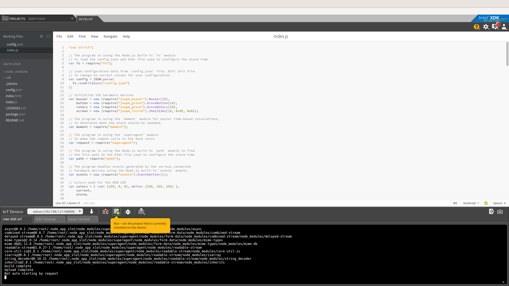
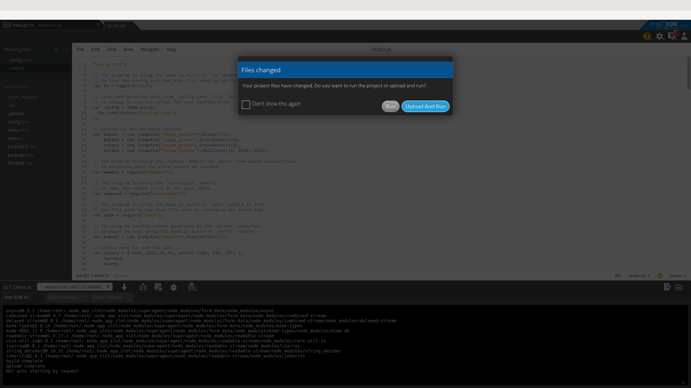

# Air quality sensor in JavaScript*

## Introduction

This air quality monitor application is part of a series of how-to Intel IoT code sample exercises using the Intel® IoT Developer Kit, Intel® Edison development platform, cloud platforms, APIs, and other technologies.

From this exercise, developers will learn how to:<br>
- Connect the Intel® Edison development platform, a computing platform designed for prototyping and producing IoT and wearable computing products.<br>
- Interface with the Intel® Edison platform IO and sensor repository using MRAA and UPM from the Intel® IoT Developer Kit, a complete hardware and software solution to help developers explore the IoT and implement innovative projects.<br>
- Run this code sample in Intel® XDK IoT Edition, an IDE for creating applications that interact with sensors and actuators, enabling a quick start for developing software for the Intel® Edison or Intel® Galileo board.<br>
- Store air quality data using Azure Redis Cache* from Microsoft* Azure*, cloud services for connecting IoT solutions including data analysis, machine learning, and a variety of productivity tools to simplify the process of connecting your sensors to the cloud and getting your IoT project up and running quickly.

## What it is

Using an Intel® Edison board, this project lets you create an air quality monitor that:<br>
- continuously checks the air quality for airborne contaminants;<br>
- sounds an audible warning when the air quality is unhealthy;<br>
- stores a record of each time the air quality sensor detects contaminants, using cloud-based data storage.

## How it works

This shop air quality monitor uses the sensor to constantly keep track of airborne contaminants.

If the sensor detects one of several different gases and the detected level exceeds a defined threshold, it makes a sound through the speaker to indicate a warning.

Also, optionally, the monitor stores the air quality data using the Intel IoT Examples Datastore running in your own Microsoft* Azure* account.

### Hardware requirements

Grove* Home Automation Kit containing:

1. Intel® Edison with an Arduino* breakout board
2. [Grove* Air Quality Sensor](http://iotdk.intel.com/docs/master/upm/node/classes/tp401.html)
3. [Grove* Speaker](http://iotdk.intel.com/docs/master/upm/node/classes/grovespeaker.html)

### Software requirements

1. Intel® XDK IoT Edition
2. Microsoft* Azure* account (optional)

### How to set up

To begin, clone the **How-To Intel IoT Code Samples** repository with Git* on your computer as follows:

    $ git clone https://github.com/intel-iot-devkit/how-to-code-samples.git

Want to download a .zip file? In your web browser, go to <a href="https://github.com/intel-iot-devkit/how-to-code-samples">https://github.com/intel-iot-devkit/how-to-code-samples</a> and click the **Download ZIP** button at the lower right. Once the .zip file is downloaded, uncompress it, and then use the files in the directory for this example.

## Adding the program to Intel® XDK IoT Edition

In Intel® XDK IoT Edition, select **Import Your Node.js Project**:



Then, navigate to the directory where the example project exists, and select it:



You need to connect to your Intel® Edison board from your computer to send code to it.



Click the **IoT Device** menu at the bottom left. If your Intel® Edison is automatically recognized, select it.



Otherwise, select **Add Manual Connection**.
In the **Address** field, type `192.168.2.15`. In the **Port** field, type `58888`.
Click **Connect** to save your connection.

### Installing the program manually on Intel® Edison

Alternatively, you can set up the code manually on the Intel® Edison board.

Clone the **How-To Intel IoT Code Samples** repository to your Intel® Edison board after you establish an SSH connection to it, as follows:

    $ git clone https://github.com/intel-iot-devkit/how-to-code-samples.git

Then, navigate to the directory with this example.

To install Git* on Intel® Edison, if you don’t have it yet, establish an SSH connection to the board and run the following command:

    $ opkg install git

### Connecting the Grove* sensors


You need to have a Grove* Shield connected to an Arduino\*-compatible breakout board to plug all the Grove* devices into the Grove* Shield. Make sure you have the tiny VCC switch on the Grove* Shield set to **5V**.

1. Plug one end of a Grove* cable into the Grove* Air Quality Sensor, and connect the other end to the AO port on the Grove* Shield.

2. Plug one end of a Grove* cable into the Grove* Speaker, and connect the other end to the D5 port on the Grove* Shield.

### Manual Intel® Edison setup

If you're running this code on your Intel® Edison manually, you need to install some dependencies.

To obtain the Node.js* modules needed for this example to execute on Intel® Edison, run the following command:

```
npm install
```

### Microsoft* Azure* server setup

Optionally, you can store the data generated by this example program in a backend database deployed using Microsoft* Azure\*, Node.js\*, and a Redis* data store.

For information on how to set up your own cloud data server, go to:

<a href="https://github.com/intel-iot-devkit/intel-iot-examples-datastore">https://github.com/intel-iot-devkit/intel-iot-examples-datastore</a>

## Configuring the example

To configure the example for the optional Microsoft* Azure* data store, change the `SERVER` and `AUTH_TOKEN` keys in the `config.json` file as follows:

```
{
  "SERVER": "http://intel-examples.azurewebsites.net/logger/air-quality",
  "AUTH_TOKEN": "s3cr3t"
}
```

## Running the program using Intel® XDK IoT Edition

When you're ready to run the example, make sure you saved all the files.



Click the **Upload** icon to upload the files to the Intel® Edison board.



Click the **Run** icon at the bottom of Intel® XDK IoT Edition. This runs the code on Intel® Edison.



If you made changes to the code, click **Upload and Run**. This runs the latest code with your changes on Intel® Edison.


You will see output similar to the above when the program is running.

### Determining the Intel® Edison IP address

You can determine what IP address Intel® Edison is connected to by running the following command:

    ip addr show | grep wlan

You will see the output similar to the following:

    3: wlan0: <BROADCAST,MULTICAST,UP,LOWER_UP> mtu 1500 qdisc pfifo_fast qlen 1000
        inet 192.168.1.13/24 brd 192.168.1.255 scope global wlan0

The IP address is shown next to `inet`. In the example above, the IP address is `192.168.1.13`.

