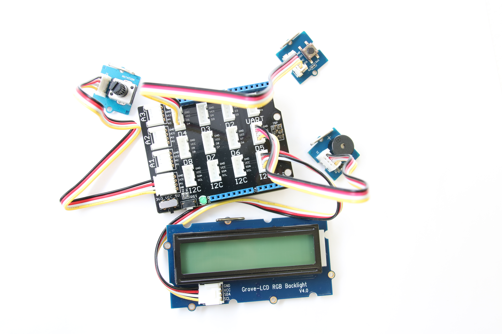
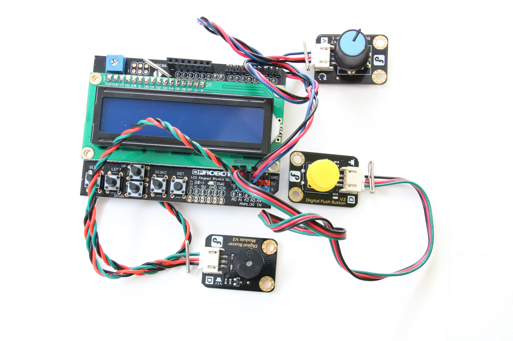
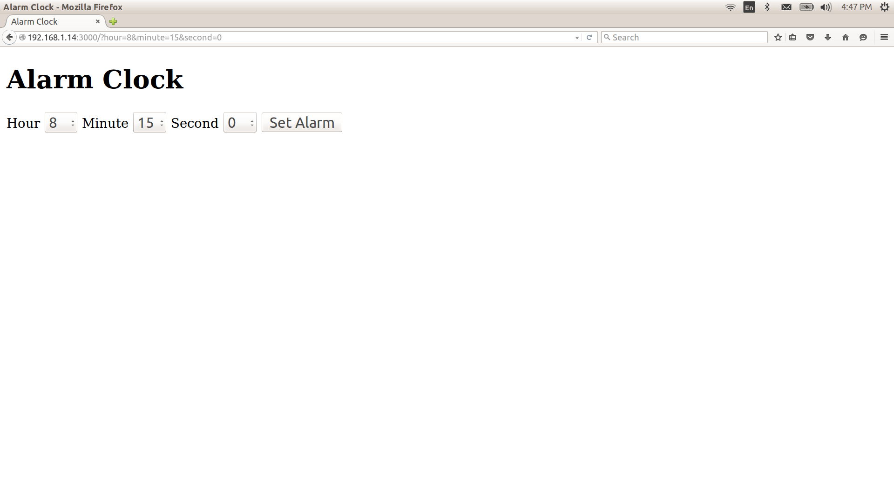

# Alarm Clock

## Introduction

This smart alarm clock application is part of a series of how-to Internet of Things (IoT) code sample exercises using the Intel® IoT Developer Kit and a compatible Intel-based platform, cloud platforms, APIs, and other technologies.

From this exercise, developers will learn how to: 

- Interface with sensors using MRAA and UPM from the Intel® IoT Developer Kit, a complete hardware and software solution to help developers explore the IoT and implement innovative projects. 
- Set up a web application server to let users enter the access code to disable the alarm system and store this alarm data using Azure Redis Cache\* from Microsoft Azure\*, Redis Store\* from IBM Bluemix\*, or Elasticache\* using Redis\* from Amazon Web Services (AWS)\*, different cloud services for connecting IoT solutions including data analysis, machine learning, and a variety of productivity tools to simplify the process of connecting your sensors to the cloud and getting your IoT project up and running quickly.
- Connect to a server using IoT Hub from Microsoft Azure\*, IoT from IBM Bluemix\*, IoT from Amazon Web Services (AWS)\*, AT&T M2X\*, Predix\* from GE, or SAP Cloud Platform\* IoT, different cloud-based IoT platforms for machine to machine communication.
- Invoke the services of the Weather Underground\* API for accessing weather data.

Available in:  
 [C++](./cpp)  
 [Java\*](./java)  
 [JavaScript\*](./javascript)  
 [Python\*](./python)  

## What it is

Using a compatible Intel-based platform, this project lets you create a smart alarm clock that: 
- can be accessed with your mobile phone via the built-in web interface to set the alarm time. 
- displays live weather data on the LCD. 
- keeps track of how long it takes you to wake up each morning, using cloud-based data storage.

## How it works

This smart alarm clock has a number of useful features. Set the alarm using a web page served directly from the compatible Intel-based platform using your mobile phone. When the alarm goes off, the buzzer sounds and the LCD indicates it’s time to get up. The rotary dial can be used to adjust the brightness of the display.

In addition, the smart alarm clock can access daily weather data via the Weather Underground\* API and use it to change the color of the LCD.

Optionally, data can be stored using your own Microsoft Azure\*, IBM Bluemix\*, AT&T M2X\*, AWS\*, Predix\*, or SAP\* account.

## First time setup  
For all the samples in this repository, see the [General Setup Instructions](./../README.md#setup) for required boards and libraries.

## Hardware requirements

In addition to using a compatible platform listed in [Hardware Compatibility](./../README.md#hardware-compatibility), here is additional hardware you will need to run this example

This sample can be used with either Grove\* or DFRobot\* components.

Grove:

1. [Grove\* Base Shield V2](https://www.seeedstudio.com/Base-Shield-V2-p-1378.html)
2. [Grove\* Rotary Analog Sensor](http://iotdk.intel.com/docs/master/upm/node/classes/groverotary.html)
3. [Grove\* Buzzer](http://iotdk.intel.com/docs/master/upm/node/classes/buzzer.html).
4. [Grove\* Button](http://iotdk.intel.com/docs/master/upm/node/classes/grovebutton.html)
5. [Grove\* RGB LCD](http://iotdk.intel.com/docs/master/upm/node/classes/jhd1313m1.html)

DFRobot:

1. [Buzzer](http://www.dfrobot.com/index.php?route=product/product&product_id=84).
3. [Button](http://iotdk.intel.com/docs/master/upm/node/classes/grovebutton.html)
4. [Rotary Dial]()
5. [LCD Keypad Shield](http://iotdk.intel.com/docs/master/upm/node/classes/sainsmartks.html)

### Connecting the Grove\* sensors

You need to have a Grove\* Shield connected to an Arduino\* compatible breakout board to plug all the Grove\* devices into the Grove\* Shield. Make sure you have the tiny VCC switch on the Grove\* Shield set to **5V**.

Sensor | Pin
--- | ---
Grove\* Rotary Analog Sensor | A0
Grove Button | D4
Grove Buzzer | D5
Grove RGB LCD | I2C

### Connecting the DFRobot\* sensors

You need to have a LCD Keypad Shield connected to an Arduino\* compatible breakout board to plug all the DFRobot\* devices into the LCD Keypad Shield.

Sensor | Pin
--- | ---
Buzzer | A1
Button | A2
Rotary Analog Sensor | A3

### Setting the alarm

The alarm is set using a single-page web interface served directly from the platform while the sample program is running.

The web server runs on port `3000`, so if your board is connected to Wi-Fi on `192.168.1.13`, the address to browse to if you are on the same network is `http://192.168.1.13:3000`.

IMPORTANT NOTICE: This software is sample software. It is not designed or intended for use in any medical, life-saving or life-sustaining systems, transportation systems, nuclear systems, or for any other mission-critical application in which the failure of the system could lead to critical injury or death. The software may not be fully tested and may contain bugs or errors; it may not be intended or suitable for commercial release. No regulatory approvals for the software have been obtained, and therefore software may not be certified for use in certain countries or environments.
