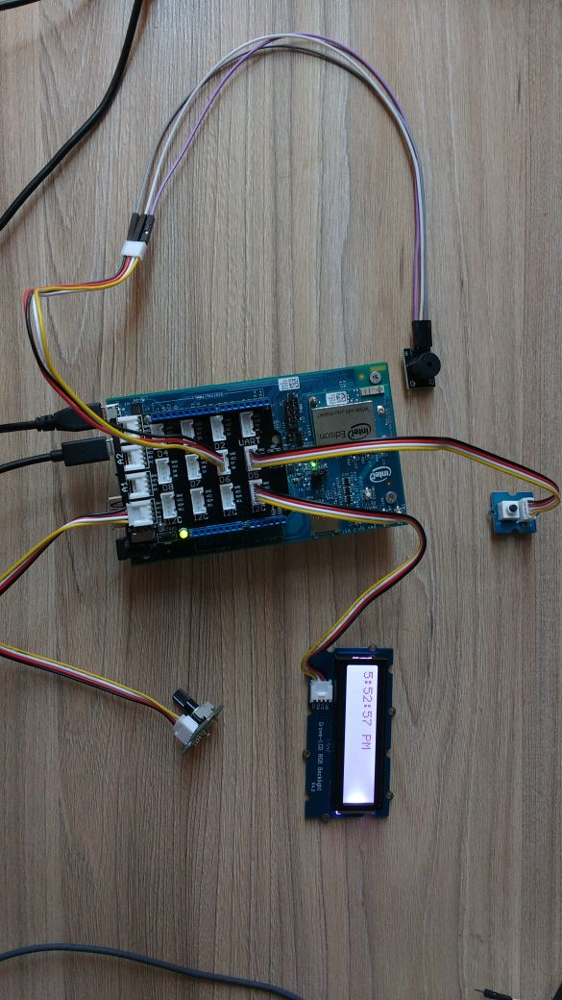
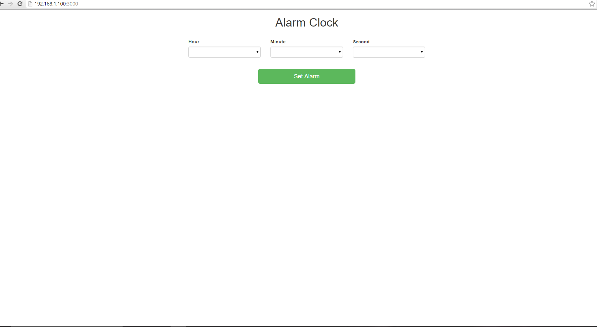

# Alarm clock

## Introduction

This smart alarm clock application is part of a series of how-to Intel IoT code sample exercises using the Intel® IoT Developer Kit, Intel® Edison board, cloud platforms, APIs, and other technologies.

From this exercise, developers will learn how to:

- Connect the Intel® Edison board, a computing platform designed for prototyping and producing IoT and wearable computing products.
- Interface with the Intel® Edison board IO and sensor repository using MRAA and UPM from the Intel® IoT Developer Kit, a complete hardware and software solution to help developers explore the IoT and implement innovative projects.
- Run this code sample in Eclipse\*, an IDE for creating applications that interact with sensors and actuators, enabling a quick start for developing software for the Intel® Edison or Intel® Galileo board. 
- Set up a web application server to set the alarm time and store this alarm data using Azure Redis Cache* from Microsoft* Azure\*, Redis Store* from IBM\* Bluemix\*, or ElastiCache\* using Redis* from Amazon Web Services* (AWS), different cloud services for connecting IoT solutions including data analysis, machine learning, and a variety of productivity tools to simplify the process of connecting your sensors to the cloud and getting your IoT project up and running quickly.
- Invoke the services of the Weather Underground* API for accessing weather data.

## What it is

Using an Intel® Edison board, this project lets you create a smart alarm clock that:

- can be accessed with your mobile phone via the built-in web interface to set the alarm time;
- displays live weather data on the LCD;
- keeps track of how long it takes you to wake up each morning, using cloud-based data storage.

## How it works

This smart alarm clock has a number of useful features. Set the alarm using a web page served directly from the Intel® Edison board, using your mobile phone. When the alarm goes off, the buzzer sounds, and the LCD indicates it’s time to get up. The rotary dial can be used to adjust the brightness of the display.

In addition, the smart alarm clock can access daily weather data via the Weather Underground* API and use it to change the color of the LCD.
Optionally, all data can also be stored using the Intel IoT Examples Datastore running in your own Microsoft* Azure*, IBM\* Bluemix\*, or AWS\* account.

## Hardware requirements

Grove* Starter Kit Plus containing:

1. Intel® Edison board with an Arduino* breakout board
2. Grove* Base Shield V2
3. [Grove* Rotary Analog Sensor](http://iotdk.intel.com/docs/master/upm/node/classes/groverotary.html)
4. [Grove* Buzzer](http://iotdk.intel.com/docs/master/upm/node/classes/buzzer.html)
5. [Grove* Button](http://iotdk.intel.com/docs/master/upm/node/classes/grovebutton.html)
6. [Grove* RGB LCD](http://iotdk.intel.com/docs/master/upm/node/classes/jhd1313m1.html)

## Software requirements

1. [Eclipse*](https://software.intel.com/en-us/eclipse-getting-started-guide)
2. Microsoft* Azure*, IBM\* Bluemix\*, or AWS\* account
3. Weather Underground* API key

## How to set up

To begin, clone the **How-To Intel IoT Code Samples** repository with Git* on your computer as follows:

    $ git clone https://github.com/intel-iot-devkit/intel-iot-examples.git

Want to download a .zip file? In your web browser, go to [https://github.com/intel-iot-devkit/intel-iot-examples](https://github.com/intel-iot-devkit/intel-iot-examples) and click the **Download ZIP** button at the lower right. Once the .zip file is downloaded, uncompress it, and then use the files in the directory for this example.

### Adding the program to Eclipse*

In Eclipse*, select **Import Wizard** to import an existing project into the workspace as follows:

1. From the main menu, select **File > Import**. 

2. The **Import Wizard** dialog box opens. Select **General > Existing Project into Workspace** and click **Next**. 

3. Click **Select root directory** and then the associated **Browse** button to locate the directory that contains the project files. 

4. Under **Projects**, select the directory with the project files you'd like to import and click **OK** and then **Finish** to import the files into Eclipse*. 

5. Your main .cpp program is now displayed in your workspace under the **src** folder. 

### Connecting the Grove* sensors

You need to have a Grove* Base Shield V2 connected to an Arduino\*-compatible breakout board to plug all the Grove* devices into the Grove* Base Shield V2. Make sure you have the tiny VCC switch on the Grove* Base Shield V2 set to **5V**.

1. Plug one end of a Grove* cable into the Grove* Rotary Analog Sensor, and connect the other end to the A0 port on the Grove* Base Shield V2. 

2. Plug one end of a Grove* cable into the Grove* Button, and connect the other end to the D4 port on the Grove* Base Shield V2.
3. Plug one end of a Grove* cable into the Grove* Buzzer, and connect the other end to the D5 port on the Grove* Base Shield V2.
4. Plug one end of a Grove* cable into the Grove* RGB LCD, and connect the other end to any of the I2C ports on the Grove* Base Shield V2.

### Intel® Edison board setup

This example uses the **restclient-cpp** library to perform REST calls to the remote data server. The code can be found in the **lib** directory. The **restclient-cpp** library requires the **libcurl** package, which is already installed on the Intel® Edison board by default.

This example also uses the Crow* web micro-framework to provide a simple-to-use, yet powerful web server. The **crow** library requires the **libboost** package be installed on the Intel® Edison board, as well as adding the needed include and lib files to the Eclipse* Cross G++ Compiler and Cross G++ Linker.

1. Update opkg base feeds so you can install the needed dependencies. Establish an SSH connection to the Intel® Edison board and run the following command: 

        vi /etc/opkg/base-feeds.conf

2. Edit the file so that it contains the following: 

        src/gz all http://repo.opkg.net/edison/repo/all
        src/gz edison http://repo.opkg.net/edison/repo/edison
        src/gz core2-32 http://repo.opkg.net/edison/repo/core2-32

3. Save the file by pressing **Esc**, then **:**, then **q**, and **Enter**.

This only needs to be done once per Intel® Edison board, so if you've already done it, you can skip to the next step.

Install the **boost** libraries onto the Intel® Edison board by running the following command:

    opkg update
    opkg install boost-dev

### Copy the libraries

You need to copy the libraries and include files from the board to your computer where you're running Eclipse* so the Cross G++ Compiler and Cross G++ Linker can find them. The easiest way to do this is by running the `scp` command from your computer (NOT the Intel® Edison board), as follows:

    scp -r USERNAME@xxx.xxx.x.xxx:/usr/include/boost ~/Downloads/iotdk-ide-linux/devkit-x86/sysroots/i586-poky-linux/usr/include
    scp USERNAME@xxx.xxx.x.xxx:/usr/lib/libboost* ~/Downloads/iotdk-ide-linux/devkit-x86/sysroots/i586-poky-linux/usr/lib

Change `USERNAME@xxx.xxx.x.xxx` to match whatever username and IP address you set your board to.

Change `~/Downloads/iotdk-ide-linux` to match the location on your computer where you installed the Intel® IoT Developer Kit.

### Copy the libraries on Windows*

We have a helpful link to get this set up here:

[https://github.com/hybridgroup/intel-iot-examples/blob/master/cpp/docs/using-winscp.md](https://github.com/hybridgroup/intel-iot-examples/blob/master/cpp/docs/using-winscp.md)

Note: you need to turn SSH on by running the `configure_edison --password` command on the board. Once you set the password, make sure you write it down. You only need to do this once and it is set when you reboot the Intel® Edison board.

### Additional setup

You also want to set the current time zone to match the zone you are in. Do this by using the `timedatectl` program on the board. For example:

    timedatectl set-timezone America/Los_Angeles

### Weather Underground* API key

To optionally fetch the real-time weather information, you need to get an API key from the Weather Underground* web site:

[http://www.wunderground.com/weather/api](http://www.wunderground.com/weather/api)

You cannot retrieve weather conditions without obtaining a Weather Underground* API key first. You can still run the example, but without the weather data.

Pass your Weather Underground* API key to the sample program by modifying the `WEATHER_API_KEY` key in the `config.json` file as follows:

1. From the **Run** menu, select **Run Configurations**.  The **Run Configurations** dialog box is displayed.
2. Under **C/C++ Remote Application**, click **alarm-clock**.  This displays the information for your application.
3. In the **Commands to execute before application** field, add the environment variables so it looks like this, except using the API key that corresponds to your own setup: 

        chmod 755 /tmp/alarm-clock; export API_KEY="YOURKEY"

4. Click **Apply** to save your new environment variables.

Now when you run your program using the **Run** button, it should be able to retrieve real-time weather data from the Intel® Edison board.

### Datastore server setup

Optionally, you can store the data generated by this sample program in a backend database deployed using Microsoft* Azure\*, IBM\* Bluemix*, or AWS\*, along with Node.js\*, and a Redis\* data store.

For information on how to set up your own cloud data server, go to:

[https://github.com/intel-iot-devkit/intel-iot-examples-datastore](https://github.com/intel-iot-devkit/intel-iot-examples-datastore)

### Connecting your Intel® Edison board to Eclipse*

1. In the bottom left corner, right-click anywhere on the **Target SSH Connections** tab and select **New > Connection**. 

2. The **Intel(R) IoT Target Connection** window appears. In the **Filter** field, type the name of your board. 

3. In the **Select one of the found connections** list, select your device name and click **OK**. 

4. On the **Target SSH Connections** tab, right-click your device and select **Connect**. 

If prompted for the username and password, the username is **root** and the password is whatever you specified when configuring the Intel® Edison board.

### Running the example with the cloud server

To run the example with the optional backend data store, you need to set the `SERVER` and `AUTH_TOKEN` environment variables. You can do this in Eclipse* as follows:

1. From the **Run** menu, select **Run Configurations**.  The **Run Configurations** dialog box is displayed.
2. Under **C/C++ Remote Application**, click **doorbell**.  This displays the information for the application.
3. In the **Commands to execute before application** field, add the environment variables so it looks like this, except using the server and authentication token that correspond to your own setup: 

        chmod 755 /tmp/alarm-clock;export API_KEY="YOURKEY"; export SERVER="http://intel-examples.azurewebsites.net/logger/alarm-clock"; export AUTH_TOKEN="YOURTOKEN"

4. Click **Apply** to save your new environment variables.

Now, when you run your program using the **Run** button, it should be able to call your server to save the data right from the Intel® Edison board.

### Running the code on the Intel® Edison board

When you're ready to run the example, click **Run** at the top menu bar in Eclipse*. 

This compiles the program using the Cross G++ Compiler, links it using the Cross G++ Linker, transfers the binary to the Intel® Edison board, and then executes it on the board itself.

After running the program, you should see output similar to the one in the image below. 

When the program uploads to the Intel® Edison board, your RGB LCD shows the current time. 

## Regenerating HTML and CSS

If you make any changes to either the **index.html** or **styles.css** file, you need to regenerate the .hex file used to serve up the assets via the built-in Crow* web server.
We have a useful tutorial on how to use the shell script here:

[https://github.com/hybridgroup/intel-iot-examples/blob/master/cpp/docs/how-to-run-the-shellscript.md](https://github.com/hybridgroup/intel-iot-examples/blob/master/cpp/docs/how-to-run-the-shellscript.md)

## Setting the alarm

The alarm is set using a single-page web interface served directly from the Intel® Edison board while the sample program is running. 

The web server runs on port `3000`, so if the Intel® Edison board is connected to Wi-Fi* on `192.168.1.13`, the address to browse to if you are on the same network is `http://192.168.1.13:3000`.
