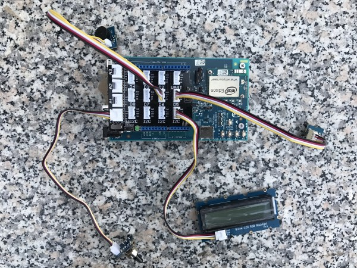
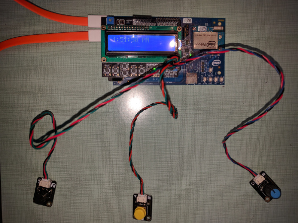

# Alarm Clock in Python*

## Introduction

This smart alarm clock application is part of a series of how-to Intel® Internet of Things (IoT) code sample exercises using the Intel® IoT Developer Kit, Intel® Edison board, Intel® IoT Gateway, cloud platforms, APIs, and other technologies.

From this exercise, developers will learn how to:<br>

- Connect the Intel® Edison board or Intel® IoT Gateway, computing platforms designed for prototyping and producing IoT and wearable computing products.<br>
- Interface with the Intel® Edison board or Arduino 101\* (branded Genuino 101\* outside the U.S.) IO and sensor repository using MRAA and UPM from the Intel® IoT Developer Kit, a complete hardware and software solution to help developers explore the IoT and implement innovative projects.<br>
- Set up a web application server to let users enter the access code to disable the alarm system and store this alarm data using Azure Redis Cache\* from Microsoft\* Azure\*, Redis Store\* from IBM\* Bluemix\*, or ElastiCache\* using Redis\* from Amazon\* Web Services\* (AWS\*), different cloud services for connecting IoT solutions including data analysis, machine learning, and a variety of productivity tools to simplify the process of connecting your sensors to the cloud and getting your IoT project up and running quickly.
- Set up a MQTT-based server using IoT Hub from Microsoft\* Azure\*, IoT from IBM\* Bluemix\*, or IoT from Amazon Web Services\* (AWS), different cloud machine to machine messaging services based on the industry standard MQTT protocol.
- Invoke the services of the Weather Underground\* API for accessing weather data.

## What it is

Using an Intel® Edison board or Intel® IoT Gateway, this project lets you create a smart alarm clock that:<br>
- can be accessed with your mobile phone via the built-in web interface to set the alarm time.<br>
- displays live weather data on the LCD.<br>
- keeps track of how long it takes you to wake up each morning, using cloud-based data storage.

## How it works

This smart alarm clock has a number of useful features. Set the alarm using a web page served directly from the Intel® Edison board or Intel® IoT Gateway using your mobile phone. When the alarm goes off, the buzzer sounds and the LCD indicates it’s time to get up. The rotary dial can be used to adjust the brightness of the display.

In addition, the smart alarm clock can access daily weather data via the Weather Underground* API and use it to change the color of the LCD.
Optionally, all data can also be stored using the Intel® IoT Examples Datastore running in your own Microsoft\* Azure\*, IBM\* Bluemix\*, or AWS account.

## Hardware requirements

This sample can be used with either the Grove\* Starter Kit Plus from Seeed Studio, or else the DFRobot\* Edison Starter Kit.

Grove\* Starter Kit Plus, containing:

1. Intel® Edison with an Arduino* breakout board
2. [Grove\* Rotary Analog Sensor](http://iotdk.intel.com/docs/master/upm/node/classes/groverotary.html)
3. [Grove\* Buzzer](http://iotdk.intel.com/docs/master/upm/node/classes/buzzer.html).
4. [Grove\* Button](http://iotdk.intel.com/docs/master/upm/node/classes/grovebutton.html)
5. [Grove\* RGB LCD](http://iotdk.intel.com/docs/master/upm/node/classes/jhd1313m1.html)

DFRobot\* Starter Kit for Intel® Edison, containing:

1. Intel® Edison with an Arduino* breakout board
2. [Buzzer](http://iotdk.intel.com/docs/master/upm/classupm_1_1_buzzer.html).
3. [Button](http://iotdk.intel.com/docs/master/upm/classupm_1_1_button.html)
4. [Rotary Dial](http://iotdk.intel.com/docs/master/upm/classupm_1_1_rotary.html)
5. [LCD Keypad Shield](http://iotdk.intel.com/docs/master/upm/classupm_1_1_s_a_i_n_s_m_a_r_t_k_s.html)

## Software requirements

1. Microsoft\* Azure\*, IBM\* Bluemix\*, or AWS account (optional)

### Connecting the Grove\* sensors



You need to have a Grove\* Shield connected to an Arduino\*-compatible breakout board to plug all the Grove\* devices into the Grove\* Shield. Make sure you have the tiny VCC switch on the Grove\* Shield set to **5V**.

1. Plug one end of a Grove\* cable into the Grove\* Rotary Analog Sensor, and connect the other end to the A0 port on the Grove\* Shield.

2. Plug one end of a Grove\* cable into the Grove Button, and connect the other end to the D5 port on the Grove\* Shield.

3. Plug one end of a Grove\* cable into the Grove Buzzer, and connect the other end to the D6 port on the Grove\* Shield.

4. Plug one end of a Grove\* cable into the Grove RGB LCD, and connect the other end to any of the I2C ports on the Grove\* Shield.

### Connecting the DFRobot\* sensors



You need to have a LCD Keypad Shield connected to an Arduino\*-compatible breakout board to plug all the DFRobot\* devices into the LCD Keypad Shield.

1. Plug one end of a DFRobot\* cable into the Buzzer, and connect the other end to the A1 port on the LCD Keypad Shield.

2. Plug one end of a DFRobot\* cable into the Button, and connect the other end to the A2 port on the LCD Keypad Shield.

3. Plug one end of a DFRobot\* cable into the Rotary Analog Sensor, and connect the other end to the A3 port on the LCD Keypad Shield.

### Intel® Edison board setup

If you're running this code on your Intel® Edison board, you need to install some dependencies by establishing an SSH session to the Edison and run the commands in the sections below.

#### Update the opkg repo

To add the Intel opkg repository:

    $ echo "src mraa-upm http://iotdk.intel.com/repos/3.5/intelgalactic/opkg/i586" > /etc/opkg/mraa-upm.conf
    $ opkg update

You'll only need to perform this step once.

#### Git

To install Git\* on the Intel® Edison board (if you don’t have it yet):

    $ opkg update
    $ opkg install git

#### MRAA and UPM Dependencies

To install the latest versions of the MRAA\* and UPM\* libraries:

    $ opkg update
    $ opkg install mraa
    $ opkg install upm

#### Python Package Manager (pip)

To install the Python\* package manager needed to install and run the example:

    $ pip install --upgrade pip setuptools


#### Install the example

Once all dependencies are installed you can install the example itself with the following command:

    $ pip install --src ~/python/examples/ -e "git+https://github.com/intel-iot-devkit/how-to-code-samples.git#egg=iot_alarm_clock&subdirectory=alarm-clock/python"

The `pip` command will install required Python dependencies, save the source code for the example in `~/python/examples/iot_alarm_clock/` and link the package to the global Python `site-packages` folder.

### Intel® IoT Gateway setup

You can run this example using an Intel® IoT Gateway connected to an Arduino\*/Genuino\* 101.

Make sure your Intel® IoT Gateway is setup, by following the directions on the web site here:

https://software.intel.com/en-us/node/633284

You must install the Intel® XDK on the Intel® IoT Gateway, by following the directions on the above link, under the section "Connecting to the Intel® XDK".

The Arduino\*/Genuino\* 101 needs to have the Firmata\* firmware installed. If you have IMRAA installed on your gateway, this will be done automatically. Otherwise, install the StandardFirmata or ConfigurableFirmata sketch manully on to your Arduino\*/Genuino\* 101.

You will also need to configure the `config.json` in the example to use the Arduino\*/Genuino\* 101. See the section "Configuring the example" below.

### Data store server setup

Optionally, you can store the data generated by this sample program in a back-end database deployed using Microsoft\* Azure\*, IBM\* Bluemix\*, or AWS, along with Node.js\*, and a Redis\* data store.

For information on how to set up your own cloud data server, go to:

[https://github.com/intel-iot-devkit/intel-iot-examples-datastore](https://github.com/intel-iot-devkit/intel-iot-examples-datastore)

### MQTT server setup

You can also optionally store the data generated by this sample program using MQTT, a machine-to-machine messaging server. You can use MQTT to connect to Microsoft\* Azure\*, IBM\* Bluemix\*, or AWS.

For information on how to connect to your own cloud MQTT messaging server, go to:

[https://github.com/intel-iot-devkit/intel-iot-examples-mqtt](https://github.com/intel-iot-devkit/intel-iot-examples-mqtt)

## Configuring the example

When the example is installed through `pip` the `config.json` file that holds the configuration for the example lives in `~/python/examples/iot_alarm_clock/alarm-clock/python/iot_alarm_clock/config.json`.

To configure the example for the Grove* kit, just leave the `kit` key in the `config.json` set to `grove`. To configure the example for the DFRobot* kit, change the `kit` key in the `config.json` to `dfrobot` as follows:

```JSON
{
  "kit": "dfrobot"
}
```

To configure the example for the Arduino\*/Genuino\* 101, add a `PLATFORM` key with the value `firmata` to the `config.json`, as follows:

```JSON
{
  "kit": "grove",
  "PLATFORM": "firmata"
}

To configure the example for the optional real-time weather data, obtain a key from the Weather Underground\* website as documented above, and then change the `WEATHER_API_KEY` and `LOCATION` keys in the `config.json` file as follows:

```JSON
{
  "kit": "grove",
  "WEATHER_API_KEY": "YOURAPIKEY",
  "LOCATION": "San_Francisco"
}
```

To configure the example for the optional Microsoft\* Azure\*, IBM\* Bluemix\*, or AWS data store, add the `SERVER` and `AUTH_TOKEN` keys in the `config.json` file below the "CODE" key as follows:

```JSON
{
  "kit": "grove",
  "SERVER": "http://intel-examples.azurewebsites.net/logger/access-control",
  "AUTH_TOKEN": "s3cr3t"
}
```

For information on how to configure the example for the optional Microsoft\* Azure\*, IBM\* Bluemix\*, or AWS MQTT messaging server, go to:

[https://github.com/intel-iot-devkit/intel-iot-examples-mqtt/](https://github.com/intel-iot-devkit/intel-iot-examples-mqtt/)

## Running the program

Once the program is installed and configured as detailed above, you can execute the program by running the following command in an SSH session to the board:

    $ python -m iot_alarm_clock

### Determining the Intel® Edison board's IP address

You can determine what IP address the Intel® Edison board is connected to by running the following command:

    ip addr show | grep wlan

You will see the output similar to the following:

    3: wlan0: <BROADCAST,MULTICAST,UP,LOWER_UP> mtu 1500 qdisc pfifo_fast qlen 1000
        inet 192.168.1.13/24 brd 192.168.1.255 scope global wlan0

The IP address is shown next to `inet`. In the example above, the IP address is `192.168.1.13`.

IMPORTANT NOTICE: This software is sample software. It is not designed or intended for use in any medical, life-saving or life-sustaining systems, transportation systems, nuclear systems, or for any other mission-critical application in which the failure of the system could lead to critical injury or death. The software may not be fully tested and may contain bugs or errors; it may not be intended or suitable for commercial release. No regulatory approvals for the software have been obtained, and therefore software may not be certified for use in certain countries or environments.
