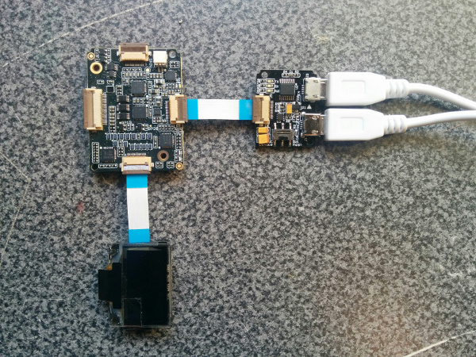

# BLE scan bracelet

## Introduction

This Bluetooth* low energy (BLE) scan bracelet application is part of a series of how-to Intel IoT code sample exercises using the Intel® IoT Developer Kit, Intel® Edison development platform, cloud platforms, APIs, and other technologies.

From this exercise, developers will learn how to:<br>
- Connect the Intel® Edison development platform, a computing platform designed for prototyping and producing IoT and wearable computing products.<br>
- Interface with the Intel® Edison platform IO and sensor repository using MRAA and UPM from the Intel® IoT Developer Kit, a complete hardware and software solution to help developers explore the IoT and implement innovative projects.<br>
- Run this code sample in Intel® System Studio IoT Edition . Intel® System Studio IoT Edition lets you create and test applications on Intel®-based IoT platforms.<br>
- Store detected BLE devices using Azure Redis Cache* from Microsoft* Azure*, cloud services for connecting IoT solutions including data analysis, machine learning, and a variety of productivity tools to simplify the process of connecting your sensors to the cloud and getting your IoT project up and running quickly.

## What it is

Using an Intel® Edison board, this project lets you create a BLE scan bracelet that:<br>
- searches for BLE devices that come within its scanning range;<br>
- displays information about detected devices using the OLED display;<br>
- keeps track of detected devices, using cloud-based data storage.

## How it works

This BLE scanner bracelet uses a Xadow* expansion board for the Intel® Edison platform and the OLED display included in the Xadow* kit.

With these components, we'll make a simple BLE scanner that displays information on the OLED display when BLE-equipped devices enter or exit its scanning range.

Optionally, all data can be stored using the Intel IoT Examples Datastore running in your own Microsoft* Azure* account.

## Hardware requirements

Xadow* Starter Kit containing:

1. Intel® Edison platform with a Xadow* expansion board
2. [Xadow* - OLED display](http://iotdk.intel.com/docs/master/upm/node/classes/ssd1308.html)


## Software requirements

1. Intel® System Studio IoT Edition
2. Microsoft* Azure* account

### How to set up

To begin, clone the **How-To Intel IoT Code Samples** repository with Git* on your computer as follows:

    $ git clone https://github.com/intel-iot-devkit/how-to-code-samples.git

Want to download a .zip file? In your web browser, go to <a href="https://github.com/intel-iot-devkit/how-to-code-samples">https://github.com/intel-iot-devkit/how-to-code-samples</a> and click the **Download ZIP** button at the lower right. Once the .zip file is downloaded, uncompress it, and then use the files in the directory for this example.

## Adding the program to Intel® System Studio IoT Edition

 ** The following screenshots are from the Alarm clock sample, however the technique for adding the program is the same, just with different source files and jars. 

Open Intel® System Studio IoT Edition, it will start by asking for a workspace directory. Choose one and click OK.

In Intel® System Studio IoT Edition , select File -> new -> **Intel(R) IoT Java Project**:


Give the project the name "BleScanBracelet" and click Next.


You now need to connect to your Intel® Edison board from your computer to send code to it.
Choose a name for the connection and enter the IP address of the Intel® Edison board in the "Target Name" field. You can also try to Search for it using the "Search Target" button. Click finish when you are done.


You have successfully created an empty project. You now need to copy the source files and the config file to the project. 
Drag all of the files from your git repository's "src" folder into the new project's src folder in Intel® System Studio IoT Edition. Make sure previously auto-generated main class is overridden.

The project uses the following external jars: [gson-2.6.1](http://central.maven.org/maven2/com/google/code/gson/gson/2.6.1/gson-2.6.1.jar), [joda-time-2.9.2](http://repo.maven.apache.org/maven2/joda-time/joda-time/2.9.2/joda-time-2.9.2.jar). These can be found in the Maven Central Repository. Create a "jars" folder in the project's root directory, and copy all needed jars in this folder.
In Intel® System Studio IoT Edition, select all jar files in "jars" folder and  right click -> Build path -> Add to build path


Now you need to add the UPM jar files relevant to this specific sample.
right click on the project's root -> Build path -> Configure build path. Java Build Path -> 'Libraries' tab -> click on "add external JARs..."

for this sample you will need the following jars:

1. upm_i2clcd.jar
2. tinyb.jar

The jars can be found at the IOT Devkit installation root path\iss-iot-win\devkit-x86\sysroots\i586-poky-linux\usr\lib\java


### Set up the Intel® Edison board for BLE development

To set up the Intel® Edison board for BLE, run the following command:

```
rfkill unblock bluetooth
```


### Connecting the Grove* sensors



You need to have a Xadow* expansion board connected to the Intel® Edison board to plug in all the Xadow* devices.

Plug one end of a Xadow* connector into the Xadow* OLED, and connect the other end to one of the side connectors on the Xadow* expansion board.

### Datastore server setup

Optionally, you can store the data generated by this sample program in a backend database deployed using Microsoft* Azure*, IBM* Bluemix, or AWS, along with Node.js*, and a Redis* data store.

For information on how to set up your own cloud data server, go to:

<a href="https://github.com/intel-iot-devkit/intel-iot-examples-datastore">https://github.com/intel-iot-devkit/intel-iot-examples-datastore</a>


## Configuring the example


To configure the example for the optional Microsoft* Azure* data store, change the `SERVER` and `AUTH_TOKEN` keys in the `config.properties` file as follows:

```

  SERVER=http://mySite.azurewebsites.net/logger/fire-alarm
  AUTH_TOKEN=myPassword

```


## Preparing the Intel® Edison board before running the project

In order for the sample to run you will need to copy some files to the Intel® Edison board. This can be done using SCP through SSH.
The files need to be copied from the sample repository: <br>
Jar files- external libraries in the project need to be copied to "/usr/lib/java"


## Running the program using Intel® System Studio IoT Edition

When you're ready to run the example, make sure you saved all the files.

Click the **Run** icon on the toolbar of Intel® System Studio IoT Edition. This runs the code on the Intel® Edison board.


### Determining the IP address of the Intel® Edison board

You can determine what IP address the Intel® Edison board is connected to by running the following command:

    ip addr show | grep wlan

You will see the output similar to the following:

    3: wlan0: <BROADCAST,MULTICAST,UP,LOWER_UP> mtu 1500 qdisc pfifo_fast qlen 1000
        inet 192.168.1.13/24 brd 192.168.1.255 scope global wlan0

The IP address is shown next to `inet`. In the example above, the IP address is `192.168.1.13`.
