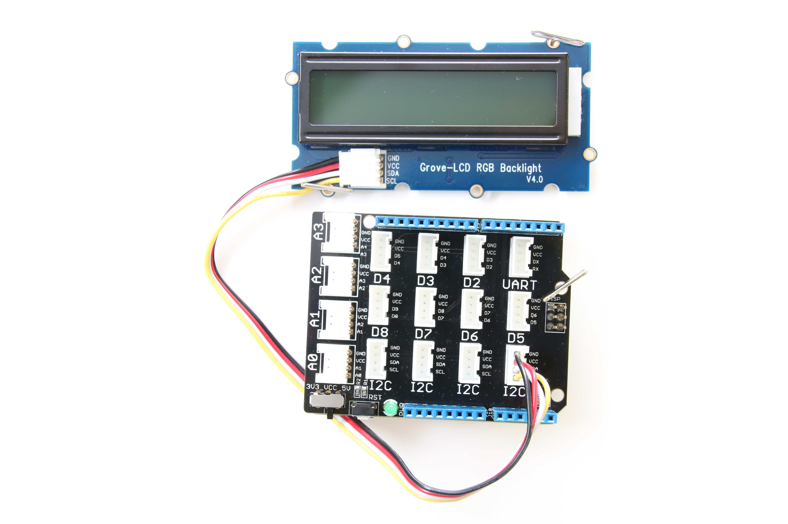

# Color match game in JavaScript*

## Introduction

This Color Match Game application is part of a series of how-to Internet of Things (IoT) code sample exercises using the Intel® IoT Developer Kit, and a compatible Intel® IoT Platform cloud platforms, APIs, and other technologies.

From this exercise, developers will learn how to: 

- Interface with and sensors using MRAA and UPM from the Intel® IoT Developer Kit, a complete hardware and software solution to help developers explore the IoT and implement innovative projects. 
- Set up a web application server to let users play the color matching game using their web browser.

Available in:  
   
   
   
  

## What it is

Using a compatible Intel® IoT Platform, this project lets you create a color match game. 
- a UI of the game is exposed through an embedded server, providing with buttons for color matching as well as a "start game" button 
- when starting the game, for each level a sequence of colors is displayed on the RGB LCD screen of the Intel® Edison board or Arduino 101\* (branded Genuino 101\* outside the U.S.) board. The player needs to click on the corresponding buttons on the website.
- for each level the sequence has one more color. 
- when a user clicks a color, the same color is displayed on the RGB LCD screen. 
- different tones are played when user clicks on color buttons.

## First time setup  
For all the samples in this repository, see the  for required boards and libraries.

## Hardware requirements
In addition to using a compatible platform listed in , here is additional hardware you will need to run this example

This sample can be used with either Grove\* or DFRobot\* components.

Grove\* Starter Kit containing:

1. [Grove\* Base Shield V2](https://www.seeedstudio.com/Base-Shield-V2-p-1378.html)
2. [Grove\* RGB LCD](http://iotdk.intel.com/docs/master/upm/node/classes/jhd1313m1.html)

### Connecting the Grove\* sensors

You need to have a Grove\* Shield connected to an Arduino-compatible breakout board to plug all the Grove\* devices into the Grove Shield. Make sure you have the tiny VCC switch on the Grove\* Shield set to **5V**.

Sensor | Pin
--- | ---
Grove RGB LCD | I2C

### Accessing the game

The color match game is set using a single-page web interface served from the Intel® IoT Platform while the sample program is running.

The web server runs on port `8080`, so if the Intel® IoT Platform is connected to Wi-Fi\* on `192.168.1.13`, the address to browse to if you are on the same network is `http://192.168.1.13:8080/home`. 

### Determining your platform's IP address

See the section on Finding Your Board's IP Address at the bottom of the  readme.

IMPORTANT NOTICE: This software is sample software. It is not designed or intended for use in any medical, life-saving or life-sustaining systems, transportation systems, nuclear systems, or for any other mission-critical application in which the failure of the system could lead to critical injury or death. The software may not be fully tested and may contain bugs or errors; it may not be intended or suitable for commercial release. No regulatory approvals for the software have been obtained, and therefore software may not be certified for use in certain countries or environments.

