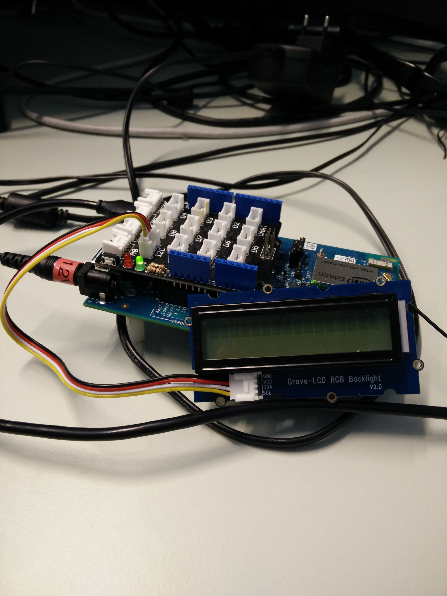

# Color Match Game in Python*

## Introduction

This Color Match Game application is part of a series of how-to Intel® Internet of Things (IoT) code sample exercises using the Intel® IoT Developer Kit, Intel® Edison board, Intel® IoT Gateway, cloud platforms, APIs, and other technologies.

From this exercise, developers will learn how to: 
- Connect the Intel® Edison board or Intel® IoT Gateway, computing platforms designed for prototyping and producing IoT and wearable computing products. 
- Interface with the Intel® Edison board or Arduino 101\* (branded Genuino 101\* outside the U.S.) IO and sensor repository using MRAA and UPM from the Intel® IoT Developer Kit, a complete hardware and software solution to help developers explore the IoT and implement innovative projects. 
- Set up a web application server to let users play the color matching game usinig their web browser.

## What it is

Using an Intel® Edison board, this project lets you create a color match game. 
- a UI of the game is exposed through an embedded server, providing with buttons for color matching as well as a "start game" button 
- when starting the game, for each level a sequence of colors is displayed on the RGB LCD screen of the Intel® Edison board or Arduino 101\* (branded Genuino 101\* outside the U.S.). The player needs to click on the corresponding buttons on the website.
- for each level the sequence has one more color. 
- when a user clicks a color, the same color is displayed on the RGB LCD screen. 
- different tones are played when user clicks on color buttons.

## Hardware requirements

Grove* Starter Kit containing:

1. Intel® Edison with an Arduino-compatible breakout board or Intel® IoT Gateway with Intel® Arduino 101
2. [Grove* RGB LCD](http://iotdk.intel.com/docs/master/upm/node/classes/jhd1313m1.html)

## Software requirements

1. Microsoft\* Azure\*, IBM\* Bluemix\*, or AWS account (optional)

### How to set up

To begin, clone the **How-To Intel IoT Code Samples** repository with Git* on your computer as follows:

    $ git clone https://github.com/intel-iot-devkit/how-to-code-samples.git

To download a .zip file, in your web browser go to <a href="https://github.com/intel-iot-devkit/how-to-code-samples">https://github.com/intel-iot-devkit/how-to-code-samples</a> and click the **Download ZIP** button at the lower right. Once the .zip file is downloaded, uncompress it, and then use the files in the directory for this example.

### Installing the program manually on the Intel® Edison board

You can set up the code manually on the Intel® Edison board.

Clone the **How-To Intel IoT Code Samples** repository to your Intel® Edison board after you establish an SSH connection to it, as follows:

    $ git clone https://github.com/intel-iot-devkit/how-to-code-samples.git

Then, navigate to the directory with this example.

To install Git\* on the Intel® Edison board (if you don’t have it yet), establish an SSH connection to the board and run the following command:

    $ opkg install git

### Connecting the Grove\* sensors

You need to have a Grove* Shield connected to an Arduino-compatible breakout board to plug all the Grove* devices into the Grove Shield. Make sure you have the tiny VCC switch on the Grove* Shield set to **5V**.

1. Plug one end of a Grove cable into the Grove RGB LCD, and connect the other end to any of the I2C ports on the Grove Shield.

### Intel® Edison board setup

If you're running this code on your Intel® Edison board, you need to install some dependencies by establishing an SSH session to the Edison and run the commands in the sections below.

#### Update the opkg repo

To add the Intel opkg repository:

    $ echo "src mraa-upm http://iotdk.intel.com/repos/3.5/intelgalactic/opkg/i586" > /etc/opkg/mraa-upm.conf
    $ opkg update

You'll only need to perform this step once.

#### Git

To install Git\* on the Intel® Edison board (if you don’t have it yet):

    $ opkg update
    $ opkg install git

#### MRAA and UPM Dependencies

To install the latest versions of the MRAA\* and UPM\* libraries:

    $ opkg update
    $ opkg install mraa
    $ opkg install upm

#### Python Package Manager (pip)

To install the Python\* package manager needed to install and run the example:

    $ pip install --upgrade pip setuptools

#### Install the example

Once all dependencies are installed you can install the example itself with the following command:

    $ pip install --src ~/python/examples/ -e "git+https://github.com/intel-iot-devkit/how-to-code-samples.git#egg=iot_color_match_game&subdirectory=color-match-game/python"

The `pip` command will install required Python dependencies, save the source code for the example in `~/python/examples/iot_color_match_game/` and link the package to the global Python `site-packages` folder.

### Intel® IoT Gateway setup

You can run this example using an Intel® IoT Gateway connected to an Arduino\*/Genuino\* 101.

Make sure your Intel® IoT Gateway is setup, by following the directions on the web site here:

https://software.intel.com/en-us/getting-started-with-intel-iot-gateways-and-iotdk

The Arduino\*/Genuino\* 101 needs to have the Firmata\* firmware installed. If you have IMRAA installed on your gateway, this will be done automatically. Otherwise, install the StandardFirmata or ConfigurableFirmata sketch manully on to your Arduino\*/Genuino\* 101.

You will also need to configure the `config.json` in the example to use the Arduino\*/Genuino\* 101. See the section "Configuring the example" below.

### Running the program manually

Once the example is installed through `pip` you can run the program by running the following command in an SSH session to the board:

    $ python -m iot_color_match_game

### Accessing the game

The color match game is set using a single-page web interface served from the Intel® Edison board while the sample program is running.

The web server runs on port `8080`, so if the Intel® Edison board is connected to Wi-Fi* on `192.168.1.13`, the address to browse to if you are on the same network is `http://192.168.1.13:8080/home`.

### Determining the Intel® Edison board's IP address

You can determine what IP address the Intel® Edison board is connected to by running the following command:

    ip addr show | grep wlan

You will see the output similar to the following:

    3: wlan0: <BROADCAST,MULTICAST,UP,LOWER_UP> mtu 1500 qdisc pfifo_fast qlen 1000
        inet 192.168.1.13/24 brd 192.168.1.255 scope global wlan0

The IP address is shown next to `inet`. In the example above, the IP address is `192.168.1.13`.

IMPORTANT NOTICE: This software is sample software. It is not designed or intended for use in any medical, life-saving or life-sustaining systems, transportation systems, nuclear systems, or for any other mission-critical application in which the failure of the system could lead to critical injury or death. The software may not be fully tested and may contain bugs or errors; it may not be intended or suitable for commercial release. No regulatory approvals for the software have been obtained, and therefore software may not be certified for use in certain countries or environments.
