# How to Run the Shell Script

### If changes are made to your html or css you will need to follow these instructions
(Windows Users Only)

1. Go to https://cygwin.com/

2. Go to the downloads section.
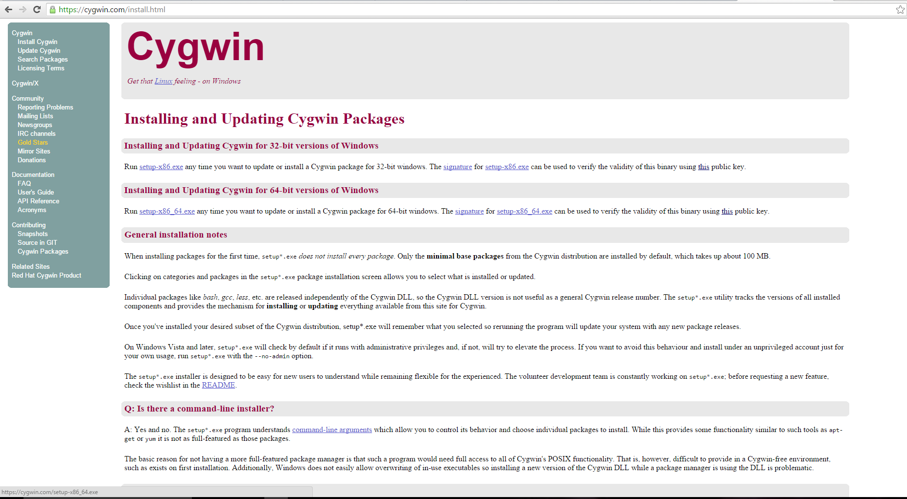

3. Download and run the exe. 
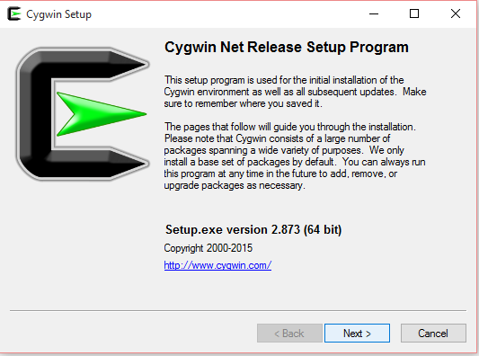

4. Only use default install!!! Download will be several gigabytes if you install all.
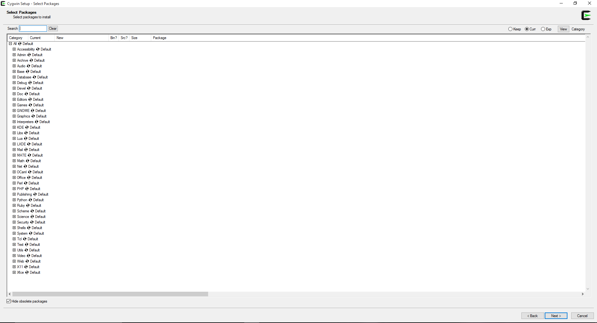

5. Go to windows control panel and click on system.
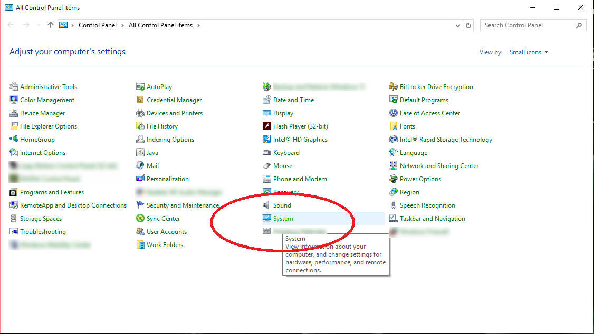

6.click on advance settings.
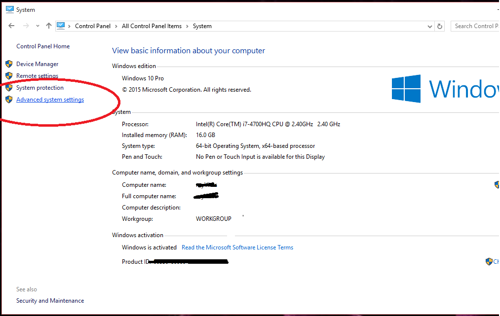

7.Under advanced, click on enviromental variables.
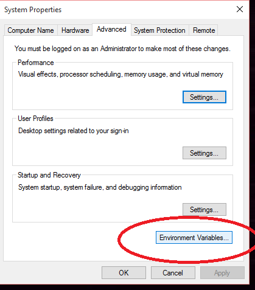

8. Find path on the second box, click it, then click edit.
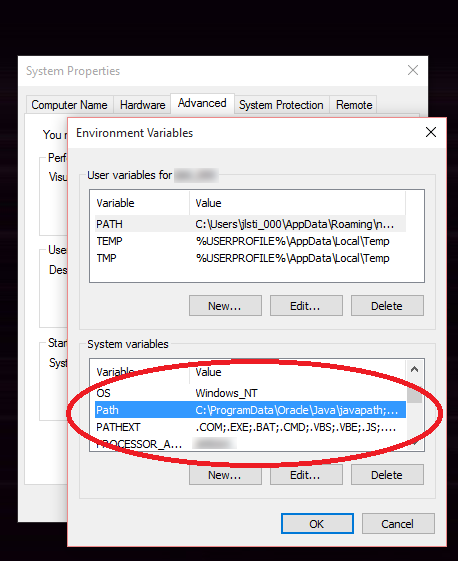

9. Add ";C\cygwin64\bin" to you path. (assuming this is where you intalled cygwin)
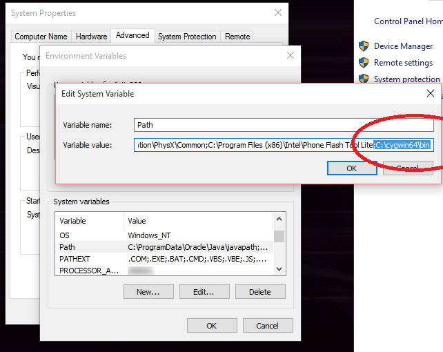

10. Open your windows command promt.
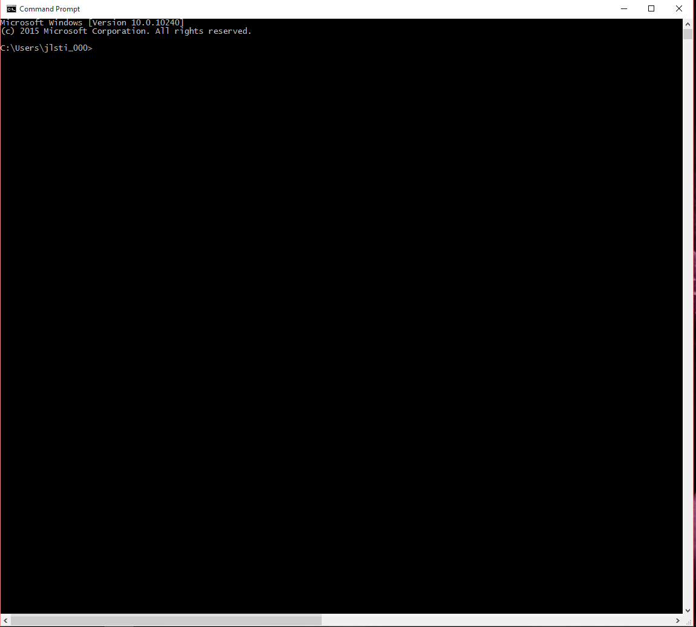

11. Find the directory the your shell script command is as well as your html and css files. For ease of use I put them in the same folder on my desktop. Now type "hex2c.sh index.html" 
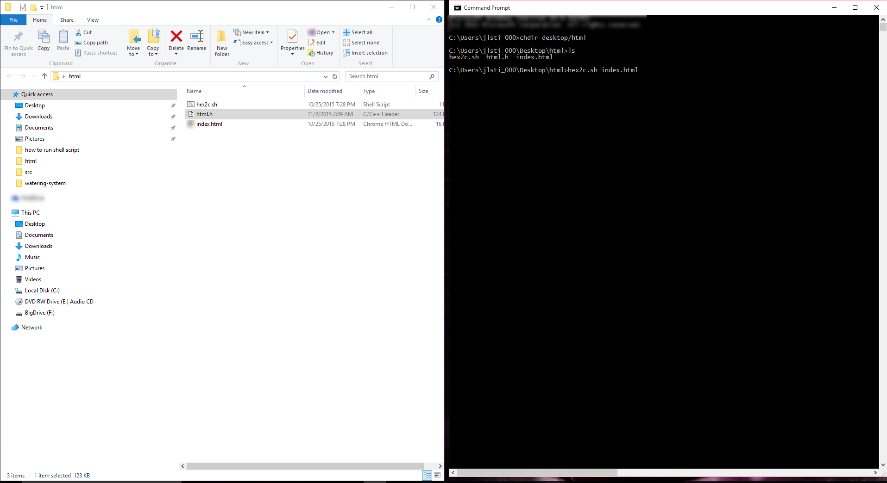

12. You may have to change the height and wisth of your command prompt for everything to fit.
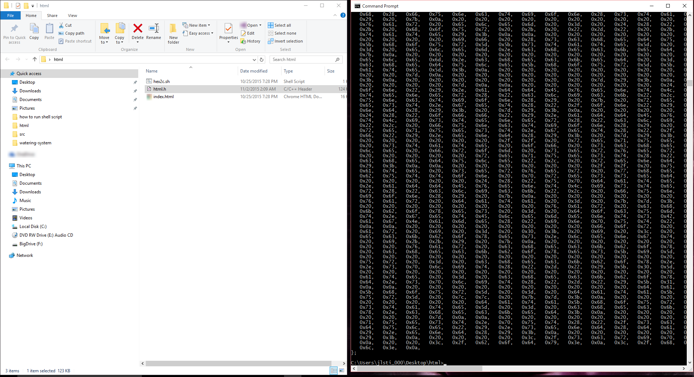

13. Copy the hex code completly. Right click at the top bar of the command promt. Click edit -> mark. 
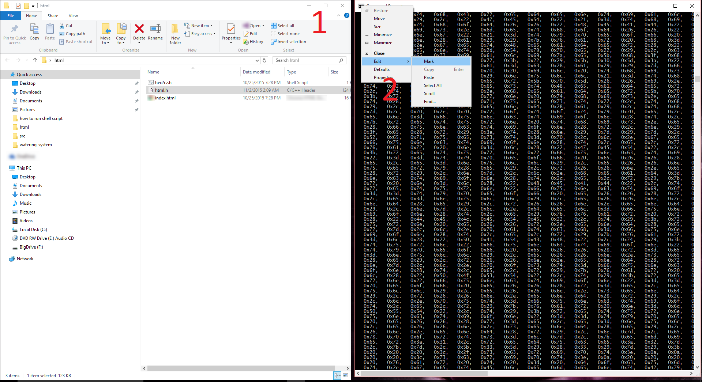

14. You can now hightlight the whole file. Press enter to copy.
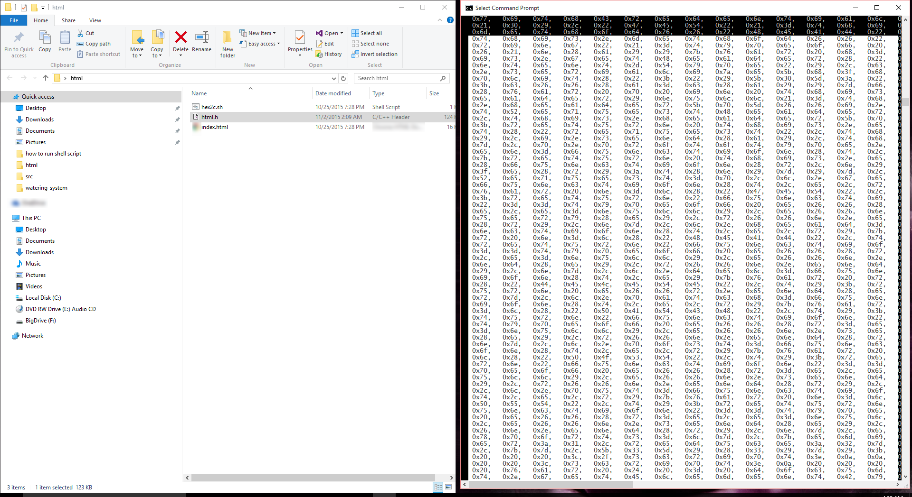

15. Finally open a new text document and paste the code inside. Then rename the document html.h and you now have the file you need if you modified your html or css. 
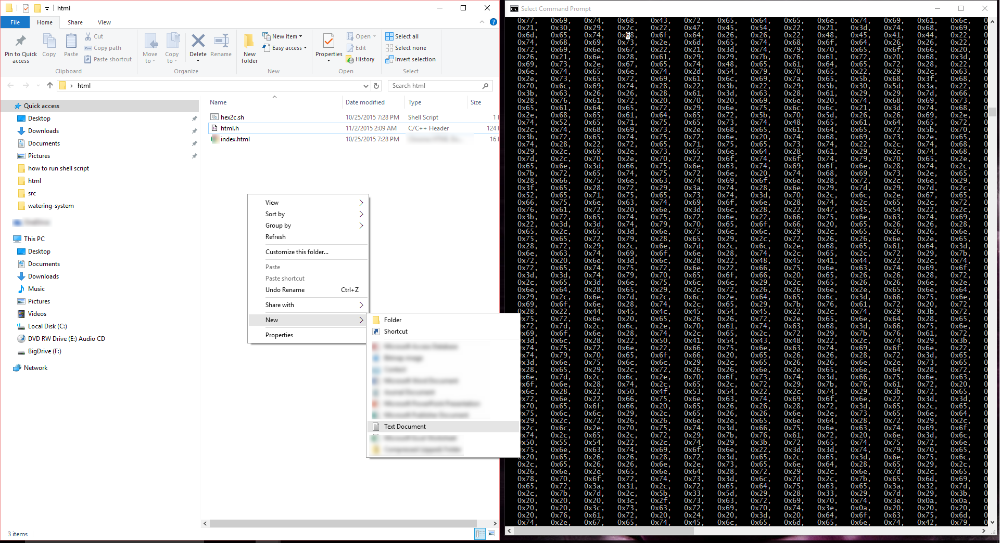