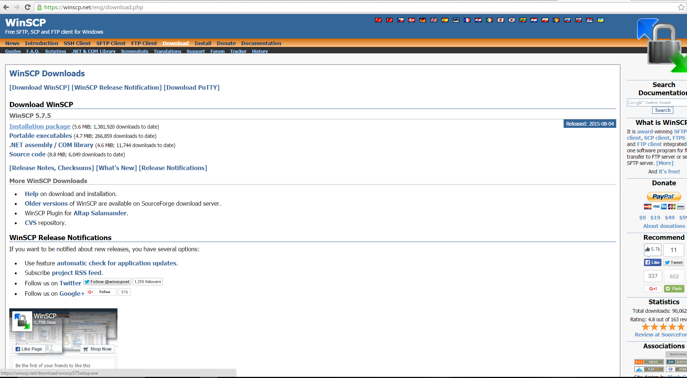
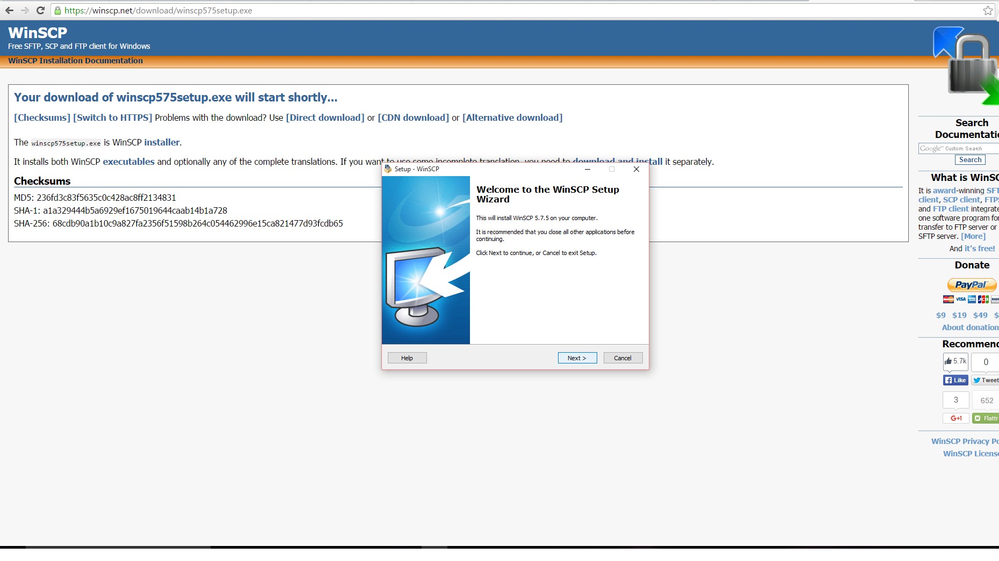
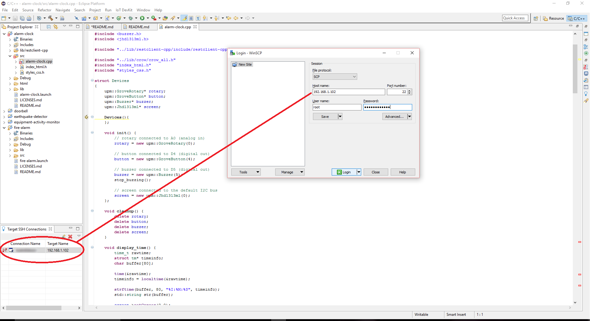
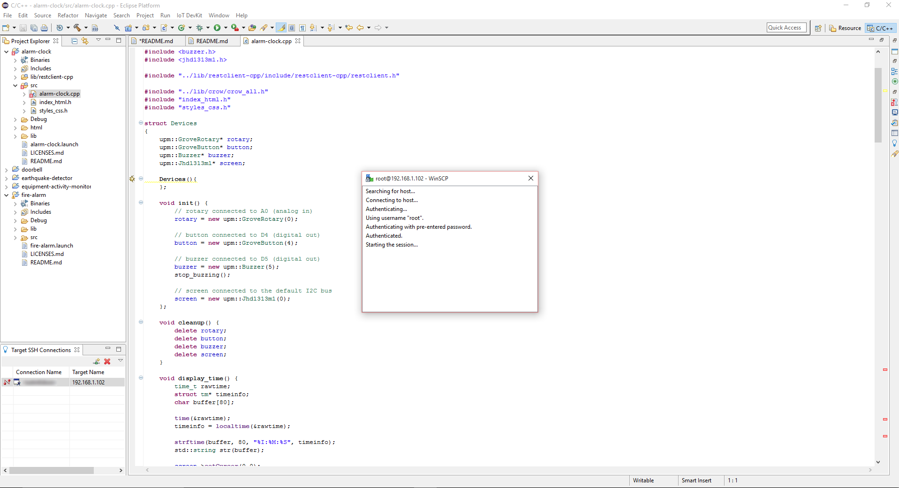
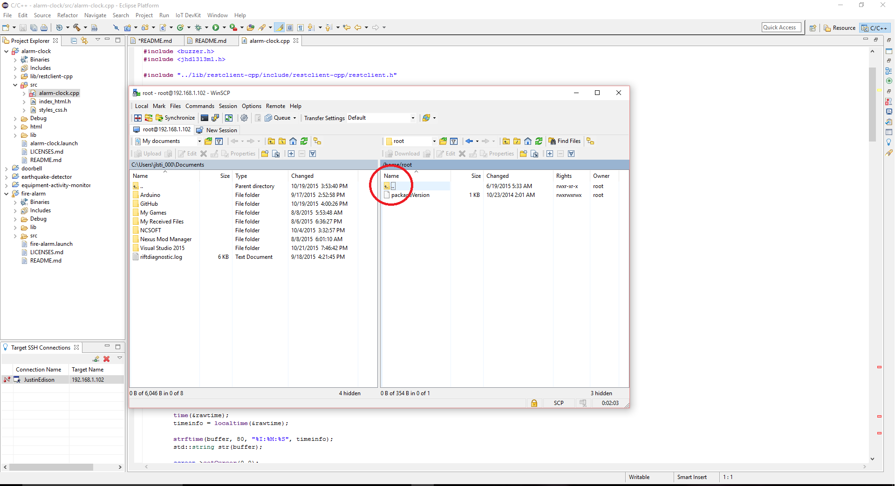

# Installing and Using WinSCP
(For windows users to copy linux libraries from the edison)

1. Go to https://winscp.net/eng/index.php

2. Click on downloads.

3. Click on the latest download.

4. follow the default setup when installing.

## Using Winscp

1. Under the "File Protocol" select SCP.

2. "Host Name" is your Edison ip address. "User Name" is root. Finally the "Password" is whatever you set it up as when you configured your Edison.

3. You will then come to a screen similar to the above image. 

4. On this page you will need to move up a few directories until you are in the /<root> directory.

5. Once you are in the correct directory then go to this directory from the root /usr/include/boost grab the folder and drag it to /Downloads/iotdk-ide-linux/devkit-x86/sysroots/i586-poky-linux/usr/include folder. (This file may not be in your downloads directory, in the example I have it on my desktop)

6. Once this process is finished you will need to move up in both directories to /usr/lib/ and grab all 36 files that start with "libboost*" respectively an move them to /Downloads/iotdk-ide-linux/devkit-x86/sysroots/i586-poky-linux/usr/lib.(This file may not be in your downloads directory, in the example I have it on my desktop)

7. Once finished you may close the WinSCP application.
