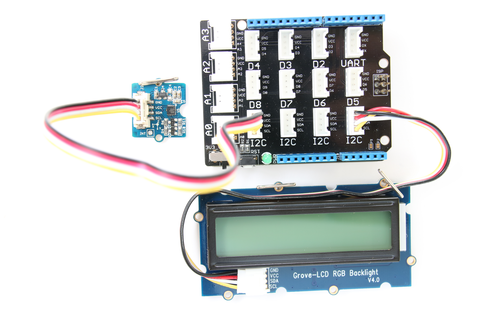
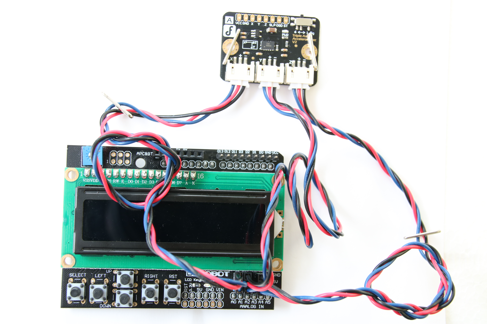

# Earthquake Detector

## Introduction

This earthquake detector application is part of a series of how-to Internet of Things (IoT) code sample exercises using the Intel® IoT Developer Kit and a compatible Intel-based platform, cloud platforms, APIs, and other technologies.

From this exercise, developers will learn how to: 

- Interface with and sensors using MRAA and UPM from the Intel® IoT Developer Kit, a complete hardware and software solution to help developers explore the IoT and implement innovative projects. 
- Invoke the services of the United States Geological Survey (USGS) API for accessing earthquake data.

Available in:  
   
   
   
  

## How it works

This earthquake detector constantly reads the 3-axis digital accelerometer looking for movement that could indicate an earthquake.

When it thinks it detects an earthquake, it attempts to verify with the USGS API that an earthquake actually occurred.

If so, it displays a warning on the LCD.

## First time setup  
For all the samples in this repository, see the  for requested boards and libraries.

## Hardware requirements

In addition to using a compatible platform listed in , here is additional hardware you will need to run this example.

This sample can be used with either Grove\* or DFRobot\* components.

Grove\* Starter Kit Plus, containing:

1. [Grove\* Base Shield V2](https://www.seeedstudio.com/Base-Shield-V2-p-1378.html)
2. [Grove\* 3-Axis Digital Accelerometer (1.5G)](http://iotdk.intel.com/docs/master/upm/node/classes/mma7660.html)
3. [Grove\* RGB LCD](http://iotdk.intel.com/docs/master/upm/node/classes/jhd1313m1.html)

DFRobot\* Starter Kit for Intel® Edison, containing:

1. [Triple Axis Accelerometer](http://www.dfrobot.com/index.php?route=product/product&description=true&product_id=507).
3. [LCD Keypad Shield](http://iotdk.intel.com/docs/master/upm/node/classes/sainsmartks.html)

### Connecting the Grove\* sensors

You need to have a Grove\* Shield connected to an Arduino\*-compatible breakout board to plug all the Grove\* devices into the Grove\* Shield. Make sure you have the tiny VCC switch on the Grove\* Shield set to **5V**.

Sensor | Pin
--- | ---
Grove\* 3-Axis Digital Accelerometer | I2C
Grove\* RGB LCD | I2C

### Connecting the DFRobot\* sensors

You need to have a LCD Keypad Shield connected to an Arduino\*-compatible breakout board to plug all the DFRobot\* devices into the LCD Keypad Shield.

Sensor | Pin
--- | ---
One end of a DFRobot\* cable into the plug labeled "X" on the Triple-Axis Accelerometer | A1
One end of a DFRobot\* cable into the plug labeled "Y" on the Triple-Axis Accelerometer | A2
One end of a DFRobot\* cable into the plug labeled "Z" on the Triple-Axis Accelerometer | A3

IMPORTANT NOTICE: This software is sample software. It is not designed or intended for use in any medical, life-saving or life-sustaining systems, transportation systems, nuclear systems, or for any other mission-critical application in which the failure of the system could lead to critical injury or death. The software may not be fully tested and may contain bugs or errors; it may not be intended or suitable for commercial release. No regulatory approvals for the software have been obtained, and therefore software may not be certified for use in certain countries or environments.
