# Earthquake detector in C++

## Introduction

This earthquake detector application is part of a series of how-to Intel® Internet of Things (IoT) code sample exercises using the Intel® IoT Developer Kit, Intel® Edison board, Intel® IoT Gateway, cloud platforms, APIs, and other technologies.

From this exercise, developers will learn how to:

- Connect the Intel® Edison board or Intel® IoT Gateway, computing platforms designed for prototyping and producing IoT and wearable computing products.
- Interface with the Intel® or Arduino 101\* (branded Genuino 101\* outside the U.S.) board  IO and sensor repository using MRAA and UPM from the Intel® IoT Developer Kit, a complete hardware and software solution to help developers explore the IoT and implement innovative projects.
- Run these code samples in the Intel® System Studio IoT Edition (Eclipse IDE for C/C++ and Java\* development) for creating applications that interact with sensors and actuators, enabling a quick start for developing software for the Intel® Edison board or the Intel® Galileo board.
- Invoke the services of the United States Geological Survey (USGS) API for accessing earthquake data.

## What it is

Using an Intel® Edison board or Intel® IoT Gateway, this project lets you create an earthquake detector that:

- senses motion using a digital accelerometer.
- checks live earthquake data, using the USGS API.
- displays an earthquake warning on the LCD.

## How it works

This earthquake detector constantly reads the 3-axis digital accelerometer looking for movement that could indicate an earthquake.

When it thinks it detects an earthquake it uses the USGS API to try and verify if an earthquake actually occurred.

If the detector believes an earthquake did occur, it issues a warning using the LCD.

## Hardware requirements

Grove\* Starter Kit containing:

1. Intel® Edison board with an Arduino\* breakout board
2. Grove Base Shield V2
3. [Grove 3-Axis Digital Accelerometer](http://iotdk.intel.com/docs/master/upm/node/classes/mma7660.html)
4. [Grove RGB LCD](http://iotdk.intel.com/docs/master/upm/node/classes/jhd1313m1.html)

DFRobot\* Starter Kit for Intel® Edison board, containing:

1. Intel® Edison board with an Arduino\* breakout board
2. [Triple Axis Accelerometer](http://www.dfrobot.com/index.php?route=product/product&description=true&product_id=507).
3. [LCD Keypad Shield](http://iotdk.intel.com/docs/master/upm/node/classes/sainsmartks.html)

## Software requirements

1. [Intel® System Studio (Eclipse IDE for C/C++ and Java* development)](https://software.intel.com/en-us/node/672439)

### How to set up

This sample is already one of the IoT examples included in Intel® System Studio. To start using it, follow these steps:

1. From the main menu, select **Intel® IoT > Import IoT Examples**. 
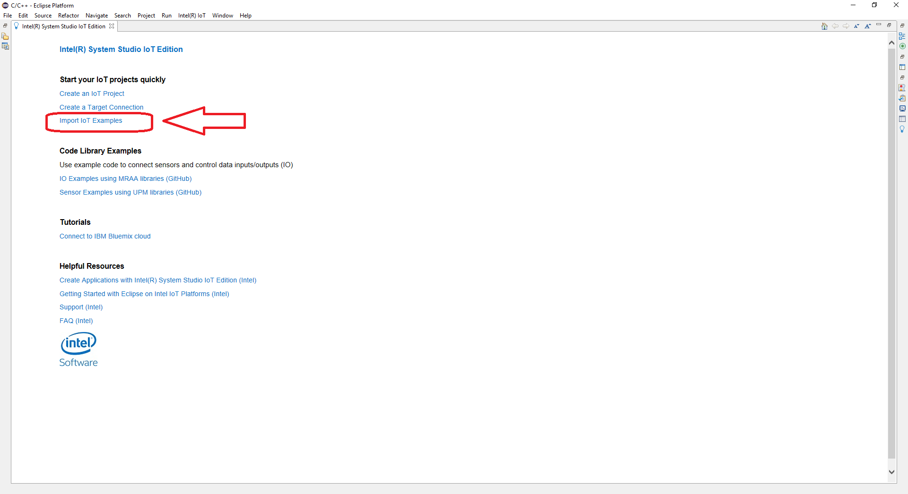
2. Expand the tree view for **C++ > How To Code Samples > Earthquake Detector** and click **Import Example**. 
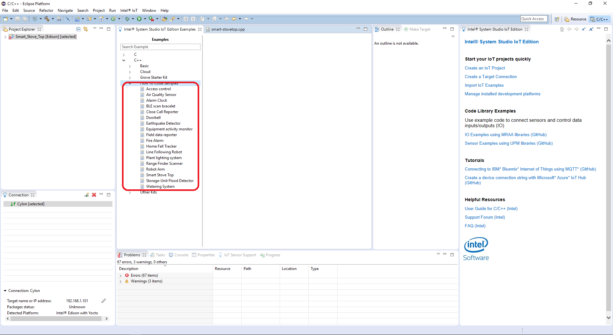
3. Select your developer board from the selection window then select **Next**. 
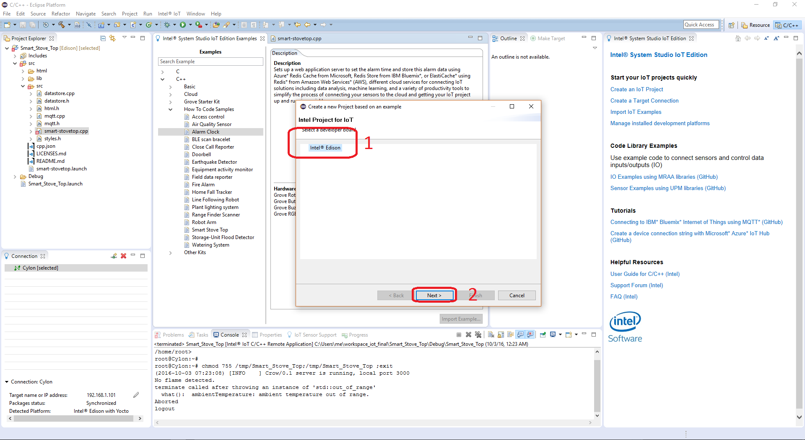
4. Select **Intel® IoT C/C++ project** from the Select a project type window then click **Next**. 
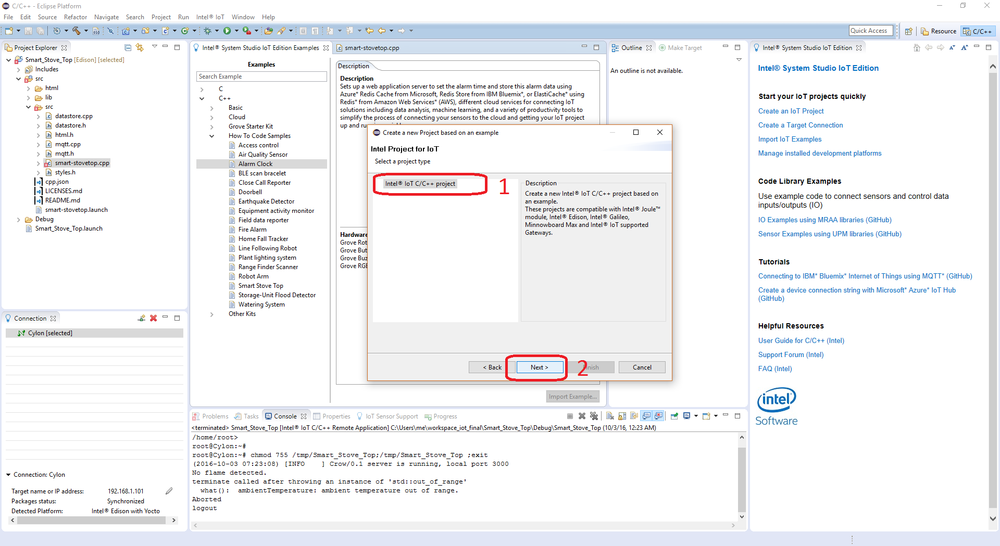
5. Select **Yocto** from the Selct target OS dropdown menu then click **Next**. 
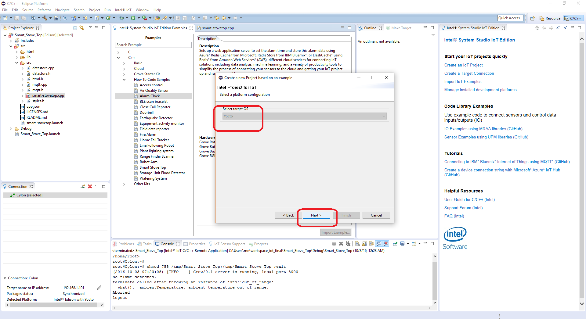
6. The next tab will ask for connection name and target name. If you do not know these click **Search Target**. 
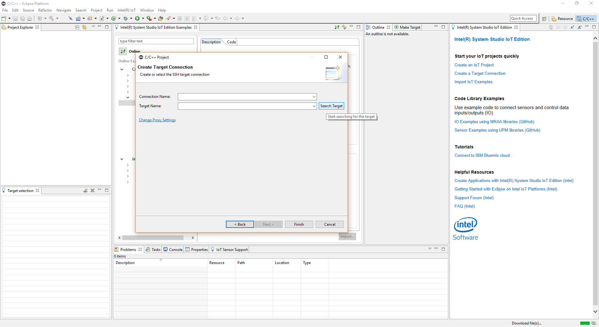
7. Select your Edison from the dropdown list. Select **OK**. 

8. Your connection name and target name should be filled in. Select **Finish**. 
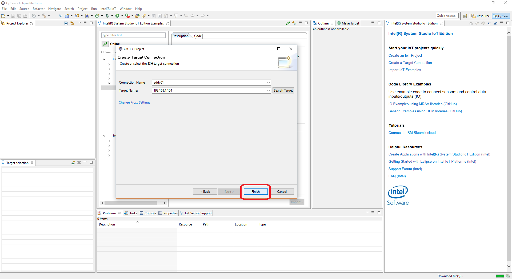
9. A new window will open for you and you will need to choose a name for your project and click **Next**. 
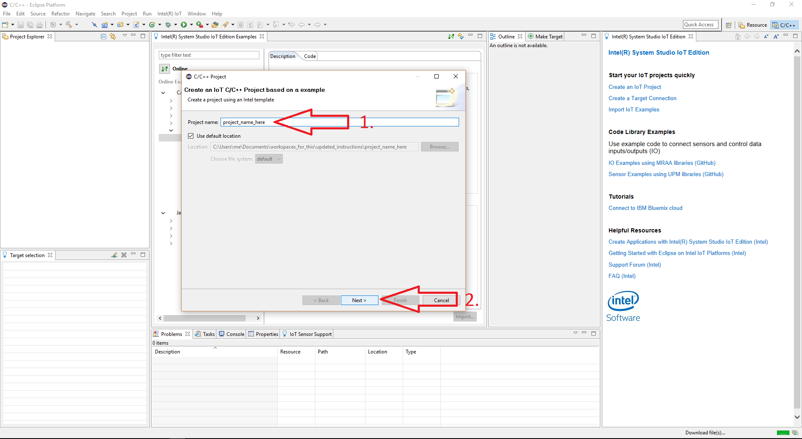
10. Your project source files will now be available on the on the upper left of your IDE by default. 
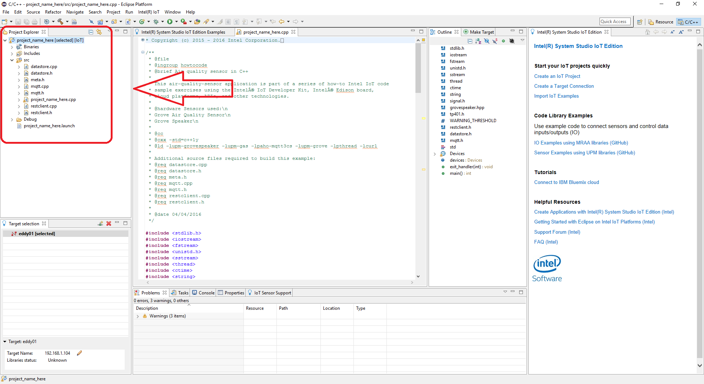

### Connecting the Grove\* sensors

You need to have the Grove\* Base Shield V2 connected to an Arduino\* compatible breakout board to plug all the Grove devices into the Grove Base Shield V2. Make sure you have the tiny VCC switch on the Grove Base Shield V2 set to **5V**.

1. Plug one end of a Grove cable into the Grove Accelerometer, and connect the other end to any of the I2C ports on the Grove Base Shield V2. 

2. Plug one end of a Grove cable into the Grove RGB LCD, and connect the other end to any of the I2C ports on the Grove Base Shield V2.

### Connecting the DFRobot\* sensors

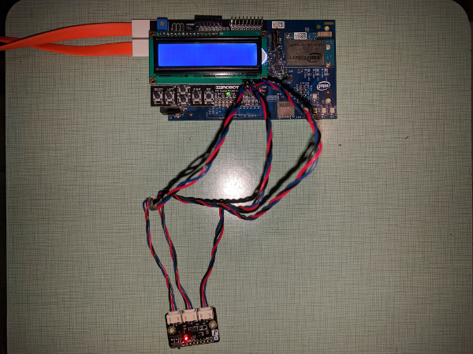

You need to have a LCD Keypad Shield connected to an Arduino\* compatible breakout board to plug all the DFRobot\* devices into the LCD Keypad Shield.

1. Plug one end of a DFRobot\* cable into the plug labeled "X" on the Triple-Axis Accelerometer, then connect the other end to the A1 port on the LCD Keypad Shield.

2. Plug one end of a DFRobot\* cable into the plug labeled "Y" on the Triple-Axis Accelerometer, then connect the other end to the A2 port on the LCD Keypad Shield.

3. Plug one end of a DFRobot\* cable into the plug labeled "Z" on the Triple-Axis Accelerometer, then connect the other end to the A3 port on the LCD Keypad Shield.

### Intel® Edison board setup

This example uses the **restclient-cpp** library to perform REST calls to the remote data server. The code can be found in the **lib** directory. The **restclient-cpp** library requires the **libcurl** package, which is already installed on the Intel® Edison board by default.

### Intel® IoT Gateway setup

You can run this example using an Intel® IoT Gateway connected to an Arduino 101\* (branded Genuino 101\* outside the U.S.).

Make sure your Intel® IoT Gateway is setup using Intel® IoT Gateway Software Suite, by following the directions on the web site here:

https://software.intel.com/en-us/getting-started-with-intel-iot-gateways-and-iotdk

The Arduino 101\* (branded Genuino 101\* outside the U.S.) needs to have the Firmata\* firmware installed. If you have IMRAA installed on your gateway, this will be done automatically. Otherwise, install the StandardFirmata or ConfigurableFirmata sketch manually onto your Arduino 101\* (branded Genuino 101\* outside the U.S.).

## Configuring the example for your hardware kit

To configure the example for the specific hardware kit that you are using, either Grove\* or DFRobot\*:

1. From the main menu, select **Project > Properties** dialog box is displayed.
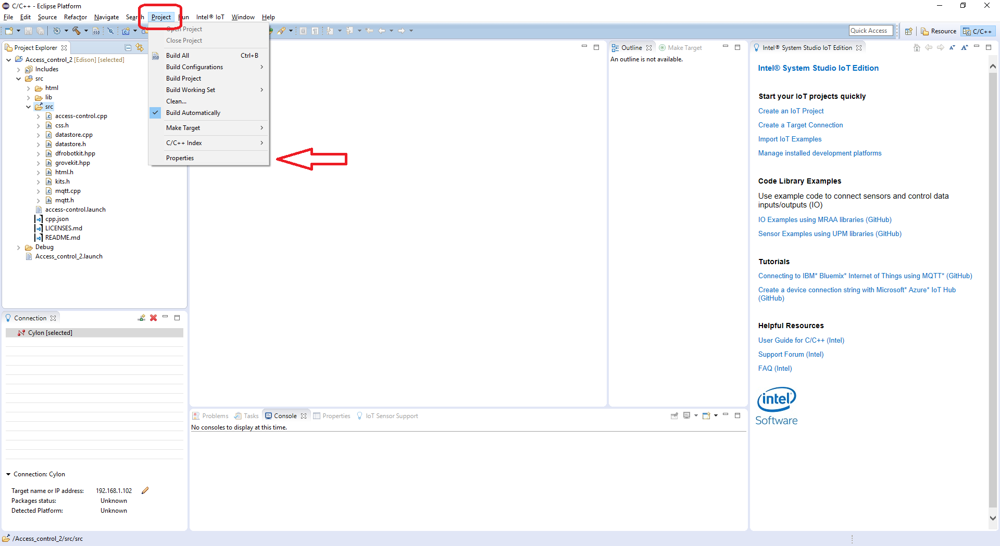
2. Expand the section **C/C++ General**.  Click on the **Paths and Symbols** sub-section, and click on the **Symbols** tab.
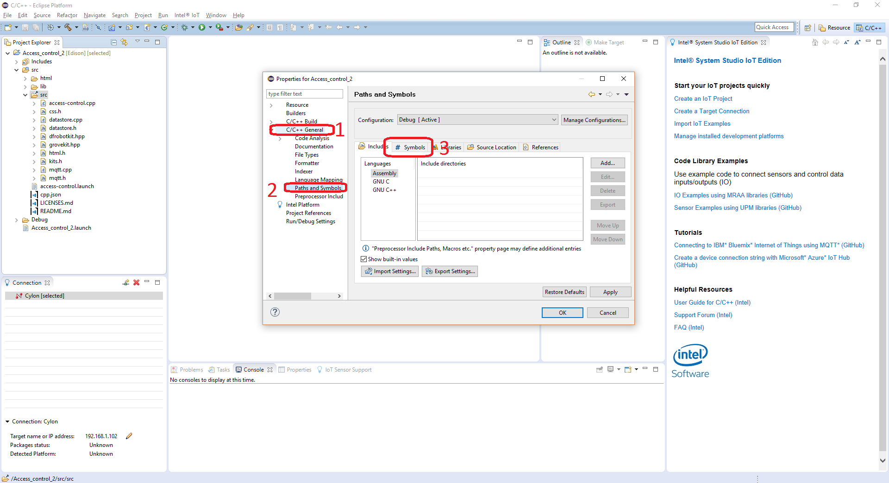
3. Now click on **GNU C++**, and click on the **Add** button.
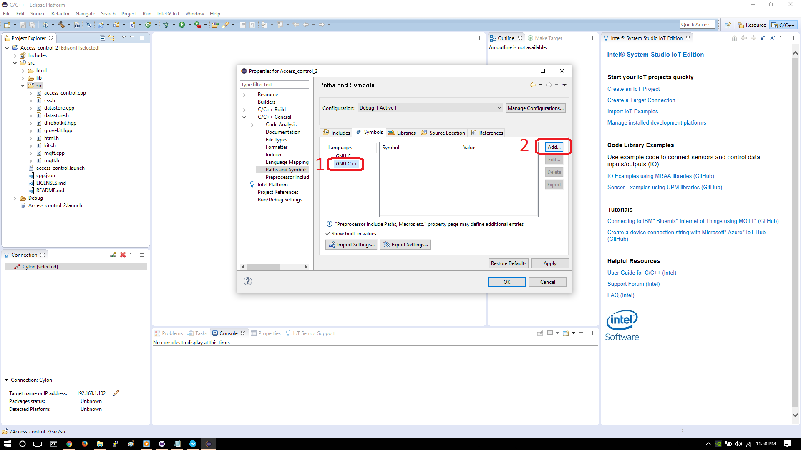
4. In the **Name** field, enter "INTEL_IOT_KIT". In the **Value** field, enter either "GROVEKIT" (this is the default) or "DFROBOTKIT", depending on which hardware kit you wish to use.
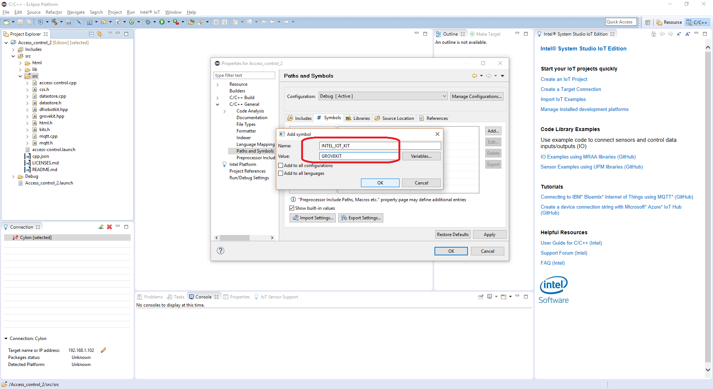
5. Your new name symbol and value will now be displayed. Click **OK**.
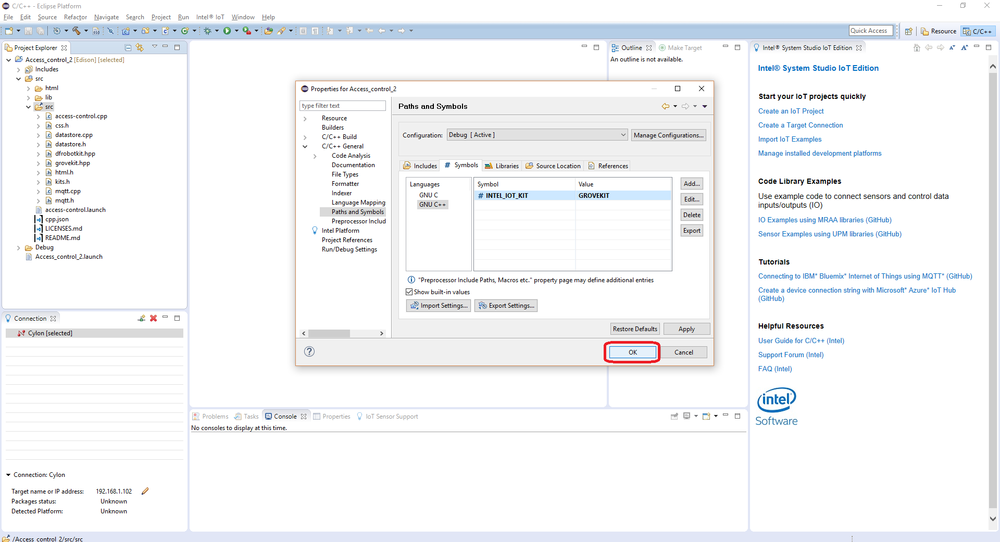
6. Another dialog box will appear asking to rebuild project. Click **OK**.
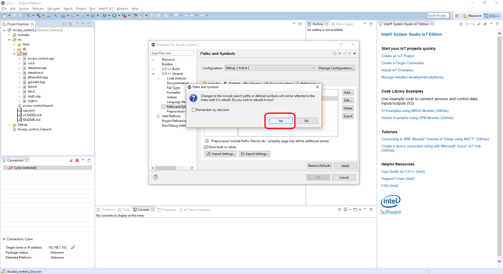

### Connecting your Intel® Edison board or Intel® IoT Gateway to Intel® System Studio

1. On the **Target SSH Connections** tab, right-click your device and select **Connect**. 
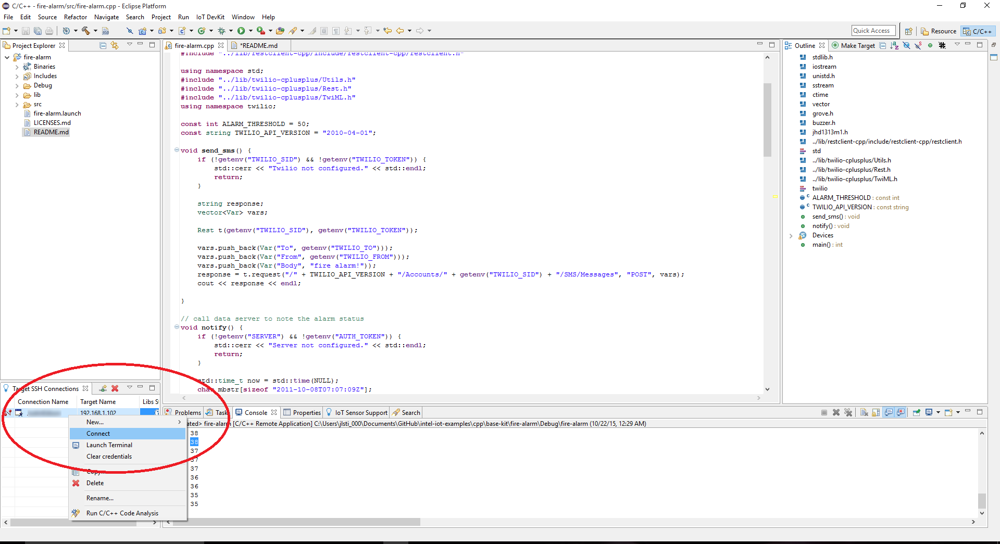

If prompted for the username and password, the username is **root** and the password is whatever you specified when configuring the Intel® Edison board or Intel® IoT Gateway.

### Running the code on the Intel® Edison board or Intel® IoT Gateway to Intel® System Studio

When you're ready to run the example, click **Run** at the top menu bar in Eclipse. 
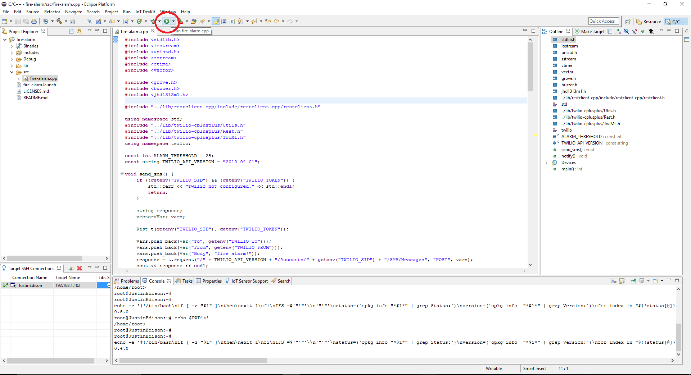

This compiles the program using the Cross G++ Compiler, links it using the Cross G++ Linker, transfers the binary to the Intel® Edison board or Intel® IoT Gateway, and then executes it on the board itself.

After running the program, you should see output similar to the one in the image below. 
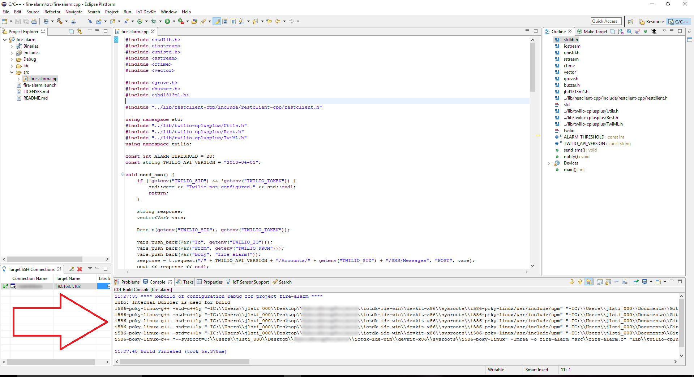

When the the program loads correctly, your Grove\* RGB LCD shows the `quakebot ready` message. 
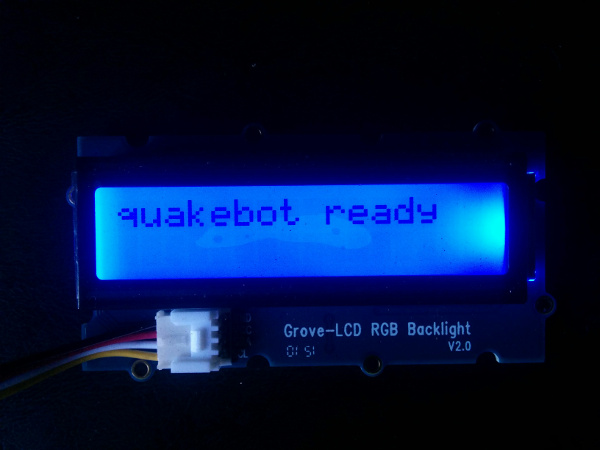

If you shake the accelerometer, the detector checks to see if there really was an earthquake.

IMPORTANT NOTICE: This software is sample software. It is not designed or intended for use in any medical, life-saving or life-sustaining systems, transportation systems, nuclear systems, or for any other mission-critical application in which the failure of the system could lead to critical injury or death. The software may not be fully tested and may contain bugs or errors; it may not be intended or suitable for commercial release. No regulatory approvals for the software have been obtained, and therefore software may not be certified for use in certain countries or environments.
