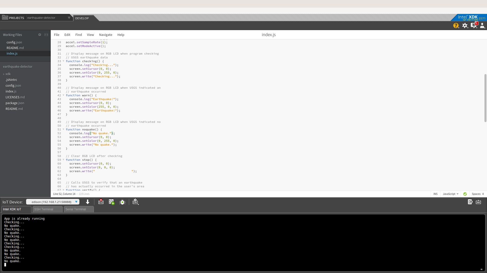

# Earthquake detector in JavaScript*

## Introduction

This earthquake detector application is part of a series of how-to Intel IoT code sample exercises using the Intel® IoT Developer Kit, Intel® Edison development platform, cloud platforms, APIs, and other technologies.

From this exercise, developers will learn how to:<br>
- Connect the Intel® Edison development platform, a computing platform designed for prototyping and producing IoT and wearable computing products.<br>
- Interface with the Intel® Edison platform IO and sensor repository using MRAA and UPM from the Intel® IoT Developer Kit, a complete hardware and software solution to help developers explore the IoT and implement innovative projects.<br>
- Run this code sample in Intel® XDK IoT Edition, an IDE for creating applications that interact with sensors and actuators, enabling a quick start for developing software for the Intel® Edison or Intel® Galileo board.<br>
- Invoke the services of the United States Geological Survey* (USGS*) API for accessing earthquake data.

## What it is

Using an Intel® Edison board, this project lets you create an earthquake detector that:<br>
- senses motion using the digital accelerometer;<br>
- checks live earthquake data, using the USGS* API;<br>
- displays the earthquake on the LCD.

## How it works

This earthquake detector constantly reads the 3-axis digital accelerometer looking for movement that could indicate an earthquake.

When it thinks it detects an earthquake, it attempts to verify with the USGS* API that an earthquake actually occurred.

If so, it displays a warning on the LCD.

## Hardware requirements

Grove* Starter Kit Plus containing:

1. Intel® Edison with an Arduino* breakout board
2. [Grove* 3-Axis Digital Accelerometer](http://iotdk.intel.com/docs/master/upm/node/classes/mma7660.html)
3. [Grove* RGB LCD](http://iotdk.intel.com/docs/master/upm/node/classes/jhd1313m1.html)

## Software requirements

1. Intel® XDK IoT Edition

### How to set up

To begin, clone the **How-To Intel IoT Code Samples** repository with Git* on your computer as follows:

    $ git clone https://github.com/intel-iot-devkit/how-to-code-samples.git

Want to download a .zip file? In your web browser, go to <a href="https://github.com/intel-iot-devkit/how-to-code-samples">https://github.com/intel-iot-devkit/how-to-code-samples</a> and click the **Download ZIP** button at the lower right. Once the .zip file is downloaded, uncompress it, and then use the files in the directory for this example.

## Adding the program to Intel® XDK IoT Edition

In Intel® XDK IoT Edition, select **Import Your Node.js Project**:


On the **New Project** screen, click on the folder icon:


Then, navigate to the directory where the example project exists, and select it:


Choose a name for the project, then click on the **Create** button. Then click on the **Continue** button to finish creating your project:


You need to connect to your Intel® Edison board from your computer to send code to it.


Click the **IoT Device** menu at the bottom left. If your Intel® Edison is automatically recognized, select it.


Otherwise, select **Add Manual Connection**.
In the **Address** field, type `192.168.2.15`. In the **Port** field, type `58888`.
Click **Connect** to save your connection.

### Installing the program manually on Intel® Edison

Alternatively, you can set up the code manually on the Intel® Edison board.

Clone the **How-To Intel IoT Code Samples** repository to your Intel® Edison board after you establish an SSH connection to it, as follows:

    $ git clone https://github.com/intel-iot-devkit/how-to-code-samples.git

Then, navigate to the directory with this example.

To install Git* on Intel® Edison, if you don’t have it yet, establish an SSH connection to the board and run the following command:

    $ opkg install git

### Connecting the Grove* sensors


You need to have a Grove* Shield connected to an Arduino\*-compatible breakout board to plug all the Grove* devices into the Grove* Shield. Make sure you have the tiny VCC switch on the Grove* Shield set to **5V**.

1. Plug one end of a Grove* cable into the Grove* 3-Axis Digital Accelerometer, and connect the other end to any of the I2C ports on the Grove* Shield.

2. Plug one end of a Grove* cable into the Grove* RGB LCD, and connect the other end to any of the I2C ports on the Grove* Shield.

### Manual Intel® Edison setup

If you're running this code on your Intel® Edison manually, you need to install some dependencies.

To obtain the Node.js* modules needed for this example to execute on Intel® Edison, run the following command:

```
npm install
```

## Configuring the example

To configure the example to check for earthquakes in your area, change the `LATITUDE` key in the `config.json` file as follows:

```
{
  "LATITUDE": "47.641944",
  "LONGITUDE": "-122.127222"
}
```

## Running the program using Intel® XDK IoT Edition

When you're ready to run the example, make sure you saved all the files.


Click the **Upload** icon to upload the files to the Intel® Edison board.


Click the **Run** icon at the bottom of Intel® XDK IoT Edition. This runs the code on Intel® Edison.


If you made changes to the code, click **Upload and Run**. This runs the latest code with your changes on Intel® Edison.



You will see output similar to the above when the program is running.

## Running the program manually

To run the example manually on Intel® Edison, establish an SSH connection to the board and execute the following command:

    node index.js

### Determining the Intel® Edison IP address

You can determine what IP address Intel® Edison is connected to by running the following command:

    ip addr show | grep wlan

You will see the output similar to the following:

    3: wlan0: <BROADCAST,MULTICAST,UP,LOWER_UP> mtu 1500 qdisc pfifo_fast qlen 1000
        inet 192.168.1.13/24 brd 192.168.1.255 scope global wlan0

The IP address is shown next to `inet`. In the example above, the IP address is `192.168.1.13`.

## IMPORTANT NOTICE

This software is sample software. It is not designed or intended for use in any medical, life-saving or life-sustaining systems, transportation systems, nuclear systems, or for any other mission-critical application in which the failure of the system could lead to critical injury or death. The software may not be fully tested and may contain bugs or errors; it may not be intended or suitable for commercial release. No regulatory approvals for the software have been obtained, and therefore software may not be certified for use in certain countries or environments.
