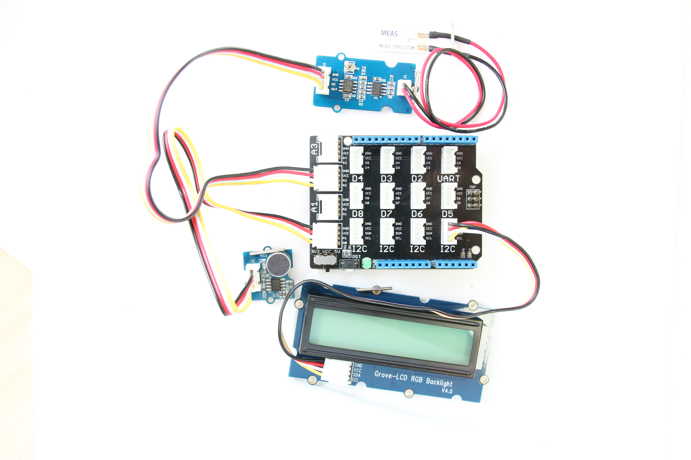

# Equipment activity monitor in Java*

## What it is

Using an Intel® Edison board, this project lets you create a shop-floor equipment activity monitor that:<br>
- tracks equipment usage by monitoring sound and vibration sensors.<br>
- issues a visual notification whenever the equipment is in use.<br>
- logs equipment usage using cloud-based data storage.

## Hardware requirements

### Grove\*



Sensor | Pin
--- | ---
Grove Sound Sensor | A0
Grove Piezo Vibration Sensor | A2
Grove RGB LCD | I2C

More details on the hardware requirements can be found in the 

## Software requirements

1. 
2.  and  
3. Microsoft Azure\*, IBM Bluemix\*, or AWS account (optional)

## Configuring the example
### Clone the repo
Clone the How-To Code Samples repository with Git* on your computer as follows:

$ git clone https://github.com/intel-iot-devkit/how-to-code-samples.git
To download a .zip file, in your web browser go to https://github.com/intel-iot-devkit/how-to-code-samples and click the Download ZIP button at the lower right. Once the .zip file is downloaded, uncompress it, and then use the files in the directory for this example.

### Set up the source files
You now need to copy the source files and the config file to the project.
Drag all of the files from your git repository's "src" folder into the new project's src folder in Intel® System Studio. Make sure previously auto-generated main class is overridden.

The project uses the following external jars: [gson-2.6.1](http://central.maven.org/maven2/com/google/code/gson/gson/2.6.1/gson-2.6.1.jar). These can be found in the Maven Central Repository. Create a "jars" folder in the project's root directory, and copy all needed jars in this folder.
In Intel® System Studio, select all jar files in "jars" folder and  right click -> Build path -> Add to build path

Now you need to add the UPM jar files relevant to this specific sample.
Right-click on the project's root -> Build path -> Configure build path. Java Build Path -> 'Libraries' tab -> click on "add external JARs..."

For this sample you will need the following jars:

1. upm_i2clcd.jar
2. upm_ldt0028.jar
3. upm_mic.jar

The jars can be found at the IOT Devkit installation root path\iss-iot-win\devkit-x86\sysroots\i586-poky-linux\usr\lib\java

## Preparing your target platform before running the project

In order for the sample to run you will need to copy some files to your board. This can be done using SCP through SSH.<br>
Two sorts of files need to be copied from the sample repository:

1. Jar files- external libraries in the project need to be copied to "/usr/lib/java"

## Data store server setup (optional)

To configure the example for the optional data store, change the `SERVER` and `AUTH_TOKEN` keys in the `config.properties` file to the server URL and authentication token that correspond to your own data store server setup. For example:

```
  SERVER=http://mySite.azurewebsites.net/logger/close-call-reporter
  AUTH_TOKEN=myPassword

```
To control sensor thresholds change the "VIBRATION_THRESHOLD" and "NOISE_THRESHOLD" keys in the configuration


IMPORTANT NOTICE: This software is sample software. It is not designed or intended for use in any medical, life-saving or life-sustaining systems, transportation systems, nuclear systems, or for any other mission-critical application in which the failure of the system could lead to critical injury or death. The software may not be fully tested and may contain bugs or errors; it may not be intended or suitable for commercial release. No regulatory approvals for the software have been obtained, and therefore software may not be certified for use in certain countries or environments.
