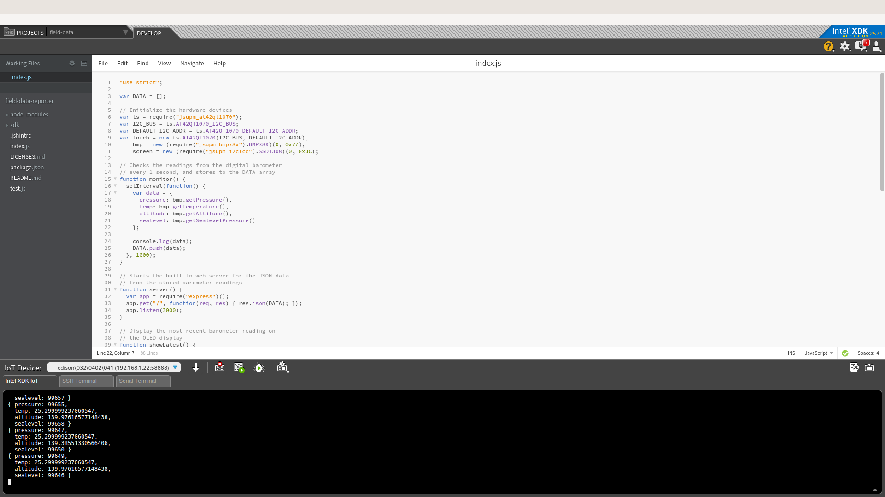

# Field data reporter

## Introduction

This wrist field data reporter application is part of a series of how-to Intel IoT code sample exercises using the Intel® IoT Developer Kit, Intel® Edison development platform, cloud platforms, APIs, and other technologies.

From this exercise, developers will learn how to:<br>
- Connect the Intel® Edison development platform, a computing platform designed for prototyping and producing IoT and wearable computing products.<br>
- Interface with the Intel® Edison platform IO and sensor repository using MRAA and UPM from the Intel® IoT Developer Kit, a complete hardware and software solution to help developers explore the IoT and implement innovative projects.<br>
- Run this code sample in Intel® XDK IoT Edition, an IDE for creating applications that interact with sensors and actuators, enabling a quick start for developing software for the Intel® Edison or Intel® Galileo board.<br>
- Set up a web application server to view data using a web page served directly from Intel® Edison.

## What it is

Using an Intel® Edison board, this project lets you create a wrist field data reporter that:<br>
- continuously monitors the data read from the digital barometer;<br>
- displays the latest reading using the OLED display when the touch sensor is tapped;<br>
- serves the recorded data in the JSON format directly from Intel® Edison.

## How it works

This wrist field data reporter can be used to sample barometer data at regular intervals.

It also provides a way to look at the latest data captured, using the QTouch* sensor and the OLED display.

These readings can be viewed or downloaded as JSON data served directly from an embedded web server running on Intel® Edison.

## Hardware requirements

Xadow* Starter Kit containing:

1. Intel® Edison with a Xadow* expansion board
2. [Xadow* - OLED Display](http://iotdk.intel.com/docs/master/upm/node/classes/ssd1308.html)
3. [Xadow* - QTouch Sensor](http://iotdk.intel.com/docs/master/upm/node/classes/at42qt1070.html)
4. [Xadow* - Atmospheric Pressure Sensor](http://iotdk.intel.com/docs/master/upm/node/classes/bmpx8x.html)

## Software requirements

1. Intel® XDK IoT Edition

### How to set up

To begin, clone the **How-To Intel IoT Code Samples** repository with Git* on your computer as follows:

    $ git clone https://github.com/intel-iot-devkit/how-to-code-samples.git

Want to download a .zip file? In your web browser, go to <a href="https://github.com/intel-iot-devkit/how-to-code-samples">https://github.com/intel-iot-devkit/how-to-code-samples</a> and click the **Download ZIP** button at the lower right. Once the .zip file is downloaded, uncompress it, and then use the files in the directory for this example.

## Adding the program to Intel® XDK IoT Edition

In Intel® XDK IoT Edition, select **Import Your Node.js Project**:


Then, navigate to the directory where the example project exists, and select it:


You need to connect to your Intel® Edison board from your computer to send code to it.


Click the **IoT Device** menu at the bottom left. If your Intel® Edison is automatically recognized, select it.


Otherwise, select **Add Manual Connection**.
In the **Address** field, type `192.168.2.15`. In the **Port** field, type `58888`.
Click **Connect** to save your connection.

### Installing the program manually on Intel® Edison

Alternatively, you can set up the code manually on the Intel® Edison board.

Clone the **How-To Intel IoT Code Samples** repository to your Intel® Edison board after you establish an SSH connection to it, as follows:

    $ git clone https://github.com/intel-iot-devkit/how-to-code-samples.git

Then, navigate to the directory with this example.

To install Git* on Intel® Edison, if you don’t have it yet, establish an SSH connection to the board and run the following command:

    $ opkg install git

### Connecting the Xadow* sensors


You need to have a Xadow* expansion board connected to Intel® Edison to plug in all the Xadow* devices.

1. Plug one end of a Xadow* connector into the Xadow* - OLED Display, and connect the other end to one of the side connectors on the Xadow* expansion board.

2. Plug one end of a Xadow* connector into the Xadow* - Atmospheric Pressure Sensor, and connect the other end to one of the side connectors on the Xadow* expansion board.

3. Plug one end of a Xadow* connector into the Xadow - QTouch* Sensor, and connect the other end to one of the other two connected devices.

### Manual Intel® Edison setup

If you're running this code on your Intel® Edison manually, you need to install some dependencies.

To obtain the Node.js* modules needed for this example to execute on Intel® Edison, run the following command:

```
npm install
```

## Running the program using Intel® XDK IoT Edition

When you're ready to run the example, make sure you saved all the files.


Click the **Upload** icon to upload the files to the Intel® Edison board.


Click the **Run** icon at the bottom of Intel® XDK IoT Edition. This runs the code on Intel® Edison.


If you made changes to the code, click **Upload and Run**. This runs the latest code with your changes on Intel® Edison.



You will see output similar to the above when the program is running.

## Running the program manually

To run the example manually on Intel® Edison, establish an SSH connection to the board and execute the following command:

    node index.js

### Data access via browser


The data collected can be downloaded as JSON directly via a web page served by the program running on Intel® Edison.

The web server runs on port `3000`, so if Intel® Edison is connected to Wi-Fi* on `192.168.1.13`, the address to browse to if you are on the same network is `http://192.168.1.13:3000`.

### Access point setup

For information on how to set up Intel® Edison to serve as a WiFi* access point, see [Intel's documentation on the matter](https://software.intel.com/en-us/getting-started-with-ap-mode-for-intel-edison-board).

### Determining the Intel® Edison IP address

You can determine what IP address Intel® Edison is connected to by running the following command:

    ip addr show | grep wlan

You will see the output similar to the following:

    3: wlan0: <BROADCAST,MULTICAST,UP,LOWER_UP> mtu 1500 qdisc pfifo_fast qlen 1000
        inet 192.168.1.13/24 brd 192.168.1.255 scope global wlan0

The IP address is shown next to `inet`. In the example above, the IP address is `192.168.1.13`.
