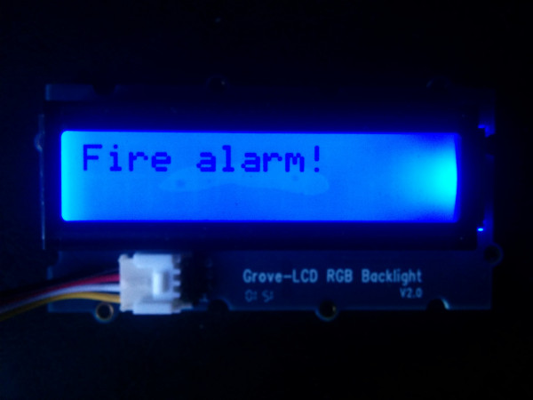

# Fire alarm in C++

## What it is

Using a compatible Intel-based platform, this project lets you create a smart fire alarm that:

- constantly monitors for unsafe temperature levels.
- audibly notifies of alerts using the buzzer.
- visually notifies of alerts using the LCD.
- keeps track of fire alarm data, using cloud-based storage.
- sends text messages to alert others of a possible fire.

## First time setup
For all the samples in this repository, see the  for required boards and libraries.  You need either Grove\* or DFRobot\* sensors but not both.

## Hardware requirements

### Grove\*


Sensor | Pin
--- | ---
Grove\* Temperature Sensor | A0
Grove\* Buzzer | D5
Grove\* RGB LCD | I2C

### DFRobot\* 


Sensor | Pin
--- | ---
Analog Temperature Sensor | A3
Buzzer | A2

For more specific information on the hardware requirements see 

## Software requirements

1.  and 
2. Intel® System Studio  
3. Microsoft Azure\*, IBM Bluemix\*, AT&T M2X\*, AWS\*, Predix\*, or SAP\* account (optional)
4. Twilio\* account

Note: The following libraries are included with the repo and already linked to in the code -jsoncpp -restclient

### Twilio\* API Key (optional)

To optionally send text messages, you need to register for an account and get an API key from the Twilio\* web site:

[https://www.twilio.com](https://www.twilio.com)

You cannot send text messages without obtaining a Twilio API key first. You can still run the example, but without SMS alerts.

## Configuring the example for your hardware kit

To configure the example for the specific hardware kit that you are using, either Grove\* or DFRobot\*:

1. From the main menu, select **Project > Properties** dialog box is displayed.

2. Expand the section **C/C++ General**. <br>Click on the **Paths and Symbols** sub-section, and click on the **Symbols** tab.

3. Now click on **GNU C++**, and click on the **Add** button.

4. In the **Name** field, enter "INTEL_IOT_KIT". In the **Value** field, enter either "GROVEKIT" (this is the default) or "DFROBOTKIT", depending on which hardware kit you wish to use.

5. Your new name symbol and value will now be displayed. Click **OK**.

6. Another dialog box will appear asking to rebuild project. Click **OK**.


You will see output similar to below when the program is running.

```
[Upload Complete] fire alarm 
Connecting to MQTT server... 
MQTT message published: { d: { value: 'fire alarm', datetime: '2016-04-22T03:17:28.279Z' } } 
SMS sent { sid: 'SMdd79f27e8e184ee891225854888ef009', 
date_created: 'Fri, 22 Apr 2016 03:17:29 +0000', 
```

When the program is uploaded to the board, the program starts to continuously monitor the temperature. If it exceeds the threshold, the `Fire Alarm!` message is displayed on the LCD.<br>


When the temperature sensor is heated, another output message is displayed in the Intel® System Studio console, this means you sent your SMS alert successfully.<br>

Refer to  for details on the functionality.

## Running the example with the cloud server (optional)

To run the example with the optional backend data store, you need to set the `SERVER` and `AUTH_TOKEN` environment variables. You can do this in Intel® System Studio as follows:

1. From the **Run** menu, select **Run Configurations**.<br> The **Run Configurations** dialog box is displayed.
2. Under **C/C++ Remote Application**, click **doorbell**.<br> This displays the information for the application.
3. In the **Commands to execute before application** field, add the following environment variables, except use the server and authentication token that correspond to your own setup:

        chmod 755 /tmp/fire-alarm; export SERVER="http://intel-iot-example-data.azurewebsites.net/logger/fire-alarm"; export AUTH_TOKEN="Enter Auth Token Here"; export TWILIO_SID="Enter Twilio SID Here"; export TWILIO_TOKEN="Enter Twilio Token Here"; export TWILIO_TO="Enter Number to Send to here Formattted 555-555-5555"; export TWILIO_FROM="Enter Number to be Sent From Here Formated 555-555-5555"

4. Click **Apply** to save your new environment variables.

Now when you run your program using the **Run** button, it should be able to call your server to save the data right from your board.

IMPORTANT NOTICE: This software is sample software. It is not designed or intended for use in any medical, life-saving or life-sustaining systems, transportation systems, nuclear systems, or for any other mission-critical application in which the failure of the system could lead to critical injury or death. The software may not be fully tested and may contain bugs or errors; it may not be intended or suitable for commercial release. No regulatory approvals for the software have been obtained, and therefore software may not be certified for use in certain countries or environments.
