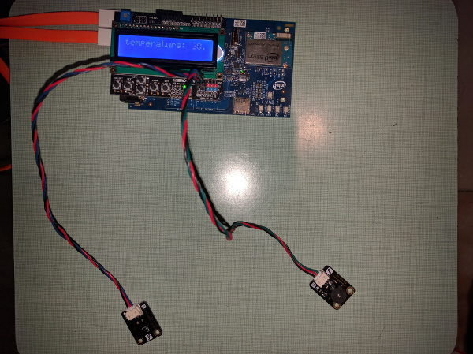

# Fire Alarm in Python*

## Introduction

This smart fire alarm application is part of a series of how-to Internet of Things (IoT) code sample exercises using the Intel® IoT Developer Kit, Intel® Edison board, Intel® IoT Gateway, cloud platforms, APIs, and other technologies.

From this exercise, developers will learn how to:<br>

- Connect the Intel® Edison board or Intel® IoT Gateway, computing platforms designed for prototyping and producing IoT and wearable computing products.<br>
- Interface with the Intel® Edison board or Arduino 101\* (branded Genuino 101\* outside the U.S.) IO and sensor repository using MRAA and UPM from the Intel® IoT Developer Kit, a complete hardware and software solution to help developers explore the IoT and implement innovative projects.<br>
- Store this alarm data using Azure Redis Cache\* from Microsoft Azure\*, Redis Store\* from IBM Bluemix\*, or ElastiCache\* using Redis\* from Amazon Web Services (AWS)\*, different cloud services for connecting IoT solutions including data analysis, machine learning, and a variety of productivity tools to simplify the process of connecting your sensors to the cloud and getting your IoT project up and running quickly.
- Set up a server using IoT Hub from Microsoft\* Azure\*, IoT from IBM\* Bluemix\*, IoT from Amazon Web Services\* (AWS), or AT&T\* M2X\* IoT, each different cloud-based machine to machine messaging services based on the industry standard MQTT protocol.
- Invoke the services of the Twilio\* API for sending text messages.

## What it is

Using an Intel® Edison board or Intel® IoT Gateway, this project lets you create a smart fire alarm that:<br>
- constantly monitors for unsafe temperature levels.<br>
- issues an audible notification using the buzzer.<br>
- issues a visual notification using the LCD.<br>
- keeps track of fire events, using cloud-based data storage.<br>
- sends text messages to alert others of a possible fire.

## How it works

This smart fire alarm monitors the ambient temperature using the connected temperature sensor.

If the temperature exceeds a certain threshold (set to 28 degrees Celsius in this example), it sounds an alarm through the buzzer and displays an alert on the LCD.

In addition, it can send a text message to a specified number through Twilio\*, warning the recipient of a possible fire danger.

Optionally, data can be stored using the Intel® IoT Examples data store or an MQTT server running in your own Microsoft\* Azure\*, IBM\* Bluemix\*, AT&T\* M2X\*, or AWS account.

## Hardware requirements

This sample can be used with either the Grove\* Starter Kit Plus from Seeed Studio\*, or else the Starter Kit for Intel® Edison/Galileo from DFRobot\*.

Grove\* Starter Kit Plus, containing:

1. Intel® Edison with an Arduino\* breakout board or Intel® IoT Gateway with Arduino 101
2. [Grove\* Temperature Sensor](http://iotdk.intel.com/docs/master/upm/node/classes/grovetemp.html)
3. [Grove\* Buzzer](http://iotdk.intel.com/docs/master/upm/node/classes/buzzer.html)
4. [Grove\* RGB LCD](http://iotdk.intel.com/docs/master/upm/node/classes/jhd1313m1.html)

Starter Kit for Intel® Edison/Galileo from DFRobot\*, containing:

1. Intel® Edison with an Arduino\* breakout board or Intel® IoT Gateway with Arduino 101
2. [Analog Temperature Sensor](http://iotdk.intel.com/docs/master/upm/node/classes/grovetemp.html)
3. [Buzzer](http://iotdk.intel.com/docs/master/upm/node/classes/buzzer.html)
4. [LCD Keypad Shield](http://iotdk.intel.com/docs/master/upm/node/classes/sainsmartks.html)

## Software requirements

1. Microsoft\* Azure\*, IBM\* Bluemix\*, AT&T\* M2X\*, or AWS\* account (optional)
2. Twilio\* account (optional)

### Connecting the Grove\* sensors


You need to have a Grove\* Shield connected to an Arduino-compatible breakout board to plug all the Grove devices into the Grove Shield. Make sure you have the tiny VCC switch on the Grove Shield set to **5V**.

1. Plug one end of a Grove\* cable into the Grove\* Temperature Sensor, and connect the other end to the A0 port on the Grove\* Shield.

2. Plug one end of a Grove\* cable into the Grove\* Buzzer, and connect the other end to the D5 port on the Grove\* Shield.

3. Plug one end of a Grove\* cable into the Grove\* RGB LCD, and connect the other end to any of the I2C\* ports on the Grove\* Shield.

### Connecting the DFRobot\* sensors



You need to have a LCD Keypad Shield connected to an Arduino-compatible breakout board to plug all the DFRobot\* devices into the LCD Keypad Shield.

1. Plug one end of a DFRobot\* cable into the Analog Temperature Sensor, and connect the other end to the A2 port on the LCD Keypad Shield.

2. Plug one end of a DFRobot\* cable into the Buzzer, and connect the other end to the A1 port on the LCD Keypad Shield.

### Intel® Edison board setup

If you're running this code on your Intel® Edison board, you need to install some dependencies by establishing an SSH session to the Edison and run the commands in the sections below.

#### Update the opkg repository

To add the Intel opkg repository:

    $ echo "src mraa-upm http://iotdk.intel.com/repos/3.5/intelgalactic/opkg/i586" > /etc/opkg/mraa-upm.conf
    $ opkg update

You'll only need to perform this step once.

#### Git

To install Git\* on the Intel® Edison board (if you don’t have it yet):

    $ opkg update
    $ opkg install git

#### MRAA and UPM Dependencies

To install the latest versions of the MRAA\* and UPM\* libraries:

    $ opkg update
    $ opkg install mraa
    $ opkg install upm

#### Python Package Manager (pip)

To install the Python\* package manager needed to install and run the example:

    $ pip install --upgrade pip setuptools


#### Install the example

Once all dependencies are installed you can install the example itself with the following command:

    $ pip install --src ~/python/examples/ -e "git+https://github.com/intel-iot-devkit/how-to-code-samples.git#egg=iot_fire_alarm&subdirectory=fire-alarm/python"

The `pip` command will install required Python dependencies, save the source code for the example in `~/python/examples/iot_fire_alarm/` and link the package to the global Python `site-packages` folder.

### Intel® IoT Gateway setup

You can run this example using an Intel® IoT Gateway connected to an Arduino 101\*(branded Genuino 101\* outside the U.S.).

Make sure your Intel® IoT Gateway is setup using Intel® IoT Gateway Software Suite, by following the directions on the web site here:

https://software.intel.com/en-us/getting-started-with-intel-iot-gateways-and-iotdk

To install and run the example, you will need to install Python\* setup tools. This is easy to do, by running:

    $ wget https://bootstrap.pypa.io/ez_setup.py -O - | python

Once these dependencies are installed you can install the example itself with the following command:

    $ pip install --src ~/python/examples/ -e "git+https://github.com/intel-iot-devkit/how-to-code-samples.git#egg=iot_fire_alarm&subdirectory=fire-alarm/python"    

The `pip` command will install required Python dependencies, save the source code for the example in `~/python/examples/iot-fire-alarm/` and link the package to the global Python `site-packages` folder.

The Arduino 101\* needs to have the Firmata\* firmware installed. If you have IMRAA installed on your gateway, this will be done automatically. Otherwise, install the StandardFirmata or ConfigurableFirmata sketch manually on to your Arduino 101.

You will also need to configure the `config.json` in the example to use the Arduino 101. See the section "Configuring the example" below.

### Twilio\* API key

To optionally send text messages, you need to register for an account and get an API key from the Twilio\* website:

<a href="https://www.twilio.com">https://www.twilio.com</a>

You cannot send text messages without obtaining a Twilio\* API key first. You can still run the example, but without the text messages.

Pass your Twilio\* API key and authentication token to the sample program by modifying the `TWILIO_ACCT_SID` and `TWILIO_AUTH_TOKEN` keys in the `config.json` file as follows:

```
{
  "ALARM_THRESHOLD": 28,
  "TWILIO_ACCT_SID": "YOURAPIKEY",
  "TWILIO_AUTH_TOKEN": "YOURTOKEN"
}
```

### Data store server setup

Optionally, you can store the data generated by this sample program in a back-end database deployed using Microsoft Azure\*, IBM Bluemix\*, or AWS\*, along with Node.js\*, and a Redis\* data store.

For information on how to set up your own cloud data server, go to:

[https://github.com/intel-iot-devkit/intel-iot-examples-datastore](https://github.com/intel-iot-devkit/intel-iot-examples-datastore)

### MQTT server setup

You can also optionally store the data generated by this sample program using MQTT, a machine-to-machine messaging server. You can use MQTT to connect to Microsoft\* Azure\*, IBM\* Bluemix*, AT&T\* M2X\*, or AWS\*.

For information on how to connect to your own cloud MQTT messaging server, go to:

[https://github.com/intel-iot-devkit/intel-iot-examples-mqtt](https://github.com/intel-iot-devkit/intel-iot-examples-mqtt)

## Configuring the example

When the example is installed through `pip` the `config.json` file that holds the configuration for the example lives in `~/python/examples/iot_fire_alarm/fire-alarm/python/iot_fire_alarm/config.json`.

To configure the example for the Grove\* kit, just leave the `kit` key in the `config.json` set to `grove`. To configure the example for the DFRobot\* kit, change the `kit` key in the `config.json` to `dfrobot` as follows:

```JSON
{
  "kit": "dfrobot",
  "ALARM_THRESHOLD": 28
}
```

To configure the example for the Arduino 101, add a `PLATFORM` key with the value `firmata` to the `config.json`, as follows:

```JSON
{
  "kit": "grove",
  "PLATFORM": "firmata",
  "ALARM_THRESHOLD": 28
}
```

To configure the example for sending optional text messages, obtain an API key from the Twilio\* web site as explained above, and then add the `TWILIO_ACCT_SID` and `TWILIO_AUTH_TOKEN` keys to the `config.json` file as follows:

```JSON
{
  "kit": "grove",
  "ALARM_THRESHOLD": 28,
  "TWILIO_ACCT_SID": "YOURAPIKEY",
  "TWILIO_AUTH_TOKEN": "YOURTOKEN"
}
```

To configure the example for the optional Microsoft\* Azure\*, IBM\* Bluemix\*, or AWS data store, add the `SERVER` and `AUTH_TOKEN` keys in the `config.json` file as follows:

```JSON
{
  "kit": "grove",
  "ALARM_THRESHOLD": 28,
  "SERVER": "http://intel-examples.azurewebsites.net/logger/fire-alarm",
  "AUTH_TOKEN": "s3cr3t"
}
```

To configure the example for both the text messages and the Microsoft Azure\*, IBM Bluemix\*, or AWS\* data store, add the `TWILIO_ACCT_SID`, `TWILIO_AUTH_TOKEN`, `SERVER`, and `AUTH_TOKEN` keys in the `config.json` file as follows:

```JSON
{
  "kit": "grove",
  "ALARM_THRESHOLD": 28,
  "TWILIO_ACCT_SID": "YOURAPIKEY",
  "TWILIO_AUTH_TOKEN": "YOURTOKEN",
  "SERVER": "http://intel-examples.azurewebsites.net/logger/fire-alarm",
  "AUTH_TOKEN": "s3cr3t"
}
```

For information on how to configure the example for the optional Microsoft\* Azure\*, IBM\* Bluemix\*, AT&T\* M2X\* or AWS\* MQTT messaging server, go to:

[https://github.com/intel-iot-devkit/intel-iot-examples-mqtt/](https://github.com/intel-iot-devkit/intel-iot-examples-mqtt/)

## Running the program

Once the program is installed and configured as detailed above, you can execute the program by running the following command in an SSH session to the board:

    $ python -m iot_fire_alarm

### Determining the Intel® Edison board's IP address

You can determine what IP address the Intel® Edison board is connected to by running the following command:

    ip addr show | grep wlan

You will see the output similar to the following:

    3: wlan0: <BROADCAST,MULTICAST,UP,LOWER_UP> mtu 1500 qdisc pfifo_fast qlen 1000
        inet 192.168.1.13/24 brd 192.168.1.255 scope global wlan0

The IP address is shown next to `inet`. In the example above, the IP address is `192.168.1.13`.

IMPORTANT NOTICE: This software is sample software. It is not designed or intended for use in any medical, life-saving or life-sustaining systems, transportation systems, nuclear systems, or for any other mission-critical application in which the failure of the system could lead to critical injury or death. The software may not be fully tested and may contain bugs or errors; it may not be intended or suitable for commercial release. No regulatory approvals for the software have been obtained, and therefore software may not be certified for use in certain countries or environments.
