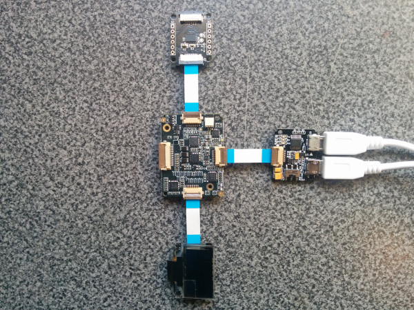

# Home fall tracker in Java*

## Introduction

This home fall tracker application is part of a series of how-to Intel® Internet of Things (IoT) code sample exercises using the Intel® IoT Developer Kit, Intel® Edison development platform, cloud platforms, APIs, and other technologies.

From this exercise, developers will learn how to:<br>
- Connect the Intel Edison development platform, a computing platform designed for prototyping and producing IoT and wearable computing products.<br>
- Interface with the Intel Edison platform IO and sensor repository using MRAA and UPM from the Intel IoT Developer Kit, a complete hardware and software solution to help developers explore the IoT and implement innovative projects.<br>
- Run this code sample in Intel System Studio IoT Edition. Intel System Studio lets you create and test applications on Intel®-based IoT platforms.<br>
- Set up a web application server to store fall data using Azure Redis Cache* from Microsoft Azure\*, cloud services for connecting IoT solutions including data analysis, machine learning, and a variety of productivity tools to simplify the process of connecting your sensors to the cloud and getting your IoT project up and running quickly.<br>
- Invoke the services of the Twilio* API for sending text messages.

## What it is

Using an Intel Edison board, this project lets you create a home fall tracker bracelet that:<br>
- monitors for possible falls using the accelerometer.<br>
- sends a text alert when a possible fall is detected.<br>
- displays information that help is on the way using the OLED display.<br>
- keeps track of detected devices, using cloud-based data storage.

## How it works

The home fall tracker bracelet detects potential falls with the accelerometer. If it detects a possible fall, it sends a text alert via Twilio* and lets the user know that their caretaker has been notified and help is on the way.

Optionally, all data can be stored using the Intel IoT Examples Data store running in your own Microsoft Azure account.

## Hardware requirements

Xadow* Starter Kit containing:

1. Intel Edison with a Xadow* expansion board
2. [Xadow - OLED display](http://iotdk.intel.com/docs/master/upm/node/classes/ssd1308.html)
2. [Xadow - 3-Axis Accelerometer](http://iotdk.intel.com/docs/master/upm/node/classes/adxl345.html)

## Software requirements

1. Intel System Studio IoT Edition
2. Microsoft Azure account
3. Twilio account

### How to set up

To begin, clone the **How-To Intel IoT Code Samples** repository with Git* on your computer as follows:

    $ git clone https://github.com/intel-iot-devkit/how-to-code-samples.git

Want to download a .zip file? In your web browser, go to <a href="https://github.com/intel-iot-devkit/how-to-code-samples">https://github.com/intel-iot-devkit/how-to-code-samples</a> and click the **Download ZIP** button at the lower right. Once the .zip file is downloaded, uncompress it, and then use the files in the directory for this example.

## Adding the program to Intel System Studio IoT Edition

** The following screenshots are from the Alarm clock sample, however the technique for adding the program is the same, just with different source files and jars.

Open Intel System Studio IoT Edition, it will start by asking for a workspace directory. Choose one and click OK.

Intel System Studio IoT Edition , select File -> new -> **Intel(R) IoT Java Project**:


Give the project the name "HomeFallTracker" and click Next.


You now need to connect to your Intel Edison board from your computer to send code to it.
Choose a name for the connection and enter the Edison's IP address in the "Target Name" field. You can also try to Search for it using the "Search Target" button. Click finish when you are done.


You have successfully created an empty project. You now need to copy the source files and the config file to the project.
Drag all of the files from your git repository's "src" folder into the new project's src folder in Intel System Studio IoT Edition. Make sure previously auto-generated main class is overridden.

The project uses the following external jars: [gson-2.6.1](http://central.maven.org/maven2/com/google/code/gson/gson/2.6.1/gson-2.6.1.jar), [twilio-java-sdk-6.3.0-jar-with-dependencies](http://repo.maven.apache.org/maven2/com/twilio/sdk/twilio-java-sdk/6.3.0/twilio-java-sdk-6.3.0-jar-with-dependencies.jar). These can be found in the Maven Central Repository. Create a "jars" folder in the project's root directory, and copy all needed jars in this folder.
In Intel® System Studio IoT Edition, select all jar files in "jars" folder and  right click -> Build path -> Add to build the path.


Now you need to add the UPM jar files relevant to this specific sample.
Right-click on the project's root -> Build path -> Configure build path. click on "add external JARs..."

For this sample you will need the following jars:

1. upm_i2clcd.jar
2. upm_mma7660.jar

The jars can be found at the IOT Devkit installation root path\iotdk-ide-win\devkit-x86\sysroots\i586-poky-linux\usr\lib\java


### Connecting the Xadow sensors



You need to have a Xadow expansion board connected to Intel® Edison to plug in all the Xadow devices.

1. Plug one end of a Xadow connector into the Xadow - OLED Display, and connect the other end to one of the side connectors on the Xadow expansion board.

2. Plug one end of a Xadow connector into the Xadow - 3-Axis Accelerometer, and connect the other end to one of the side connectors on the Xadow expansion board.

### Data store server setup

Optionally, you can store the data generated by this sample program in a back-end database deployed using Microsoft Azure, IBM* Bluemix, or AWS, along with Node.js*, and a Redis* data store.

For information on how to set up your own cloud data server, go to:

<a href="https://github.com/intel-iot-devkit/intel-iot-examples-datastore">https://github.com/intel-iot-devkit/intel-iot-examples-datastore</a>


## Configuring the example

To configure the example for the optional Microsoft Azure data store, change the `SERVER`, `AUTH_TOKEN`, `QUAKE_SERVER`, `LATITUSE`, `LONGITUDE` and `MAX_RADIUS_KM` keys in the `config.properties` file as follows:

```

  TWILIO_ACCT_SID="YOURAPIKEY"
  TWILIO_AUTH_TOKEN="YOURTOKEN"
  TWILIO_OUTGOING_NUMBER=323-555-1212
  NUMBER_TO_SEND_TO=213-555-1212
  SERVER=http://intel-examples.azurewebsites.net/logger/fall-detector
  AUTH_TOKEN=mypassword

```

### Twilio API key

To optionally send text messages, you need to register for an account and get an API key from the Twilio website:

<a href="https://www.twilio.com">https://www.twilio.com</a>

You cannot send text messages without obtaining a Twilio API key first. You can still run the example, but without the text messages.

Pass your Twilio API key and authentication token to the sample program by modifying the `TWILIO_ACCT_SID` and `TWILIO_AUTH_TOKEN` keys in the `config.json` file as follows:

```
{
  "TWILIO_ACCT_SID": "YOURAPIKEY",
  "TWILIO_AUTH_TOKEN": "YOURTOKEN"
}
```

## Preparing the Intel Edison board before running the project

In order for the sample to run you will need to copy some files to the Intel Edison board. This can be done using SCP through SSH. Two sorts of files need to be copied:

1. Jar files- external libraries in the project need to be copied to "/usr/lib/java"
2. web files- files within site_contents folder need to be copied to "/var/HomeFallTracker"

## Running the program using Intel System Studio IoT Edition

When you're ready to run the example, make sure you saved all the files.

Click the **Run** icon on the toolbar of Intel System Studio IoT Edition. This runs the code on Intel Edison.


You will see output similar to the following when the program is running.


### Determining the Intel Edison IP address

You can determine what IP address Intel Edison is connected to by running the following command:

    ip addr show | grep wlan

You will see  output similar to the following:

    3: wlan0: <BROADCAST,MULTICAST,UP,LOWER_UP> mtu 1500 qdisc pfifo_fast qlen 1000
        inet 192.168.1.13/24 brd 192.168.1.255 scope global wlan0

The IP address is shown next to `inet`. In the example above, the IP address is `192.168.1.13`.


IMPORTANT NOTICE: This software is sample software. It is not designed or intended for use in any medical, life-saving or life-sustaining systems, transportation systems, nuclear systems, or for any other mission-critical application in which the failure of the system could lead to critical injury or death. The software may not be fully tested and may contain bugs or errors; it may not be intended or suitable for commercial release. No regulatory approvals for the software have been obtained, and therefore software may not be certified for use in certain countries or environments.
