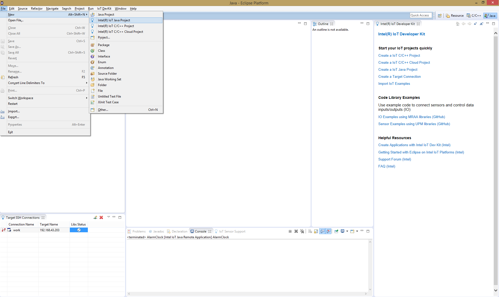
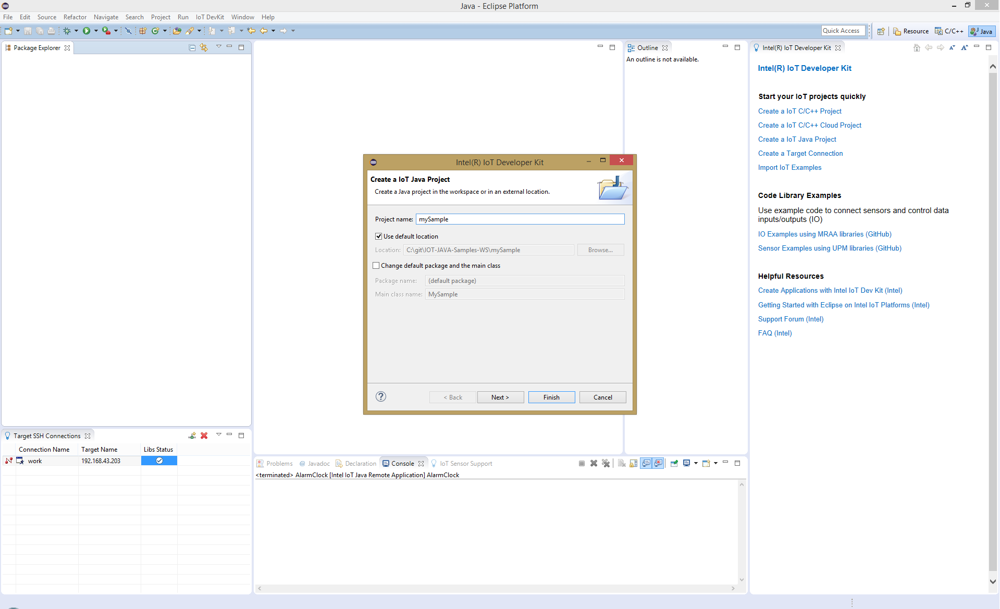
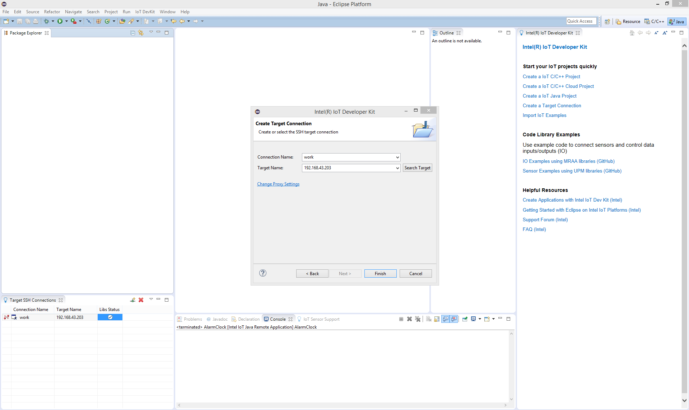
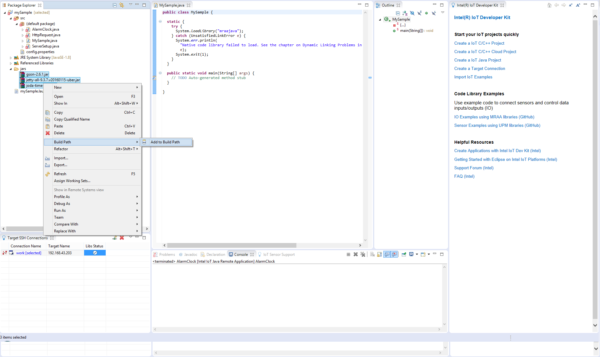
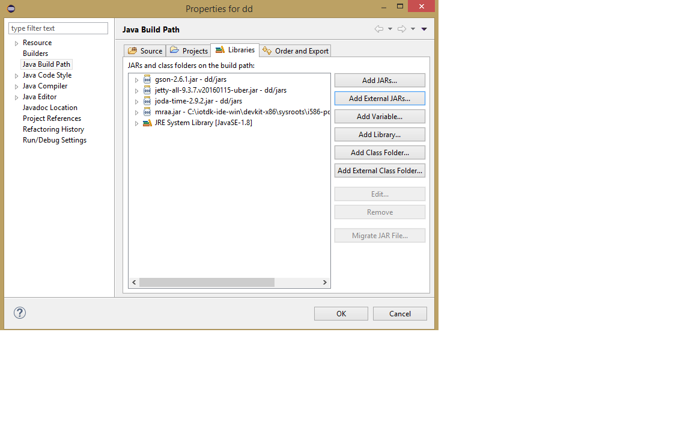
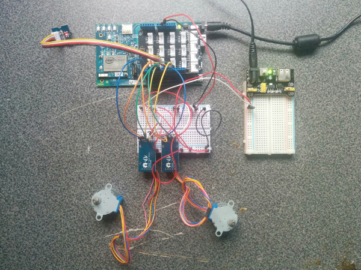

# Line following robot in Java*

## Introduction

This Line following robot application is part of a series of how-to Intel® Internet of Things (IoT) code sample exercises using the Intel® IoT Developer Kit, Intel® Edison development platform, cloud platforms, APIs, and other technologies.

From this exercise, developers will learn how to:<br>
- Connect the Intel® Edison development platform, a computing platform designed for prototyping and producing IoT and wearable computing products.<br>
- Interface with the Intel® Edison platform IO and sensor repository using MRAA and UPM from the Intel® IoT Developer Kit, a complete hardware and software solution to help developers explore the IoT and implement innovative projects.<br>
- Run this code sample in Intel® System Studio IoT Edition. Intel® System Studio IoT Edition lets you create and test applications on Intel-based IoT platforms.<br>
- Store line detection data using Azure Redis Cache\* from Microsoft Azure\*, Redis Store\* from IBM Bluemix\*, or ElastiCache\* using Redis\* from Amazon Web Services\* (AWS), different cloud services for connecting IoT solutions including data analysis, machine learning, and a variety of productivity tools to simplify the process of connecting your sensors to the cloud and getting your IoT project up and running quickly.

## What it is

Using an Intel® Edison board, this project lets you create a line following robot that:<br>
- continuously checks the line finder sensor.<br>
- moves forward if on the line, using the stepper motors.<br>
- tries to pivot to find the line if not on it, using the stepper motors.<br>
- logs events from the line finder sensor, using cloud-based data storage.

## How it works
The line finder robot uses the two attached motors to attempt to follow a line, keeping track of it with the line finder sensor. If on the line, it moves forward. Otherwise, it pivots in place, trying to locate it using the line finder sensor.

Optionally, it can store system events using the Intel® IoT Examples Data store running in your own Microsoft Azure* account.
## Hardware requirements

Grove* Robotics Kit containing:

1. Intel® Edison platform with an Arduino* breakout board
2. [Grove* Line Finder](http://iotdk.intel.com/docs/master/upm/node/classes/grovelinefinder.html)
3. [Stepper Motor Controller & Stepper Motor](http://iotdk.intel.com/docs/master/upm/node/classes/uln200xa.html) (x2)


## Software requirements

1. Intel® System Studio IoT Edition
2. Microsoft Azure\*, IBM Bluemix\*, or AWS account (optional)

### How to set up

To begin, clone the **How-To Intel IoT Code Samples** repository with Git* on your computer as follows:

    $ git clone https://github.com/intel-iot-devkit/how-to-code-samples.git

To download download a .zip file, in your web browser, go to <a href="https://github.com/intel-iot-devkit/how-to-code-samples">https://github.com/intel-iot-devkit/how-to-code-samples</a> and click the **Download ZIP** button at the lower right. Once the .zip file is downloaded, uncompress it, and then use the files in the directory for this example.

## Adding the program to Intel® System Studio IoT Edition

 ** The following screenshots are from the Alarm clock sample, however the technique for adding the program is the same, just with different source files and jars.

Open Intel® System Studio IoT Edition. It will start by asking for a workspace directory; choose one and then click OK.

In Intel® System Studio IoT Edition, select File -> new -> **Intel(R) IoT Java Project**:



Give the project the name "LineFollowingRobot" and then click Next.



You now need to connect to your Intel® Edison board from your computer to send code to it.
Choose a name for the connection and enter the IP address of the Intel® Edison board in the "Target Name" field. You can also try to Search for it using the "Search Target" button. Click finish when you are done.



You have successfully created an empty project. You now need to copy the source files and the config file to the project.
Drag all of the files from your git repository's "src" folder into the new project's src folder in Intel® System Studio IoT Edition. Make sure previously auto-generated main class is overridden.

The project uses the following external jars: [gson-2.6.1](http://central.maven.org/maven2/com/google/code/gson/gson/2.6.1/gson-2.6.1.jar), [joda-time-2.9.2](http://repo.maven.apache.org/maven2/joda-time/joda-time/2.9.2/joda-time-2.9.2.jar). These can be found in the Maven Central Repository. Create a "jars" folder in the project's root directory, and copy all needed jars in this folder.
In Intel® System Studio IoT Edition, select all jar files in "jars" folder and  right click -> Build path -> Add to build path



Now you need to add the UPM jar files relevant to this specific sample.
Right-click on the project's root -> Build path -> Configure build path. Java Build Path -> 'Libraries' tab -> click on "add external JARs..."

For this sample you will need the following jars:

1. upm_grovelinefinder.jar
2. upm_uln200xa.jar

The jars can be found at the IOT Devkit installation root path\iss-iot-win\devkit-x86\sysroots\i586-poky-linux\usr\lib\java



### Connecting the Grove* sensors



You need to have a Grove* Shield connected to an Arduino\*-compatible breakout board to plug all the Grove devices into the Grove Shield. Make sure you have the tiny VCC switch on the Grove Shield set to **5V**.

You need to power the Intel® Edison board with the external power adapter that comes with your starter kit, or substitute it with an external 12V 1.5A power supply. You can also use an external battery, such as a 5V USB battery.

In addition, you need a breadboard and an extra 5V power supply to provide power to both motors. Note: you need a separate battery or power supply for the motors. You cannot use the same power supply for both the Intel® Edison board and the motors, so you need either 2 batteries or 2 power supplies in total.

1. Plug each of the stepper motor controllers into 4 pins on the Arduino* breakout board for it to be able to be controlled. Connect stepper motor controller #1 to pins 4, 5, 6, and 7. Connect stepper motor controller #2 to pins 9, 10, 11, and 12. Connect both controllers to ground (GND), to the 5V power coming from the Arduino* breakout board (VCC), and to the separate 5V power for the motors (VM).

2. Plug one end of a Grove cable into the Grove Line Finder, and connect the other end to the D2 port on the Grove Shield.

### Data store server setup

Optionally, you can store the data generated by this sample program in a backend database deployed using Microsoft Azure\*, IBM Bluemix\*, or AWS\*, along with Node.js\*, and a Redis* data store.

For information on how to set up your own cloud data server, go to:

<a href="https://github.com/intel-iot-devkit/intel-iot-examples-datastore">https://github.com/intel-iot-devkit/intel-iot-examples-datastore</a>

## Preparing the Intel® Edison board before running the project

In order for the sample to run you will need to copy some files to the Intel® Edison board. This can be done using SCP through SSH.<br>
The files need to be copied from the sample repository: <br>
Jar files- external libraries in the project need to be copied to "/usr/lib/java"

## Configuring the example

To configure the example for the optional data store, change the `SERVER` and `AUTH_TOKEN` keys in the `config.properties` file to the server URL and authentication token that correspond to your own data store server setup. For example:

```
  SERVER= "http://mySamples.azurewebsites.net/logger/line-follower"
  AUTH_TOKEN="s3cr3t"
```

## Running the program using Intel® System Studio IoT Edition

When you're ready to run the example, make sure you have saved all the files.

Click the **Run** icon on the toolbar of Intel® System Studio IoT Edition. This runs the code on the Intel® Edison board.


### Determining the IP address of the Intel® Edison board

You can determine what IP address the Intel® Edison board is connected to by running the following command:

    ip addr show | grep wlan

You will see output similar to the following:

    3: wlan0: <BROADCAST,MULTICAST,UP,LOWER_UP> mtu 1500 qdisc pfifo_fast qlen 1000
        inet 192.168.1.13/24 brd 192.168.1.255 scope global wlan0

The IP address is shown next to `inet`. In the example above, the IP address is `192.168.1.13`.


IMPORTANT NOTICE: This software is sample software. It is not designed or intended for use in any medical, life-saving or life-sustaining systems, transportation systems, nuclear systems, or for any other mission-critical application in which the failure of the system could lead to critical injury or death. The software may not be fully tested and may contain bugs or errors; it may not be intended or suitable for commercial release. No regulatory approvals for the software have been obtained, and therefore software may not be certified for use in certain countries or environments.
