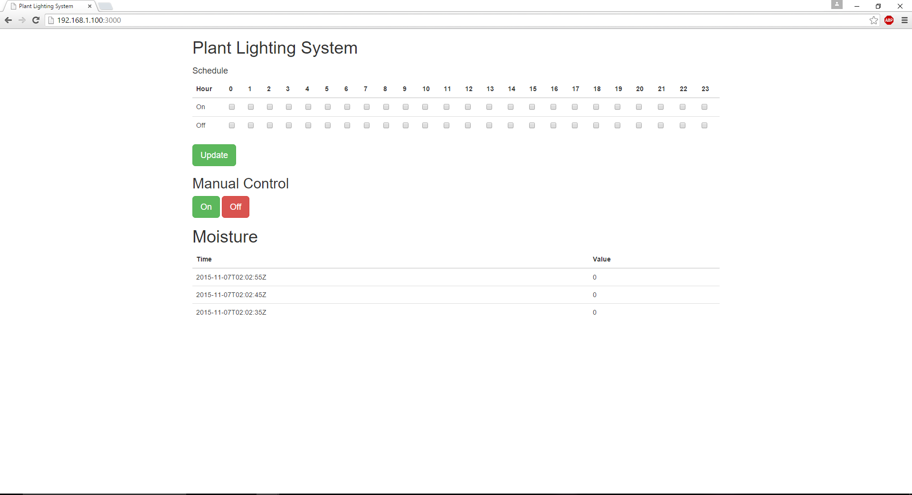

# Plant lighting system in C++

## What it is

Using a compatible Intel-based platform, this project lets you create an automatic plant lighting monitor system that:

- checks if a separate automated lighting system is turned on or off based on a configurable schedule, by using a light sensor.
- can be accessed with your mobile phone to set the lighting periods via a built-in web interface.
- monitors water levels using a connected moisture sensor.
- logs events from the lighting system, using cloud-based data storage.
- sends text messages to alert the user if the system is not working as expected.

## First time setup
For all the samples in this repository, see the  for required boards and libraries.  You need either Grove\* or DFRobot\* sensors but not both.

## Hardware requirements

### Grove\* 

Sensor | Pin
--- | ---
Grove\* Light Sensor | A0
Grove\* Moisture Sensor | A1
Grove\* RGB LCD | I2C

### DFRobot\* Starter Kit for Intel® Edison containing:

Sensor | Pin
--- | ---
Analog Ambient Light Sensor | A1
Moisture Sensor | A2

For more specific information on the hardware requirements see 

## Software requirements

1. [MRAA](https://github.com/intel-iot-devkit/mraa) and [UPM](https://upm.mraa.io)
2. Microsoft Azure\*, IBM Bluemix\*, AT&T M2X\*, AWS\*, Predix\*, or SAP\* account (optional)
3. Twilio\* account

Note: The following libraries are included with the repo and already linked to in the code -jsoncpp -restclient


### Twilio\* API Key (optional)

To optionally send text messages, you need to register for an account and get an API key from the Twilio\* web site:

[https://www.twilio.com](https://www.twilio.com)

You can still run the example, but without a Twilio API key you cannot send SMS alerts.

## Configuring the example for your hardware kit

To configure the example for the specific hardware kit that you are using, either Grove\* or DFRobot\*:

1. From the main menu, select **Project > Properties** dialog box is displayed.

2. Expand the section **C/C++ General**. <br>Click on the **Paths and Symbols** sub-section, and click on the **Symbols** tab.

3. Now click on **GNU C++**, and click on the **Add** button.

4. In the **Name** field, enter "INTEL_IOT_KIT". In the **Value** field, enter either "GROVEKIT" (this is the default) or "DFROBOTKIT", depending on which hardware kit you wish to use.

5. Your new name symbol and value will now be displayed. Click **OK**.

6. Another dialog box will appear asking to rebuild project. Click **OK**.


    
You will see output similar to below when the program is running.

```
MQTT message published: { d: { value: 'off 2016-04-22T03:39:36.101Z' } } 
SMS sent { sid: 'SM14faee6a517f44db91d985c9ee68b3b2', 
	date_created: 'Fri, 22 Apr 2016 03:39:36 +0000', 
	date_updated: 'Fri, 22 Apr 2016 03:39:36 +0000', 
	date_sent: null, 
```

### Setting the lighting schedule

The schedule for the lighting system is set using a single-page web interface served up from your board while the sample program is running.<br>


The latest data values from the connected Grove\* Moisture Sensor are displayed at the bottom of the web page.

The web server runs on port `3000`, so if your board is connected to Wi-Fi on `192.168.1.13`, the address to browse to if you are on the same network is `http://192.168.1.13:3000`.

Refer to  for details on the functionality.

### Running the example with the cloud server (optional)

To run the example with the optional backend data store, you need to set the `SERVER` and `AUTH_TOKEN` environment variables. You can do this in Intel® IoT Gateway to Intel® System Studio as follows:

1. From the **Run** menu, select **Run Configurations**.<br> The **Run Configurations** dialog box is displayed.
2. Under **C/C++ Remote Application**, click **doorbell**.<br> This displays the information for the application.
3. In the **Commands to execute before application** field, add the following environment variables, except use the server and authentication token that correspond to your own setup:<br>

        chmod 755 /tmp/watering-system; export SERVER="http://intel-iot-example-data.azurewebsites.net/logger/watering-system"; export AUTH_TOKEN="Enter Auth Token Here"; export TWILIO_SID="Enter Twilio SID Here"; export TWILIO_TOKEN="Enter Twilio Token Here"; export TWILIO_TO="Enter Number to Send to here Formattted 555-555-5555"; export TWILIO_FROM="Enter Number to be Sent From Here Formated 555-555-5555"

4. Click **Apply** to save your new environment variables.

Now when you run your program using the **Run** button, it should be able to call your server to save the data right from your board.

## Regenerating HTML and CSS

If you make any changes to either the **index.html** or **styles.css** file, you need to regenerate the .hex file used to serve up the assets via the built-in Crow\* web server.
For help using the shell script, go to this link:

[how-to-run-the-shellscript.md](./../../docs/cpp/how-to-run-the-shellscript.md)

IMPORTANT NOTICE: This software is sample software. It is not designed or intended for use in any medical, life-saving or life-sustaining systems, transportation systems, nuclear systems, or for any other mission-critical application in which the failure of the system could lead to critical injury or death. The software may not be fully tested and may contain bugs or errors; it may not be intended or suitable for commercial release. No regulatory approvals for the software have been obtained, and therefore software may not be certified for use in certain countries or environments.
