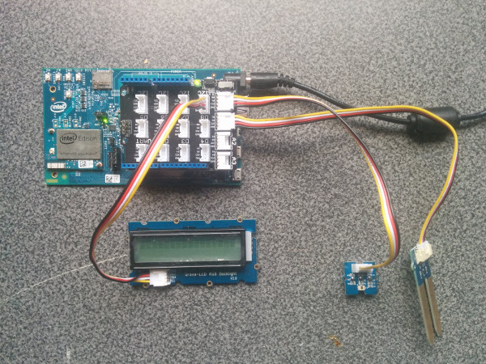

# Plant lighting system in JavaScript*

## Introduction

This automatic plant lighting system monitor application is part of a series of how-to Intel IoT code sample exercises using the Intel® IoT Developer Kit, Intel® Edison development platform, cloud platforms, APIs, and other technologies.

From this exercise, developers will learn how to:<br>
- Connect the Intel® Edison development platform, a computing platform designed for prototyping and producing IoT and wearable computing products.<br>
- Interface with the Intel® Edison platform IO and sensor repository using MRAA and UPM from the Intel® IoT Developer Kit, a complete hardware and software solution to help developers explore the IoT and implement innovative projects.<br>
- Run this code sample in Intel® XDK IoT Edition, an IDE for creating applications that interact with sensors and actuators, enabling a quick start for developing software for the Intel® Edison or Intel® Galileo board.<br>
- Set up a web application server to store lighting system data using Azure Redis Cache\* from Microsoft\* Azure\*, Redis Store\* from IBM\* Bluemix\*, or ElastiCache\* using Redis\* from Amazon\* Web Services\* (AWS\*), different cloud services for connecting IoT solutions including data analysis, machine learning, and a variety of productivity tools to simplify the process of connecting your sensors to the cloud and getting your IoT project up and running quickly.
- Set up a MQTT-based server using IoT Hub\* from Microsoft\* Azure\*, IoT\* from IBM\* Bluemix\*, or IoT\* from Amazon\* Web Services\* (AWS\*), different cloud machine to machine messaging services based on the industry standard MQTT protocol.
- Invoke the services of the Twilio* API for sending text messages.

## What it is

Using an Intel® Edison board, this project lets you create an automatic plant lighting monitor system that:<br>
- checks if a separate automated lighting system is turned on or off based on a configurable schedule, by using a light sensor;<br>
- can be accessed with your mobile phone via the built-in web interface to set the lighting times;<br>
- also monitors the water levels using a connected moisture sensor;<br>
- logs events from the lighting system, using cloud-based data storage;<br>
- sends text messages to alert recipients if the system if not working as expected.

## How it works

The system allows setting the lighting schedule via a web page served directly from Intel® Edison by using your mobile phone.

If the lighting is supposed to be on, but the light sensor does not detect any light, it sends a text alert to a specified number through Twilio*.

It also automatically checks and logs moisture sensor data at periodic intervals.

Optionally, all data can be stored using the Intel IoT Examples Datastore or an MQTT server running in your own Microsoft\* Azure\*, IBM\* Bluemix\*, or AWS\* account.

## Hardware requirements

Grove* Indoor Environment Kit containing:

1. Intel® Edison with an Arduino* breakout board
2. [Grove* Moisture Sensor](http://iotdk.intel.com/docs/master/upm/node/classes/grovemoisture.html)
3. [Grove* Light Sensor](http://iotdk.intel.com/docs/master/upm/node/classes/grovelight.html)
4. [Grove* RGB LCD](http://iotdk.intel.com/docs/master/upm/node/classes/jhd1313m1.html)

## Software requirements

1. Intel® XDK IoT Edition
2. Microsoft\* Azure\*, IBM\* Bluemix\*, or AWS\* account (optional)
3. Twilio* account (optional)

### How to set up

To begin, clone the **How-To Intel IoT Code Samples** repository with Git* on your computer as follows:

    $ git clone https://github.com/intel-iot-devkit/how-to-code-samples.git

Want to download a .zip file? In your web browser, go to <a href="https://github.com/intel-iot-devkit/how-to-code-samples">https://github.com/intel-iot-devkit/how-to-code-samples</a> and click the **Download ZIP** button at the lower right. Once the .zip file is downloaded, uncompress it, and then use the files in the directory for this example.

## Adding the program to Intel® XDK IoT Edition

In Intel® XDK IoT Edition, select **Import Your Node.js Project**:


Then, navigate to the directory where the example project exists, and select it:


You need to connect to your Intel® Edison board from your computer to send code to it.


Click the **IoT Device** menu at the bottom left. If your Intel® Edison is automatically recognized, select it.


Otherwise, select **Add Manual Connection**.
In the **Address** field, type `192.168.2.15`. In the **Port** field, type `58888`.
Click **Connect** to save your connection.

### Installing the program manually on Intel® Edison

Alternatively, you can set up the code manually on the Intel® Edison board.

Clone the **How-To Intel IoT Code Samples** repository to your Intel® Edison board after you establish an SSH connection to it, as follows:

    $ git clone https://github.com/intel-iot-devkit/how-to-code-samples.git

Then, navigate to the directory with this example.

To install Git* on Intel® Edison, if you don’t have it yet, establish an SSH connection to the board and run the following command:

    $ opkg install git

### Connecting the Grove* sensors



You need to have a Grove* Shield connected to an Arduino\*-compatible breakout board to plug all the Grove* devices into the Grove* Shield. Make sure you have the tiny VCC switch on the Grove* Shield set to **5V**.

1. Plug one end of a Grove* cable into the Grove* Light Sensor, and connect the other end to the A0 port on the Grove* Shield.

2. Plug one end of a Grove* cable into the Grove* Moisture Sensor, and connect the other end to the A1 port on the Grove* Shield.

3. Plug one end of a Grove* cable into the Grove* RGB LCD, and connect the other end to any of the I2C ports on the Grove* Shield.

### Manual Intel® Edison setup

If you're running this code on your Intel® Edison manually, you need to install some dependencies.

To obtain the Node.js* modules needed for this example to execute on Intel® Edison, run the following command:

```
npm install
```

### Twilio* API key

To optionally send text messages, you need to register for an account and get an API key from the Twilio* web site:

<a href="https://www.twilio.com">https://www.twilio.com</a>

You cannot send text messages without obtaining a Twilio* API key first. You can still run the example, but without the text messages.

### Datastore server setup

Optionally, you can store the data generated by this sample program in a backend database deployed using Microsoft\* Azure\*, IBM\* Bluemix\*, or AWS\*, along with Node.js\*, and a Redis\* data store.

For information on how to set up your own cloud data server, go to:

[https://github.com/intel-iot-devkit/intel-iot-examples-datastore](https://github.com/intel-iot-devkit/intel-iot-examples-datastore)

### MQTT server setup

You can also optionally store the data generated by this sample program using [MQTT](http://mqtt.org/), a Machine To Machine messaging server. You can use MQTT to connect to Microsoft\* Azure\*, IBM\* Bluemix\*, or AWS\*.

For information on how to connect to your own cloud MQTT messaging server, go to:

[https://github.com/intel-iot-devkit/intel-iot-examples-mqtt](https://github.com/intel-iot-devkit/intel-iot-examples-mqtt)

## Configuring the example

To configure the example for sending optional text messages, obtain an API key from the Twilio* web site as explained above, and then add the `TWILIO_ACCT_SID` and `TWILIO_AUTH_TOKEN` keys to the `config.json` file as follows:

```
{
  "TWILIO_ACCT_SID": "YOURAPIKEY",
  "TWILIO_AUTH_TOKEN": "YOURTOKEN"
}
```

To configure the example for the optional Microsoft\* Azure\*, IBM\* Bluemix\*, or AWS\* data store, add the `SERVER` and `AUTH_TOKEN` keys to the `config.json` file as follows:

```
{
  "SERVER": "http://intel-examples.azurewebsites.net/logger/lighting-system",
  "AUTH_TOKEN": "s3cr3t"
}
```

To configure the example for both the text messages and the Microsoft\* Azure\*, IBM\* Bluemix\*, or AWS\* data store, add the `TWILIO_ACCT_SID`, `TWILIO_AUTH_TOKEN`, `SERVER`, and `AUTH_TOKEN` keys to the `config.json` file as follows:

```
{
  "TWILIO_ACCT_SID": "YOURAPIKEY",
  "TWILIO_AUTH_TOKEN": "YOURTOKEN",
  "SERVER": "http://intel-examples.azurewebsites.net/logger/lighting-system",
  "AUTH_TOKEN": "s3cr3t"
}
```

For information on how to configure the example for the optional Microsoft\* Azure\*, IBM\* Bluemix\*, or AWS\* MQTT messaging server, go to:

[https://github.com/intel-iot-devkit/intel-iot-examples-mqtt/](https://github.com/intel-iot-devkit/intel-iot-examples-mqtt/)

## Running the program using Intel® XDK IoT Edition

When you're ready to run the example, make sure you saved all the files.


Click the **Upload** icon to upload the files to the Intel® Edison board.


Click the **Run** icon at the bottom of Intel® XDK IoT Edition. This runs the code on Intel® Edison.


If you made changes to the code, click **Upload and Run**. This runs the latest code with your changes on Intel® Edison.


You will see output similar to the above when the program is running.

## Running the program manually

To run the example manually on Intel® Edison, establish an SSH connection to the board and execute the following command:

    node index.js

### Setting the lighting schedule


The schedule for the lighting system is set using a single-page web interface served from Intel® Edison while the sample program is running.

The web server runs on port `3000`, so if Intel® Edison is connected to Wi-Fi* on `192.168.1.13`, the address to browse to if you are on the same network is `http://192.168.1.13:3000`.

### Determining the Intel® Edison IP address

You can determine what IP address Intel® Edison is connected to by running the following command:

    ip addr show | grep wlan

You will see the output similar to the following:

    3: wlan0: <BROADCAST,MULTICAST,UP,LOWER_UP> mtu 1500 qdisc pfifo_fast qlen 1000
        inet 192.168.1.13/24 brd 192.168.1.255 scope global wlan0

The IP address is shown next to `inet`. In the example above, the IP address is `192.168.1.13`.
