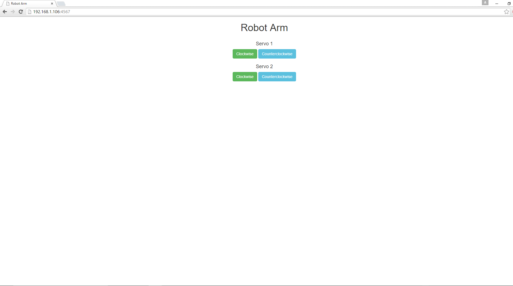

# Robot arm in C++

## Introduction

This robot arm application is part of a series of how-to Intel® Internet of Things (IoT) code sample exercises using the Intel® IoT Developer Kit, Intel® Edison board, Intel® IoT Gateway, cloud platforms, APIs, and other technologies.

From this exercise, developers will learn how to:

- Connect the Intel® Edison board or Intel® IoT Gateway, computing platforms designed for prototyping and producing IoT and wearable computing products.
- Interface with the Intel® Edison board or Intel® Arduino/Genuino 101 board IO and sensor repository using MRAA and UPM from the Intel® IoT Developer Kit, a complete hardware and software solution to help developers explore the IoT and implement innovative projects.
- Run these code samples in the Intel® System Studio IoT Edition (Eclipse IDE for C/C++ and Java\* development) for creating applications that interact with sensors and actuators, enabling a quick start for developing software for the Intel® Edison board or the Intel® Galileo board.
- Set up a web application server to control a robot arm using a web page served up directly from the Intel® Edison board.

## What it is

Using an Intel® Edison board or Intel® IoT Gateway, this project lets you create a robot arm that:

- continuously checks the Grove* Joystick.
- moves two stepper motors, based on the control of the joystick.
- can be accessed via a built-in web interface to control the motors.

## How it works

This example allows you to control a robotic arm using a thumb joystick. Each axis of the joystick corresponds one of the two stepper motors.

Additionally, the motors can be controlled individually via a web page served up directly from the Intel® Edison board or or Intel® IoT Gateway.

## Hardware requirements

Grove* Robotics Kit containing:

1. Intel® Edison board with an Arduino* breakout board
2. Grove Base Shield V2
3. [Grove Thumb Joystick](http://iotdk.intel.com/docs/master/upm/node/classes/joystick12.html)
4. [Stepper Motor Controller & Stepper Motor](http://iotdk.intel.com/docs/master/upm/node/classes/uln200xa.html) (x2)

## Software requirements

1. [Intel® System Studio (Eclipse IDE for C/C++ and Java* development)](https://software.intel.com/en-us/node/672439)

### How to set up

This sample is already one of the IoT examples included in Intel® System Studio. To start using it, follow these steps:

1. From the main menu, select **Intel® IoT > Import IoT Examples**. 

2. Expand the tree view for **C++ > How To Code Samples > Robot Arm** and click **Import Example**. 

3. Select your developer board from the selection window then select **Next**. 

4. Select **Intel® IoT C/C++ project** from the Select a project type window then click **Next**. 

5. Select **Yocto** from the Selct target OS dropdown menu then click **Next**. 

6. The next tab will ask for connection name and target name. If you do not know these click **Search Target**. 

7. Select your Edison from the dropdown list. Select **OK**. 

8. Your connection name and target name should be filled in. Select **Finish**. 

9. A new window will open for you and you will need to choose a name for your project and click **Next**. 

10. Your project source files will now be available on the on the upper left of your IDE by default. 

### Connecting the Grove* sensors

You need to have a Grove* Base Shield V2 connected to the Arduino\*-compatible breakout board to plug all the Grove devices into the Grove Base Shield V2. Make sure you have the tiny VCC switch on the Grove Base Shield V2 set to **5V**.

You need to power the Intel® Edison board with the external power adapter that comes with your starter kit, or substitute an external **12V 1.5A** power supply. You can also use an external battery, such as a **5V** USB battery.

In addition, you need a breadboard and an extra **5V** power supply to provide power to both the motors. 

Note: You need a separate battery or power supply for the motors. You cannot use the same power supply for both the Intel® Edison board and the motors, so you need either 2 batteries or 2 power supplies in total.

1. Plug each stepper motor controller into four pins on the Arduino* breakout board. Connect stepper motor controller #1 to pins 4, 5, 6, and 7, and stepper motor controller #2 to pins 8, 9, 10, and 11. Connect both the controllers to ground (GND), to the **5V** power coming from the Arduino* breakout board (VCC), and to the separate **5V** power for the motors (VM). 

2. Plug one end of a Grove* cable into the Grove Joystick, and connect the other end to the A0 port on the Grove Base Shield V2.

### Connecting your Intel® Edison board or Intel® IoT Gateway to Intel® System Studio

1. On the **Target SSH Connections** tab, right-click your device and select **Connect**. 

If prompted for the username and password, the username is **root** and the password is whatever you specified when configuring the Intel® Edison board.

### Running the code on the Intel® Edison board or Intel® IoT Gateway

When you're ready to run the example, click **Run** at the top menu bar in Intel® System Studio. 

This compiles the program using the Cross G++ Compiler, links it using the Cross G++ Linker, transfers the binary to the Intel® Edison board, and then executes it on the board itself.

After running the program, you should see output similar to the one in the image below. 

### Intel® IoT Gateway setup

You can run this example using an Intel® IoT Gateway connected to an Arduino\*/Genuino\* 101.

Make sure your Intel® IoT Gateway is setup, by following the directions on the web site here:

https://software.intel.com/en-us/node/633284

The Arduino\*/Genuino\* 101 needs to have the Firmata\* firmware installed. If you have IMRAA installed on your gateway, this will be done automatically. Otherwise, install the StandardFirmata or ConfigurableFirmata sketch manually onto your Arduino\*/Genuino\* 101.

## Regenerating HTML and CSS

If you make any changes to either the **index.html** or **styles.css** file, you need to regenerate the .hex file used to serve up the assets via the built-in Crow* web server.

For help using the shell script, go to this link: 

[how-to-run-the-shellscript.md](./../../docs/cpp/how-to-run-the-shellscript.md)

### Controlling the robot arm via a web browser

The robot arm is controlled using a single-page web interface served directly from the Intel® Edison board or Intel® IoT Gateway while the sample program is running. 

The web server runs on port `3000`; if the Intel® Edison board or Intel® IoT Gateway is connected to Wi-Fi* on `192.168.1.13`, the address to browse to if you are on the same network is `http://192.168.1.13:3000`.

IMPORTANT NOTICE: This software is sample software. It is not designed or intended for use in any medical, life-saving or life-sustaining systems, transportation systems, nuclear systems, or for any other mission-critical application in which the failure of the system could lead to critical injury or death. The software may not be fully tested and may contain bugs or errors; it may not be intended or suitable for commercial release. No regulatory approvals for the software have been obtained, and therefore software may not be certified for use in certain countries or environments.
