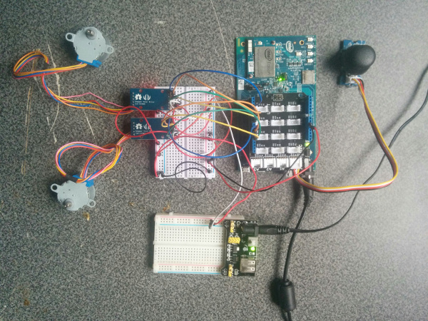

# Robot Arm in Python*

## Introduction

This Robot Arm application is part of a series of how-to Intel® Internet of Things (IoT) code sample exercises using the Intel® IoT Developer Kit, Intel® Edison board, Intel® IoT Gateway, cloud platforms, APIs, and other technologies.

From this exercise, developers will learn how to:<br>
- Connect the Intel® Edison development platform, a computing platform designed for prototyping and producing IoT and wearable computing products.<br>
- Interface with the Intel® Edison platform IO and sensor repository using MRAA\* and UPM\* from the Intel® IoT Developer Kit, a complete hardware and software solution to help developers explore the IoT and implement innovative projects.<br>
- Set up a web application server to control a robot arm using a web page served directly from the Intel® Edison board.

## What it is

Using an Intel® Edison board, this project lets you create a robot arm that:<br>
- continuously checks the Grove\* Joystick.<br>
- moves two stepper motors based on the joystick control.<br>
- can be accessed via the built-in web interface to control the motors.

## How it works

The robot arm example allows you to control a robotic arm using a thumb joystick.
Each axis of the joystick corresponds to a motor to control.

Additionally, the motors can be controlled individually via a web page served directly from the Intel® Edison board.

## Hardware requirements

Grove\* Robotics Kit, containing:

1. Intel® Edison board with an Arduino\* breakout board
2. [Grove\* Thumb Joystick](http://iotdk.intel.com/docs/master/upm/node/classes/joystick12.html)
3. [Stepper Motor Controller & Stepper Motor](http://iotdk.intel.com/docs/master/upm/node/classes/uln200xa.html) (x2)
4. [Grove\* RGB LCD](http://iotdk.intel.com/docs/master/upm/node/classes/jhd1313m1.html)

### How to set up

To begin, clone the **How-To Intel® IoT Code Samples** repository with Git\* on your computer as follows:

    $ git clone https://github.com/intel-iot-devkit/how-to-code-samples.git

To download a .zip file, in your web browser go to <a href="https://github.com/intel-iot-devkit/how-to-code-samples">https://github.com/intel-iot-devkit/how-to-code-samples</a> and click the **Download ZIP** button at the lower right. Once the .zip file is downloaded, uncompress it, and then use the files in the directory for this example.

### Installing the program manually on the Intel® Edison board

You can set up the code manually on the Intel® Edison board.

Clone the **How-To Intel® IoT Code Samples** repository to your Intel® Edison board after you establish an SSH connection to it, as follows:

    $ git clone https://github.com/intel-iot-devkit/how-to-code-samples.git

Then, navigate to the directory with this example.

To install Git\* on the Intel® Edison board (if you don’t have it yet), establish an SSH connection to the board and run the following command:

    $ opkg install git

### Connecting the Grove\* sensors



You need to have a Grove\* Shield connected to an Arduino\*-compatible breakout board to plug all the Grove\* devices into the Grove\* Shield. Make sure you have the tiny VCC switch on the Grove\* Shield set to **5V**.

You need to power the Intel® Edison board with the external power adapter that comes with your starter kit, or substitute it with an external 12V 1.5A power supply. You can also use an external battery, such as a 5V USB battery.

In addition, you need a breadboard and an extra 5V power supply to provide power to both motors. Note: you need a separate battery or power supply for the motors. You cannot use the same power supply for both the Intel® Edison board and the motors, so you need either 2 batteries or 2 power supplies in total.

1. Plug each of the stepper motor controllers into 4 pins on the Arduino\* breakout board for it to be able to be controlled. Connect stepper motor controller #1 to pins 4, 5, 6, and 7. Connect stepper motor controller #2 to pins 9, 10, 11, and 12. Connect both controllers to ground (GND), to the 5V power coming from the Arduino\* breakout board (VCC), and to the separate 5V power for the motors (VM).

2. Plug one end of a Grove\* cable into the Grove\* Thumb Joystick, and connect the other end to the A0 port on the Grove\* Shield.

3. Plug one end of a Grove\* cable into the Grove\* RGB LCD, and connect the other end to any of the I2C\* ports on the Grove\* Shield.

### Intel® Edison board setup

If you're running this code on your Intel® Edison board, you need to install some dependencies by establishing an SSH session to the Edison and run the commands in the sections below.

#### Update the opkg repo

To add the Intel opkg repository:

    $ echo "src mraa-upm http://iotdk.intel.com/repos/3.5/intelgalactic/opkg/i586" > /etc/opkg/mraa-upm.conf
    $ opkg update

You'll only need to perform this step once.

#### Git

To install Git\* on the Intel® Edison board (if you don’t have it yet):

    $ opkg update
    $ opkg install git

#### MRAA and UPM Dependencies

To install the latest versions of the MRAA\* and UPM\* libraries:

    $ opkg update
    $ opkg install mraa
    $ opkg install upm

#### Python Package Manager (pip)

To install the Python\* package manager needed to install and run the example:

    $ pip install --upgrade pip setuptools

#### Install the example

Once all dependencies are installed you can install the example itself with the following command:

    $ pip install --src ~/python/examples/ -e "git+https://github.com/intel-iot-devkit/how-to-code-samples.git#egg=iot_robot_arm&subdirectory=robot-arm/python"

The `pip` command will install required Python dependencies, save the source code for the example in `~/python/examples/iot_robot_arm/` and link the package to the global Python `site-packages` folder.

### Intel® IoT Gateway setup

You can run this example using an Intel® IoT Gateway connected to an Arduino 101\* (branded Genuino 101\* outside the U.S.).

Make sure your Intel® IoT Gateway is setup, by following the directions on the web site here:

https://software.intel.com/en-us/node/633284

You must install the Intel® XDK on the Intel® IoT Gateway, by following the directions on the above link, under the section "Connecting to the Intel® XDK".

The Arduino 101\* needs to have the Firmata\* firmware installed. If you have IMRAA installed on your gateway, this will be done automatically. Otherwise, install the StandardFirmata or ConfigurableFirmata sketch manully on to your Arduino 101.

You will also need to configure the `config.json` in the example to use the Arduino 101. See the section "Configuring the example" below.

## Configuring the example

When the example is installed through `pip` the `config.json` file that holds the configuration for the example lives in `~/python/examples/iot_robot_arm/robot-arm/python/iot_robot_arm/config.json`.

To configure the example for the Grove\* kit, just leave the `kit` key in the `config.json` set to `grove`.

To configure the example for the Arduino 101, add a `PLATFORM` key with the value `firmata` to the `config.json`, as follows:

```JSON
{
  "kit": "grove",
  "PLATFORM": "firmata"
}

## Running the program manually

Once the example is installed through `pip` you can run the program by running the following command in an SSH session to the board:

    $ python -m iot_robot_arm

### Determining the IP address of the Intel® Edison board

You can determine what IP address the Intel® Edison board is connected to by running the following command:

    ip addr show | grep wlan

You will see the output similar to the following:

    3: wlan0: <BROADCAST,MULTICAST,UP,LOWER_UP> mtu 1500 qdisc pfifo_fast qlen 1000
        inet 192.168.1.13/24 brd 192.168.1.255 scope global wlan0

The IP address is shown next to `inet`. In the example above, the IP address is `192.168.1.13`.

IMPORTANT NOTICE: This software is sample software. It is not designed or intended for use in any medical, life-saving or life-sustaining systems, transportation systems, nuclear systems, or for any other mission-critical application in which the failure of the system could lead to critical injury or death. The software may not be fully tested and may contain bugs or errors; it may not be intended or suitable for commercial release. No regulatory approvals for the software have been obtained, and therefore software may not be certified for use in certain countries or environments.
