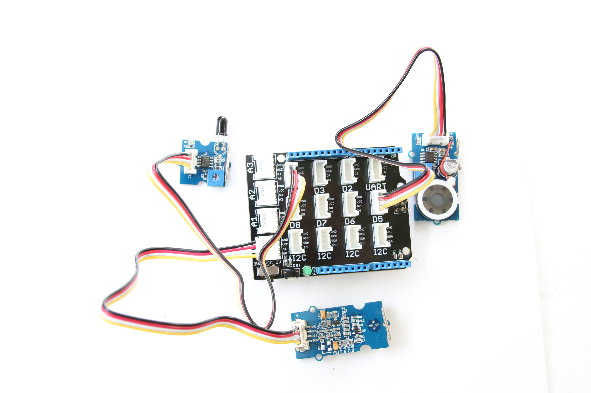
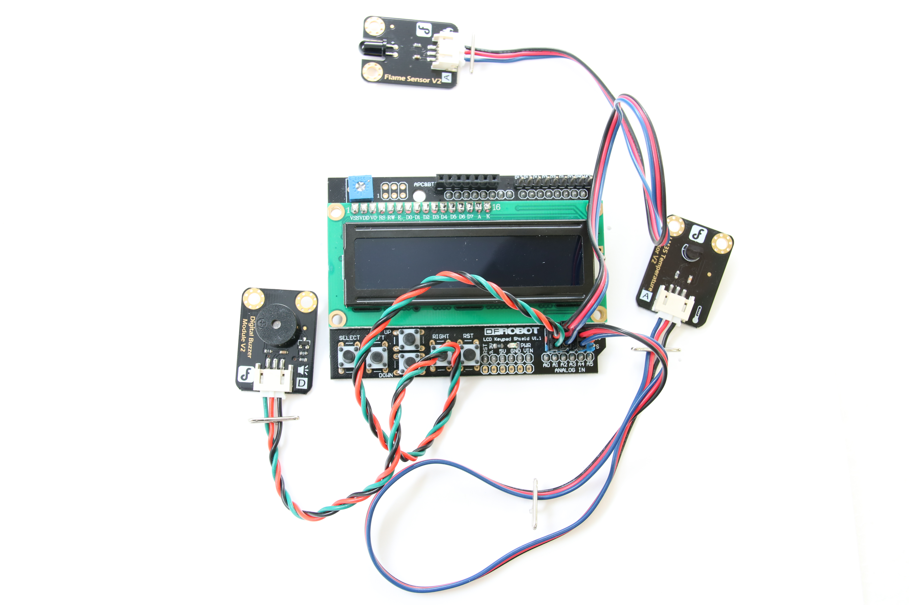

# Smart Stove Top

## Introduction

This smart stove top application is part of a series of how-to Internet of Things (IoT) code sample exercises using the Intel® IoT Developer Kit and a compatible Intel-based platform, cloud platforms, APIs, and other technologies.

From this exercise, developers will learn how to: 

- Interface with and sensors using MRAA and UPM from the Intel® IoT Developer Kit, a complete hardware and software solution to help developers explore the IoT and implement innovative projects. 
- Set up a web application server to set the target temperature and store this data using Azure Redis Cache\* from Microsoft Azure\*, Redis Store\* from IBM Bluemix\*, or Elasticache\* using Redis\* from Amazon Web Services (AWS)\*, different cloud services for connecting IoT solutions including data analysis, machine learning, and a variety of productivity tools to simplify the process of connecting your sensors to the cloud and getting your IoT project up and running quickly.
- Connect to a server using IoT Hub from Microsoft Azure\*, IoT from IBM Bluemix\*, IoT from Amazon Web Services (AWS)\*, AT&T M2X\*, Predix\* from GE, or SAP Cloud Platform\* IoT, different cloud-based IoT platforms for machine to machine communication.

Available in:  
   
   
   
  

## What it is

Using a compatible Intel-based platform, this project lets you create a smart stove top that: 
- allows you to set a target temperature. 
- monitors your stove and notifies you when your set temperature is reached. 
- stores historical temperature data using cloud-based data storage.

## How it works

This smart stove top sensor has a number of useful features designed to help you monitor the temperature of the food you are cooking on your legacy stove top.
Set the target temperature for a pot on your range top via a web page served directly from the Intel-based platform, using your mobile phone.

When the target temperature is reached, the speaker issues an audible notification. If an open flame from a pot boiling over is detected, alarm goes off.

Optionally, data can be stored using your own Microsoft Azure\*, IBM Bluemix\*, AT&T M2X\*, AWS\*, Predix\*, or SAP\* account.

## First time setup  
For all the samples in this repository, see the  for required boards and libraries.

## Hardware requirements

In addition to using a compatible platform listed in , here is additional hardware you will need to run this example

This sample can be used with either Grove\* or DFRobot\* components.

Grove\* Home Automation Kit, containing:

1. [Grove\* Base Shield V2](https://www.seeedstudio.com/Base-Shield-V2-p-1378.html)
2. [Grove\* IR Temperature Sensor](http://iotdk.intel.com/docs/master/upm/node/classes/otp538u.html)
3. [Grove\* Flame Sensor](http://iotdk.intel.com/docs/master/upm/node/classes/yg1006.html)
4. [Grove\* Speaker](http://iotdk.intel.com/docs/master/upm/node/classes/grovespeaker.html)

DFRobot\* Starter Kit for Intel® Edison, containing:

1. [Analog Temperature Sensor](http://iotdk.intel.com/docs/master/upm/node/classes/grovetemp.html)
3. [Flame Sensor](http://www.dfrobot.com/index.php?route=product/product&product_id=195)
4. [I/O Expansion Shield](http://www.dfrobot.com/index.php?route=product/product&product_id=1009)

### Connecting the Grove\* sensors

You need to have a Grove\* Shield connected to an Arduino\* compatible breakout board to plug all the Grove devices into the Grove\* Shield. Make sure you have the tiny VCC switch on the Grove Shield set to **5V**.

Sensor | Pin
--- | ---
Grove\* IR Temperature Sensor | A0
Grove\* Flame Sensor | D4
Grove\* Speaker | D5

### Connecting the DFRobot\* sensors

You need to have a LCD Keypad Shield connected to an Arduino\* compatible breakout board to plug all the DFRobot\* devices into the LCD Keypad Shield.

Sensor | Pin
--- | ---
Analog Temperature Sensor | A3
Buzzer | A1
Flame Sensor | A2

### Setting the temperature

The target temperature is set using a single-page web interface served from the Intel-based platform while the sample program is running.

The web server runs on port `3000`; if the Intel-based platform is connected to Wi-Fi on `192.168.1.13`, the address to browse to if you are on the same network is `http://192.168.1.13:3000`.

### Determining your platform's IP Address

See the section on Finding Your Board's IP Address at the bottom of the  readme. 

IMPORTANT NOTICE: This software is sample software. It is not designed or intended for use in any medical, life-saving or life-sustaining systems, transportation systems, nuclear systems, or for any other mission-critical application in which the failure of the system could lead to critical injury or death. The software may not be fully tested and may contain bugs or errors; it may not be intended or suitable for commercial release. No regulatory approvals for the software have been obtained, and therefore software may not be certified for use in certain countries or environments.
