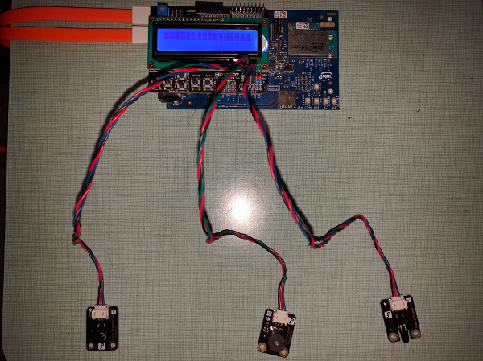
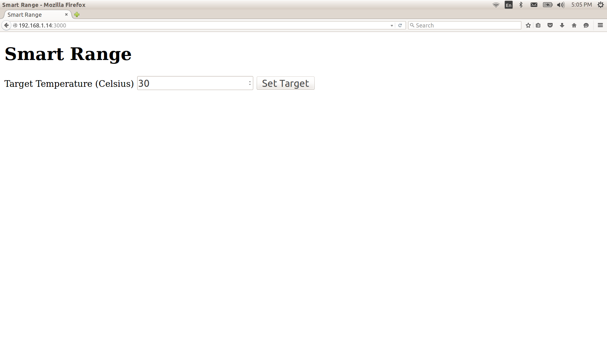

# Smart Stove Top in Python*

## Introduction

This Smart Stove Top application is part of a series of how-to Internet of Things (IoT) code sample exercises using the Intel® IoT Developer Kit, Intel® Edison board, Intel® IoT Gateway, cloud platforms, APIs, and other technologies.

From this exercise, developers will learn how to:<br>
- Connect the Intel® Edison board or Intel® IoT Gateway, computing platforms designed for prototyping and producing IoT and wearable computing products.<br>
- Interface with the Intel® Edison board or Arduino 101\* (branded Genuino 101\* outside the U.S.) board IO and sensor repository using MRAA and UPM from the Intel® IoT Developer Kit, a complete hardware and software solution to help developers explore the IoT and implement innovative projects.<br>
- Store the Smart Stove Top data using Azure Redis Cache\* from Microsoft Azure\*, Redis Store\* from IBM Bluemix\*, or Elasticache\* using Redis\* from Amazon Web Services (AWS)\*, different cloud services for connecting IoT solutions including data analysis, machine learning, and a variety of productivity tools to simplify the process of connecting your sensors to the cloud and getting your IoT project up and running quickly.
- Connect to a server using IoT Hub from Microsoft Azure\*, IoT from IBM Bluemix\*, IoT from Amazon Web Services (AWS)\*, AT&T M2X\*, Predix\* from GE, or SAP Cloud Platform\* IoT, different cloud-based IoT platforms for machine to machine communication.

## What it is

Using an Intel® Edison board or Intel® IoT Gateway, this project lets you create a smart stove top that:<br>
- allows you to set a target temperature.<br>
- monitors your stove and notifies you when your set temperature is reached.<br>
- stores historical temperature data using cloud-based data storage.

## How it works

This smart stove top sensor has a number of useful features designed to help you monitor the temperature of the food you are cooking on your legacy stove top.
Set the target temperature for a pot on your range top via a web page served directly from the Using an Intel® Edison board or Intel® IoT Gateway using your mobile phone.

When the target temperature is reached, the speaker issues an audible notification. If an open flame from a pot boiling over is detected, alarm goes off.

Optionally, data can be stored using your own Microsoft Azure\*, IBM Bluemix\*, AT&T M2X\*, AWS\*, Predix\*, or SAP\* account.

## Hardware requirements

This sample can be used with either the Grove\* Home Automation Kit from Seeed Studio, or else the DFRobot\* Edison Starter Kit with some additional DFRobot\* parts.

Grove\* Home Automation Kit, containing:

1. Intel® Edison module with an Arduino\* breakout board or Intel® IoT Gateway with Arduino 101\* (branded Genuino 101\* outside the U.S.) board
2. [Grove\* IR Temperature Sensor](http://iotdk.intel.com/docs/master/upm/node/classes/otp538u.html)
3. [Grove\* Flame Sensor](http://iotdk.intel.com/docs/master/upm/node/classes/yg1006.html)
4. [Grove\* Speaker](http://iotdk.intel.com/docs/master/upm/node/classes/grovespeaker.html)

DFRobot\* Starter Kit for Intel® Edison, containing:

1. Intel® Edison module board with an Arduino\* breakout board or Intel® IoT Gateway with Arduino 101\* (branded Genuino 101\* outside the U.S.) board
2. [Analog Temperature Sensor](http://iotdk.intel.com/docs/master/upm/node/classes/grovetemp.html)
3. [Flame Sensor](http://www.dfrobot.com/index.php?route=product/product&product_id=195)
4. [I/O Expansion Shield](http://www.dfrobot.com/index.php?route=product/product&product_id=1009)

## Software requirements

1. Microsoft Azure\*, IBM Bluemix\*, AT&T M2X\*, AWS\*, Predix\*, or SAP\* account (optional)

### How to set up

To begin, clone the **How-To Code Samples** repository with Git\* on your computer as follows:

    $ git clone https://github.com/intel-iot-devkit/how-to-code-samples.git

To download a .zip file, in your web browser go to <a href="https://github.com/intel-iot-devkit/how-to-code-samples">https://github.com/intel-iot-devkit/how-to-code-samples</a> and click the **Download ZIP** button at the lower right. Once the .zip file is downloaded, uncompress it, and then use the files in the directory for this example.

### Connecting the Grove\* sensors


You need to have a Grove\* Shield connected to an Arduino\* compatible breakout board to plug all the Grove devices into the Grove\* Shield. Make sure you have the tiny VCC switch on the Grove Shield set to **5V**.

1. Plug one end of a Grove\* cable into the Grove\* IR Temperature Sensor, and connect the other end to the A2 port on the Grove\* Shield.

2. Plug one end of a Grove\* cable into the Grove\* Flame Sensor, and connect the other end to the D4 port on the Grove\* Shield.

3. Plug one end of a Grove\* cable into the Grove\* Speaker, and connect the other end to the D5 port on the Grove\* Shield.

### Connecting the DFRobot\* sensors



You need to have a LCD Keypad Shield connected to an Arduino\* compatible breakout board to plug all the DFRobot\* devices into the LCD Keypad Shield.

1. Plug one end of a DFRobot\* cable into the Analog Temperature Sensor, and connect the other end to the A3 port on the LCD Keypad Shield.

2. Plug one end of a DFRobot\* cable into the Buzzer, and connect the other end to the A1 port on the LCD Keypad Shield.

3. Plug one end of a DFRobot\* cable into the Flame Sensor, and connect the other end to the A2 port on the LCD Keypad Shield.

### Manual Intel® Edison board setup

If you're running this code on your Intel® Edison board manually, you need to install some dependencies by establishing an SSH session to the board running the following commands.

To install Git\* on the Intel® Edison board (if you don’t have it yet), establish an SSH connection to the board and run the following command:

    $ opkg install git

To obtain the Python\* packages needed for this example to execute on the Intel® Edison board:

Run the following commands to update to the latest version of the Python\* package installer:

    $ pip install --upgrade pip setuptools

Run the following to update to the latest versions of the Intel MRAA and UPM libaries:

    $ echo "src mraa-upm http://iotdk.intel.com/repos/3.5/intelgalactic/opkg/i586" > /etc/opkg/mraa-upm.conf
    $ opkg update
    $ opkg install mraa upm

Once the dependencies are installed you can install the example itself with the following command:

    $ pip install --src ~/python/examples/ -e "git+https://github.com/intel-iot-devkit/how-to-code-samples.git#egg=iot_smart_stove_top&subdirectory=smart-stove-top/python"

The `pip` command will install required Python dependencies, save the source code for the example in `~/python/examples/iot_smart_stove_top/` and link the package to the global Python `site-packages` folder.

### Intel® IoT Gateway setup

You can run this example using an Intel® IoT Gateway connected to an Arduino 101\*(branded Genuino 101\* outside the U.S.) board.

Make sure your Intel® IoT Gateway is setup using Intel® IoT Gateway Software Suite, by following the directions on the web site here:

https://software.intel.com/en-us/getting-started-with-intel-iot-gateways-and-iotdk

To install and run the example, you will need to install Python setuptools. This is easy to do, by running:

    $ wget https://bootstrap.pypa.io/ez_setup.py -O - | python

Once these dependencies are installed you can install the example itself with the following command:

    $ pip install --src ~/python/examples/ -e "git+https://github.com/intel-iot-devkit/how-to-code-samples.git#egg=iot_smart_stove_top&subdirectory=smart-stove-top/python"    

The `pip` command will install required Python dependencies, save the source code for the example in `~/python/examples/iot_smart_stove_top/` and link the package to the global Python `site-packages` folder.

The Arduino 101\* (branded Genuino 101\* outside the U.S.) board needs to have the Firmata\* firmware installed. If you have IMRAA installed on your gateway, this will be done automatically. Otherwise, install the StandardFirmata or ConfigurableFirmata sketch manually on to your Arduino 101.

You will also need to configure the `config.json` in the example to use the Arduino 101. See the section "Configuring the example" below.

### IoT cloud setup

You can optionally store the data generated by this sample program using cloud-based IoT platforms from Microsoft Azure\*, IBM Bluemix\*, AT&T M2X\*, AWS\*, Predix\*, or SAP\*.

For information on how to connect to your own cloud server, go to:

[https://github.com/intel-iot-devkit/iot-samples-cloud-setup](https://github.com/intel-iot-devkit/iot-samples-cloud-setup)

### Data store server setup

Optionally, you can store the data generated by this sample program in a back-end database deployed using Microsoft Azure\*, IBM Bluemix\*, or AWS\*, along with Node.js\*, and a Redis\* data store.

For information on how to set up your own cloud data server, go to:

[https://github.com/intel-iot-devkit/intel-iot-examples-datastore](https://github.com/intel-iot-devkit/intel-iot-examples-datastore)

## Configuring the example

When the example is installed through `pip` the `config.json` file that holds the configuration for the example lives in `~/python/examples/iot_smart_stove_top/smart-stove-top/python/iot_smart_stove_top/config.json`.

To configure the example for the Grove\* kit, just leave the `kit` key in the `config.json` set to `grove`. To configure the example for the DFRobot\* kit, change the `kit` key in the `config.json` to `dfrobot` as follows:

```JSON
{
  "kit": "dfrobot"
  "TARGET_TEMP": 30
}
```

To configure the example for the Arduino 101\* (branded Genuino 101\* outside the U.S.) board, add a `PLATFORM` key with the value `firmata` to the `config.json`, as follows:

```JSON
{
  "kit": "grove",
  "PLATFORM": "firmata",
  "TARGET_TEMP": 30
}
```

To configure the example for the optional Microsoft Azure\*, IBM Bluemix\*, or AWS\* data store, add the `SERVER` and `AUTH_TOKEN` keys in the `config.json` file below the "CODE" key as follows:

```JSON
{
  "kit": "grove",
  "TARGET_TEMP": 30,
  "SERVER": "http://intel-examples.azurewebsites.net/logger/access-control",
  "AUTH_TOKEN": "s3cr3t"
}
```

For information on how to configure the example for an optional Microsoft Azure\*, IBM Bluemix\*, AT&T M2X\*, AWS\*, Predix\*, or SAP\* IoT cloud server, go to:

[https://github.com/intel-iot-devkit/iot-samples-cloud-setup](https://github.com/intel-iot-devkit/iot-samples-cloud-setup)

## Running the program

Once the example is installed through `pip` you can run the program by running the following command in an SSH session to the board:

    $ python -m iot_smart_stove_top

### Setting the target temperature



The target temperature is set using a single-page web interface served directly from the Intel® Edison board or Intel® IoT Gateway while the sample program is running.

The web server runs on port `3000`, so if the Intel® Edison board or Intel® IoT Gateway is connected to Wi-Fi on `192.168.1.13`, the address to browse to if you are on the same network is `http://192.168.1.13:3000`.

### Determining the Intel® Edison board IP address

You can determine what IP address the Intel® Edison board is connected to by running the following command:

    ip addr show | grep wlan

You will see the output similar to the following:

    3: wlan0: <BROADCAST,MULTICAST,UP,LOWER_UP> mtu 1500 qdisc pfifo_fast qlen 1000
        inet 192.168.1.13/24 brd 192.168.1.255 scope global wlan0

The IP address is shown next to `inet`. In the example above, the IP address is `192.168.1.13`.

IMPORTANT NOTICE: This software is sample software. It is not designed or intended for use in any medical, life-saving or life-sustaining systems, transportation systems, nuclear systems, or for any other mission-critical application in which the failure of the system could lead to critical injury or death. The software may not be fully tested and may contain bugs or errors; it may not be intended or suitable for commercial release. No regulatory approvals for the software have been obtained, and therefore software may not be certified for use in certain countries or environments.
