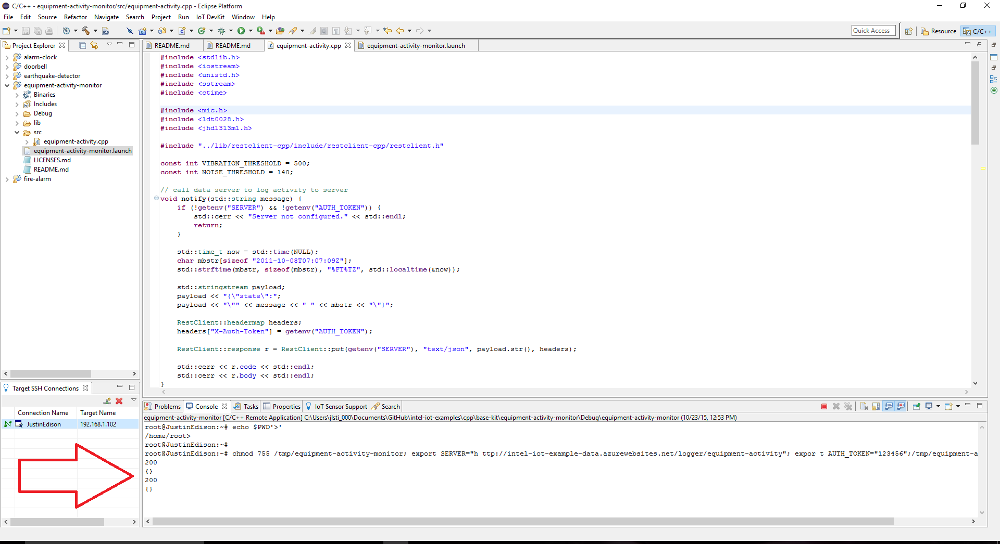

# Watering system in C++

## Introduction

This automatic watering system application is part of a series of how-to Intel® Internet of Things (IoT) code sample exercises using the Intel® IoT Developer Kit, Intel® Edison board, Intel® IoT Gateway, cloud platforms, APIs, and other technologies.

From this exercise, developers will learn how to:

- Connect the Intel® Edison board or Intel® IoT Gateway, computing platforms designed for prototyping and producing IoT and wearable computing products.
- Interface with the Intel® Edison board or Intel® Arduino/Genuino 101 board IO and sensor repository using MRAA and UPM from the Intel® IoT Developer Kit, a complete hardware and software solution to help developers explore the IoT and implement innovative projects.
- Run these code samples in the Intel® System Studio IoT Edition (Eclipse IDE for C/C++ and Java\* development) for creating applications that interact with sensors and actuators, enabling a quick start for developing software for the Intel® Edison board or the Intel® Galileo board.
- Set up a web application server to set the watering system time and store this data using Azure* Redis Cache from Microsoft, Redis Store\* from IBM Bluemix\*, or ElastiCache\* using Redis\* from Amazon Web Services\* (AWS), different cloud services for connecting IoT solutions including data analysis, machine learning, and a variety of productivity tools to simplify the process of connecting your sensors to the cloud and getting your IoT project up and running quickly.
- Invoke the services of the Twilio\* API for sending text messages.
- Set up a MQTT-based server using IoT Hub\* from Microsoft Azure\*, IoT\* from IBM Bluemix\*, or IoT\* from Amazon Web Services\* (AWS), different cloud machine to machine messaging services based on the industry standard MQTT protocol.

## What it is

Using an Intel® Edison board or Intel® IoT Gateway, this project lets you create an automatic watering system that:

- turns a water pump on and off based on a configurable schedule.
- detects if the watering system is pumping when expected, by using a water flow sensor.
- can be accessed with your mobile phone via a built-in web interface to set the watering intervals.
- keeps track of the watering system, using cloud-based data storage.
- sends text messages to alert the user if the system if not working as expected.

## How it works

This watering system application has several useful features.

Using your mobile phone, you can set the watering system schedule using a web page served directly from the Intel® Edison board or Intel® IoT Gateway.

The watering system automatically checks the moisture sensor data at specified intervals and displays that data on the web page.

If the water pump is supposed to be on but the water flow sensor does not detect that the pumping is talking place as expected, the application sends an SMS to a specified number through Twilio* so the watering system can be repaired.

Optionally, all data can be stored using the Intel® IoT Examples Datastore or an MQTT server running in your own Microsoft Azure\*, IBM Bluemix\*, or AWS account.

## Hardware requirements

Grove* Environment & Agriculture Kit containing:

1. Intel® Edison board with an Arduino* breakout board
2. Grove Base Shield V2
3. [Grove Moisture Sensor](http://iotdk.intel.com/docs/master/upm/node/classes/grovemoisture.html)
4. [Water Pump](http://www.seeedstudio.com/depot/6V-Mini-Water-Pump-p-1945.html)
5. [Water Flow Sensor](http://iotdk.intel.com/docs/master/upm/node/classes/grovewfs.html)
6. [Dry-reed Relay](http://iotdk.intel.com/docs/master/upm/node/classes/groverelay.html)

## Software requirements

1. [Intel® System Studio (Eclipse IDE for C/C++ and Java* development)](https://software.intel.com/en-us/node/672439)
2. Microsoft Azure\*, IBM Bluemix\*, or AWS account (optional)
3. Twilio* account

### How to set up

This sample is already one of the IoT examples included in Intel® System Studio. To start using it, follow these steps:

1. From the main menu, select **Intel® IoT > Import IoT Examples**. 

2. Expand the tree view for **C++ > How To Code Samples > Watering System** and click **Import Example**. 

3. Select your developer board from the selection window then select **Next**. 

4. Select **Intel® IoT C/C++ project** from the Select a project type window then click **Next**. 

5. Select **Yocto** from the Selct target OS dropdown menu then click **Next**. 

6. The next tab will ask for connection name and target name. If you do not know these click **Search Target**. 

7. Select your Edison from the dropdown list. Select **OK**. 

8. Your connection name and target name should be filled in. Select **Finish**. 

9. A new window will open for you and you will need to choose a name for your project and click **Next**. 

10. Your project source files will now be available on the on the upper left of your IDE by default. 

### Connecting the Grove* sensors

You need to have a Grove* Base Shield V2 connected to an Arduino\*-compatible breakout board to plug all the Grove devices into the Grove Base Shield V2. Make sure you have the tiny VCC switch on the Grove Base Shield V2 set to **5V**.

For this example, you need to power the Intel® Edison board with the external power adapter that comes with your starter kit, or else substitute an external **12V 1.5A** power supply. You can also use an external battery, such as a **5V** USB battery.

In addition, you need a breadboard and an extra **5V** power supply to provide power to the pump. 

Note: You need a separate battery or power supply for the pump. You cannot use the same power supply for both the Intel® Edison board and the pump, so you need either 2 batteries or 2 power supplies.

You need to use the Grove* Dry-reed Relay board to connect the Water Pump.

1. Plug one end of a Grove* cable into the Grove* Dry-reed Relay, and connect the other end to the D4 port on the Grove Base Shield V2. 

2. Plug one wire from the Water Pump into the 5V power source reserved for the pump.
3. Plug the other wire from the Water Pump into one of the power connectors on the Grove Dry-reed Relay board.
4. Plug the other power connector on the Grove* Dry-reed Relay board into the ground of the 5V power source reserved for the Water Pump.
5. Plug the Water Flow Sensor's red wire into the 5V pin on the Grove* Base Shield V2.
6. Plug the Water Flow Sensor's black wire into the GND pin on the Grove* Base Shield V2.
7. Plug the Water Flow Sensor's yellow wire into the 2 pin (aka digital pin 2) on the Grove* Base Shield V2.
8. Plug one end of a Grove cable into the Grove* Moisture Sensor, and connect the other end to the A0 port on the Grove Base Shield V2.

### Copy the libraries on Windows*

For help installing and using WinSCP, go to this link:

[using-winscp.md](./../../docs/cpp/using-winscp.md)

Note: You need to turn SSH on by running the `configure_edison --password` command on the board. Once you set the password, make sure you write it down. You only need to do this once and it is set when you reboot the Intel® Edison board.

### Twilio* API Key

To optionally send text messages, you need to register for an account and get an API key from the Twilio* website:

[https://www.twilio.com](https://www.twilio.com)

You can still run the example, but without a Twilio API key you cannot send SMS alerts.

### Data store server setup

Optionally, you can store the data generated by this sample program in a back-end database deployed using Microsoft Azure\*, IBM Bluemix\*, or AWS, along with Node.js\*, and a Redis\* data store.

For information on how to set up your own cloud data server, go to:

[https://github.com/intel-iot-devkit/intel-iot-examples-datastore](https://github.com/intel-iot-devkit/intel-iot-examples-datastore)

### MQTT server setup

You can also optionally store the data generated by this sample program using [MQTT](http://mqtt.org/), a Machine To Machine messaging server. You can use MQTT to connect to Microsoft Azure\*, IBM Bluemix\*, or AWS.

For information on how to connect to your own cloud MQTT messaging server, go to:

[https://github.com/intel-iot-devkit/intel-iot-examples-mqtt](https://github.com/intel-iot-devkit/intel-iot-examples-mqtt)

### Connecting your Intel® Edison board or Intel® IoT Gateway to Intel® System Studio

1. On the **Target SSH Connections** tab, right-click your device and select **Connect**. 

If prompted for the username and password, the username is **root** and the password is whatever you specified when configuring the Intel® Edison board.

### Running the example with the cloud server

To run the example with the optional backend data store, you need to set the `SERVER` and `AUTH_TOKEN` environment variables. You can do this in Intel® System Studio as follows:

1. From the **Run** menu, select **Run Configurations**.  The **Run Configurations** dialog box is displayed.
2. Under **C/C++ Remote Application**, click **doorbell**.  This displays the information for the application.
3. In the **Commands to execute before application** field, add the following environment variables, except use the server and authentication token that correspond to your own setup: 

        chmod 755 /tmp/watering-system; export SERVER="http://intel-iot-example-data.azurewebsites.net/logger/watering-system"; export AUTH_TOKEN="Enter Auth Token Here"; export TWILIO_SID="Enter Twilio SID Here"; export TWILIO_TOKEN="Enter Twilio Token Here"; export TWILIO_TO="Enter Number to Send to here Formattted 555-555-5555"; export TWILIO_FROM="Enter Number to be Sent From Here Formated 555-555-5555"

4. Click **Apply** to save your new environment variables.

Now when you run your program using the **Run** button, it should be able to call your server to save the data right from the Intel® Edison board or Intel® IoT Gateway.

### Running the code on the Intel® Edison board or Intel® IoT Gateway

When you're ready to run the example, click **Run** at the top menu bar in Intel® System Studio. 

This compiles the program using the Cross G++ Compiler, links it using the Cross G++ Linker, transfers the binary to the Intel® Edison board or Intel® IoT Gateway, and then executes it on the board itself.

After running the program, you should see output similar to the one in the image below. 

Successful output should be similar to the one in the image below. 

## Regenerating HTML and CSS

If you make any changes to either the **index.html** or **styles.css** file, you need to regenerate the .hex file used to serve up the assets via the built-in Crow web server.

For help using the shell script, go to this link:

[how-to-run-the-shellscript.md](./../../docs/cpp/how-to-run-the-shellscript.md)

## Setting the watering schedule

The schedule for the watering system is set using a single-page web interface served up from the Intel® Edison board or Intel® IoT Gateway while the sample program is running. 

The latest data values from the connected Grove* Moisture Sensor are displayed at the bottom of the web page.

The web server runs on port `3000`; if the Intel® Edison board or Intel® IoT Gateway is connected to WiFi* on `192.168.1.13`, the address to browse to if you are on the same network is `http://192.168.1.13:3000`.

IMPORTANT NOTICE: This software is sample software. It is not designed or intended for use in any medical, life-saving or life-sustaining systems, transportation systems, nuclear systems, or for any other mission-critical application in which the failure of the system could lead to critical injury or death. The software may not be fully tested and may contain bugs or errors; it may not be intended or suitable for commercial release. No regulatory approvals for the software have been obtained, and therefore software may not be certified for use in certain countries or environments.
