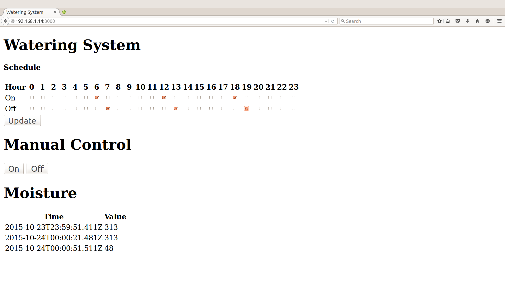

# Watering system in Java*

## What it is

Using a compatible Intel-based platform, this project lets you create an automatic watering system that:

- turns a water pump on and off based on a configurable schedule.
- detects if the watering system is pumping when expected, by using a water flow sensor.
- can be accessed with your mobile phone via a built-in web interface to set the watering intervals.
- keeps track of the watering system, using cloud-based data storage.
- sends text messages to alert the user if the system if not working as expected.

## First time setup
For all the samples in this repository, see the  for required boards and libraries.

## Hardware requirements

### Grove\* 

Sensor | Pin
--- | ---
Grove\* Dry-Reed Relay | D4
One wire from the pump | 5V power source
Other wire from pump | One of the Power connectors on the Grove\* Dry-Reed Relay board
Other power connector  on the Grove\* Dry-Reed Relay board | 5V power source reserved for the pump
Water Flow Sensor | Red wire into the 5V pin, the black wire into the GND pin, and the yellow wire into digital pin 2
Grove\* Moisture Sensor | A0

### DFRobot\*

Sensor | Pin
--- | ---
Relay Module | A1
One wire from the pump | GND of the power source
Other wire from the pump | NC (Normally Closed) connector on the Relay Module
COM (Common) connector | + of the 5V power source
Moisture Sensor | A3

More details on the hardware requirements can be found in the 

## Software requirements
1. 
2.  and  
3. Microsoft Azure\*, IBM Bluemix\*, AT&T M2X\*, AWS\*, Predix\*, or SAP\* account (optional)
4. Twilio\* account (optional)

### Twilio\* API Key (optional)

To optionally send text messages, you need to register for an account and get an API key from the Twilio\* website:

[https://www.twilio.com](https://www.twilio.com)

You can still run the example, but without a Twilio API key you cannot send SMS alerts.

### Configuring the example with your Twilio\* API key (optional)

Pass your Twilio\* API key and authentication token to the sample program by modifying the `TWILIO_ACCT_SID` and `TWILIO_AUTH_TOKEN` keys in the `config.properties` file. `NUMBER_TO_SEND_TO` and `TWILIO_OUTGOING_NUMBER` are also part of the Twilio\* setup. For example:

```
  TWILIO_ACCT_SID="YOURAPIKEY"
  TWILIO_AUTH_TOKEN="YOURTOKEN"
  TWILIO_OUTGOING_NUMBER="YOURTWILIOOUTGOINGNUMBER"
  NUMBER_TO_SEND_TO="NUMBERTOSENDTO"
```

## Configuring the example
### Clone the repo
Clone the How-To Code Samples repository with Git* on your computer as follows:

$ git clone https://github.com/intel-iot-devkit/how-to-code-samples.git
To download a .zip file, in your web browser go to https://github.com/intel-iot-devkit/how-to-code-samples and click the Download ZIP button at the lower right. Once the .zip file is downloaded, uncompress it, and then use the files in the directory for this example.

### Set up the source files
You now need to copy the source files and the config file to the project.
Drag all of the files from your git repository's "src" folder into the new project's src folder in Intel® System Studio. Make sure previously auto-generated main class is overridden.

The project uses the following external jars: [gson-2.6.1](http://central.maven.org/maven2/com/google/code/gson/gson/2.6.1/gson-2.6.1.jar), [jetty-all-9.3.7.v20160115-uber](http://repo1.maven.org/maven2/org/eclipse/jetty/aggregate/jetty-all/9.3.7.v20160115/jetty-all-9.3.7.v20160115-uber.jar), [joda-time-2.9.2](http://repo.maven.apache.org/maven2/joda-time/joda-time/2.9.2/joda-time-2.9.2.jar), [twilio-java-sdk-6.3.0-jar-with-dependencies](http://repo.maven.apache.org/maven2/com/twilio/sdk/twilio-java-sdk/6.3.0/twilio-java-sdk-6.3.0-jar-with-dependencies.jar). These can be found in the Maven Central Repository. Create a "jars" folder in the project's root directory, and copy all needed jars in this folder.
In Intel® System Studio, select all jar files in "jars" folder and  right click -> Build path -> Add to build path

Now you need to add the UPM jar files relevant to this specific sample.
Right-click on the project's root -> Build path -> Configure build path. Java Build Path -> 'Libraries' tab -> click on "add external JARs..."

For this sample you will need the following jars:

1. upm_grovemoisture.jar
2. upm_grovewfs.jar

The jars can be found at the IOT Devkit installation root path\iss-iot-win\devkit-x86\sysroots\i586-poky-linux\usr\lib\java

### Preparing your target platform before running the project

In order for the sample to run you will need to copy some files to your board. This can be done using SCP through SSH.<br>
Two sorts of files need to be copied from the sample repository:

1. Jar files- external libraries in the project need to be copied to "/usr/lib/java"
2. web files- files within site_contents folder need to be copied to "/var/WateringSystem"

### Set the kit
To configure the example for the specific hardware kit that you are using, either Grove\* or DFRobot\* you will need to change the `INTEL_IOT_KIT` key in the `config.properties` file to either **GROVEKIT** (this is the default) or **DFROBOTKIT**, depending on which hardware kit you wish to use. For example:

```

  INTEL_IOT_KIT=GROVEKIT

```

### Expected output
You will see output similar to below when the program is running.

```
moisture (46) 
Connecting to MQTT server... 
MQTT message published: { d: { value: 'moisture (46) 2016-04-22705:14:56.681Z' } } 
```
### Setting the lighting schedule



The schedule for the lighting system is set using a single-page web interface served from your board while the sample program is running.

The web server runs on port `8080`, so if your board is connected to Wi-Fi* on `192.168.1.13`, the address to browse to if you are on the same network is `http://192.168.1.13:8080`.

## Regenerating HTML and CSS

If you make any changes to either the **index.html** or **styles.css** file, you need to regenerate the .hex file used to serve up the assets via the built-in Crow\* web server.

For help using the shell script, go to this link:

[how-to-run-the-shellscript.md](./../../docs/cpp/how-to-run-the-shellscript.md)

### IoT cloud setup (optional)

You can optionally store the data generated by this sample program using cloud-based IoT platforms from Microsoft Azure\*, IBM Bluemix\*, AT&T M2X\*, AWS\*, Predix\*, or SAP\*.

For information on how to connect to your own cloud server, go to:

[https://github.com/intel-iot-devkit/iot-samples-cloud-setup](https://github.com/intel-iot-devkit/iot-samples-cloud-setup)


### Data store server setup (optional)

Optionally, you can store the data generated by this sample program in a back-end database deployed using Microsoft Azure\*, IBM Bluemix\*, or AWS\*, along with Node.js\*, and a Redis\* data store.

For information on how to set up your own cloud data server, go to:

[https://github.com/intel-iot-devkit/intel-iot-examples-datastore](https://github.com/intel-iot-devkit/intel-iot-examples-datastore)

### Running the example with the cloud server

To run the example with the optional back-end data store, you need to change the `SERVER` and `AUTH_TOKEN` keys in the `config.properties` file to the server URL and authentication token that correspond to your own data store server setup. For example:

```

  SERVER=http://intel-examples.azurewebsites.net/logger/watering-system
  AUTH_TOKEN="YOURTOKEN"

```

IMPORTANT NOTICE: This software is sample software. It is not designed or intended for use in any medical, life-saving or life-sustaining systems, transportation systems, nuclear systems, or for any other mission-critical application in which the failure of the system could lead to critical injury or death. The software may not be fully tested and may contain bugs or errors; it may not be intended or suitable for commercial release. No regulatory approvals for the software have been obtained, and therefore software may not be certified for use in certain countries or environments.
