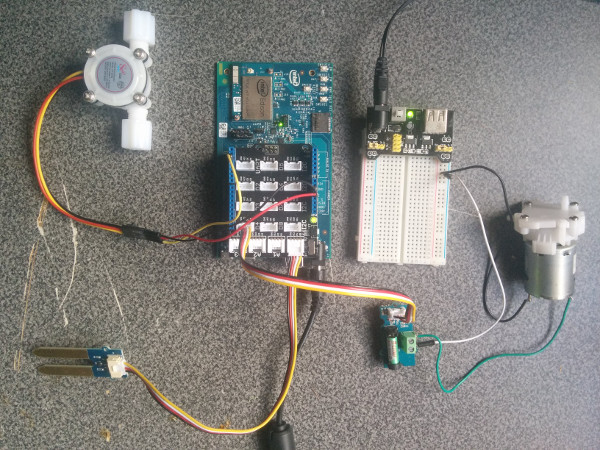

# Watering system

## Introduction

This automatic automatic watering system application is part of a series of how-to Intel IoT code sample exercises using the Intel® IoT Developer Kit, Intel® Edison development platform, cloud platforms, APIs, and other technologies.

From this exercise, developers will learn how to:<br>
- Connect the Intel® Edison development platform, a computing platform designed for prototyping and producing IoT and wearable computing products.<br>
- Interface with the Intel® Edison platform IO and sensor repository using MRAA and UPM from the Intel® IoT Developer Kit, a complete hardware and software solution to help developers explore the IoT and implement innovative projects.<br>
- Run this code sample in Intel® System Studio IoT Edition . Intel® System Studio IoT Edition lets you create and test applications on Intel®-based IoT platforms.<br>
- Set up a web application server to store watering system data using Azure Redis Cache* from Microsoft* Azure\*, cloud services for connecting IoT solutions including data analysis, machine learning, and a variety of productivity tools to simplify the process of connecting your sensors to the cloud and getting your IoT project up and running quickly.<br>
- Invoke the services of the Twilio* API for sending text messages.

## What it is

Using an Intel® Edison board, this project lets you create an automatic watering system that:<br>
- turns a water pump on or off based on a configurable schedule;<br>
- detects if the pumping occurs when expected, by using a water flow sensor;<br>
- can be accessed with your mobile phone via the built-in web interface to set the watering times;<br>
- keeps track of watering events, using cloud-based data storage;<br>
- sends text messages to alert recipients if the system is not working as expected.

## How it works

This watering system allows you to set the watering schedule via a web page served directly from the Intel® Edison board, by using your mobile phone.

It automatically checks moisture sensor data at periodic intervals, and displays this data on the web page.

If the water pump is supposed to be on, but the water flow sensor does not detect that the pumping is talking place as expected, it sends a text message to a specified number through Twilio* so the watering system can be repaired.

Optionally, it can also log watering system events using the Intel IoT Examples Datastore running in your own Microsoft* Azure* account.

## Hardware requirements

Grove* Environment & Agriculture Kit containing:

1. Intel® Edison platform with an Arduino* breakout board
2. [Grove* Moisture Sensor](http://iotdk.intel.com/docs/master/upm/node/classes/grovemoisture.html)
3. [Water Pump](http://www.seeedstudio.com/depot/6V-Mini-Water-Pump-p-1945.html)
4. [Water Flow Sensor](http://www.seeedstudio.com/depot/G18-Water-Flow-Sensor-p-1346.html)
5. [Grove* Dry-Reed Relay](http://iotdk.intel.com/docs/master/upm/node/classes/groverelay.html)


## Software requirements

1. Intel® System Studio IoT Edition
2. Microsoft* Azure* account
3. Twilio* account

### How to set up

To begin, clone the **How-To Intel IoT Code Samples** repository with Git* on your computer as follows:

    $ git clone https://github.com/intel-iot-devkit/how-to-code-samples.git

Want to download a .zip file? In your web browser, go to <a href="https://github.com/intel-iot-devkit/how-to-code-samples">https://github.com/intel-iot-devkit/how-to-code-samples</a> and click the **Download ZIP** button at the lower right. Once the .zip file is downloaded, uncompress it, and then use the files in the directory for this example.

## Adding the program to Intel® System Studio IoT Edition

 ** The following screenshots are from the Alarm clock sample, however the technique for adding the program is the same, just with different source files and jars. 

Open Intel® System Studio IoT Edition, it will start by asking for a workspace directory. Choose one and click OK.

In Intel® System Studio IoT Edition , select File -> new -> **Intel(R) IoT Java Project**:


Give the project the name "WateringSystem" and click Next.


You now need to connect to your Intel® Edison board from your computer to send code to it.
Choose a name for the connection and enter the IP address of the Intel® Edison board in the "Target Name" field. You can also try to Search for it using the "Search Target" button. Click finish when you are done.


You have successfully created an empty project. You now need to copy the source files and the config file to the project. 
Drag all of the files from your git repository's "src" folder into the new project's src folder in Intel® System Studio IoT Edition. Make sure previously auto-generated main class is overridden.

The project uses the following external jars: [gson-2.6.1](http://central.maven.org/maven2/com/google/code/gson/gson/2.6.1/gson-2.6.1.jar), [jetty-all-9.3.7.v20160115-uber](http://repo1.maven.org/maven2/org/eclipse/jetty/aggregate/jetty-all/9.3.7.v20160115/jetty-all-9.3.7.v20160115-uber.jar), [joda-time-2.9.2](http://repo.maven.apache.org/maven2/joda-time/joda-time/2.9.2/joda-time-2.9.2.jar), [twilio-java-sdk-6.3.0-jar-with-dependencies](http://repo.maven.apache.org/maven2/com/twilio/sdk/twilio-java-sdk/6.3.0/twilio-java-sdk-6.3.0-jar-with-dependencies.jar). These can be found in the Maven Central Repository. Create a "jars" folder in the project's root directory, and copy all needed jars in this folder.
In Intel® System Studio IoT Edition, select all jar files in "jars" folder and  right click -> Build path -> Add to build path


Now you need to add the UPM jar files relevant to this specific sample.
right click on the project's root -> Build path -> Configure build path. Java Build Path -> 'Libraries' tab -> click on "add external JARs..."

for this sample you will need the following jars:

1. upm_grovemoisture.jar
2. upm_grovewfs.jar

The jars can be found at the IOT Devkit installation root path\iss-iot-win\devkit-x86\sysroots\i586-poky-linux\usr\lib\java


### Connecting the Grove* sensors



You need to have a Grove* Shield connected to an Arduino\*-compatible breakout board to plug all the Grove* devices into the Grove* Shield. Make sure you have the tiny VCC switch on the Grove* Shield set to **5V**.

You need to power the Intel® Edison board with the external power adapter that comes with your starter kit, or substitute it with an external 12V 1.5A power supply. You can also use an external battery, such as a 5V USB battery.

In addition, you need a breadboard and an extra 5V power supply to provide power to the pump. Note: you need a separate battery or power supply for the pump. You cannot use the same power supply for both the Intel® Edison board and the pump, so you need either 2 batteries or 2 power supplies in total.

You need to use the Grove* Dry-Reed Relay board to connect the water pump.

1. Plug one end of a Grove* cable into the Grove* Dry-Reed Relay, and connect the other end to the D4 port on the Grove* Shield.
2. Connect one wire from the pump to the 5V power source reserved for the pump.
3. Connect the other wire from the pump to one of the power connectors on the Grove* Dry-Reed Relay board.
4. Connect the other power connector on the Grove* Dry-Reed Relay board to the ground of the 5V power source reserved for the pump.
5. Connect the Water Flow Sensor by plugging the red wire into the 5V pin, the black wire into the GND pin, and the yellow wire into digital pin 2 on the Grove* Shield.
6. Plug one end of a Grove* cable into the Grove* Moisture Sensor, and connect the other end to the A0 port on the Grove* Shield.


### Datastore server setup

Optionally, you can store the data generated by this sample program in a backend database deployed using Microsoft* Azure*, IBM* Bluemix, or AWS, along with Node.js*, and a Redis* data store.

For information on how to set up your own cloud data server, go to:

<a href="https://github.com/intel-iot-devkit/intel-iot-examples-datastore">https://github.com/intel-iot-devkit/intel-iot-examples-datastore</a>

### Twilio* API key

To optionally send text messages, you need to register for an account and get an API key from the Twilio* web site:

<a href="https://www.twilio.com">https://www.twilio.com</a>

You cannot send text messages without obtaining a Twilio* API key first. You can still run the example, but without the text messages.

## Configuring the example

Pass your Twilio* API key and authentication token to the sample program by modifying the `TWILIO_ACCT_SID` and `TWILIO_AUTH_TOKEN` keys in the `config.properties`. 
`NUMBER_TO_SEND_TO` and `TWILIO_OUTGOING_NUMBER` are also part of the twilio setup.

Also, to configure the example for the optional Microsoft* Azure* data store, change the `SERVER` and `AUTH_TOKEN` keys in the `config.properties` file as follows:

```

  TWILIO_ACCT_SID=ACdd1eb41a542da1a11f6680f949d1fa6d
  TWILIO_AUTH_TOKEN=9980bbd2b2fa97d0b918f6b788d4120d
  TWILIO_OUTGOING_NUMBER=323-555-1212
  NUMBER_TO_SEND_TO=213-555-1212
  SERVER=http://mysamples.azurewebsites.net/logger/lighting-system
  AUTH_TOKEN=mypassword

```


## Preparing the Intel® Edison board before running the project

In order for the sample to run you will need to copy some files to the Intel® Edison board. This can be done using SCP through SSH.
Two sorts of files need to be copied from the sample repository:<br>

1. Jar files- external libraries in the project need to be copied to "/usr/lib/java"
2. web files- files within site_contents folder need to be copied to "/var/WateringSystem"


## Running the program using Intel® System Studio IoT Edition

When you're ready to run the example, make sure you saved all the files.

Click the **Run** icon on the toolbar of Intel® System Studio IoT Edition. This runs the code on the Intel® Edison board.


You will see output similar to the following when the program is running.


### Setting the lighting schedule


The schedule for the lighting system is set using a single-page web interface served from the Intel® Edison board while the sample program is running.

The web server runs on port `8080`, so if the Intel® Edison board is connected to Wi-Fi* on `192.168.1.13`, the address to browse to if you are on the same network is `http://192.168.1.13:8080`.

### Determining the IP address of the Intel® Edison board

You can determine what IP address the Intel® Edison board is connected to by running the following command:

    ip addr show | grep wlan

You will see the output similar to the following:

    3: wlan0: <BROADCAST,MULTICAST,UP,LOWER_UP> mtu 1500 qdisc pfifo_fast qlen 1000
        inet 192.168.1.13/24 brd 192.168.1.255 scope global wlan0

The IP address is shown next to `inet`. In the example above, the IP address is `192.168.1.13`.
