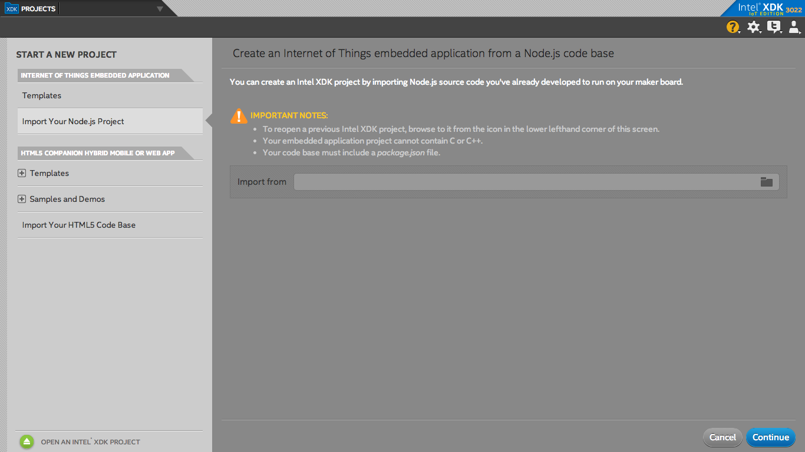
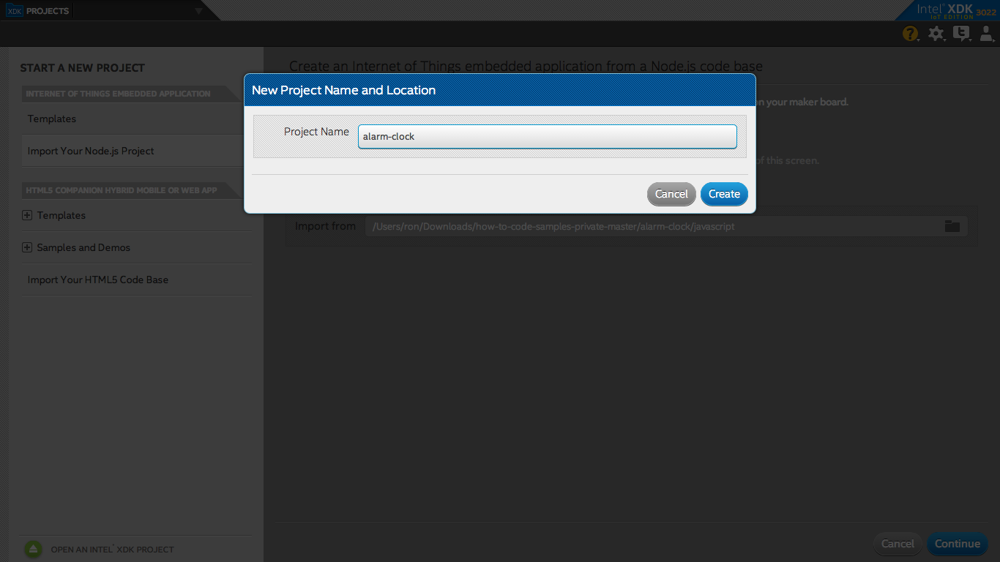
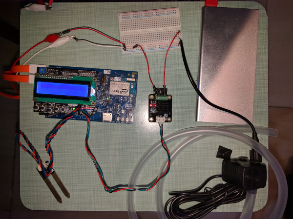
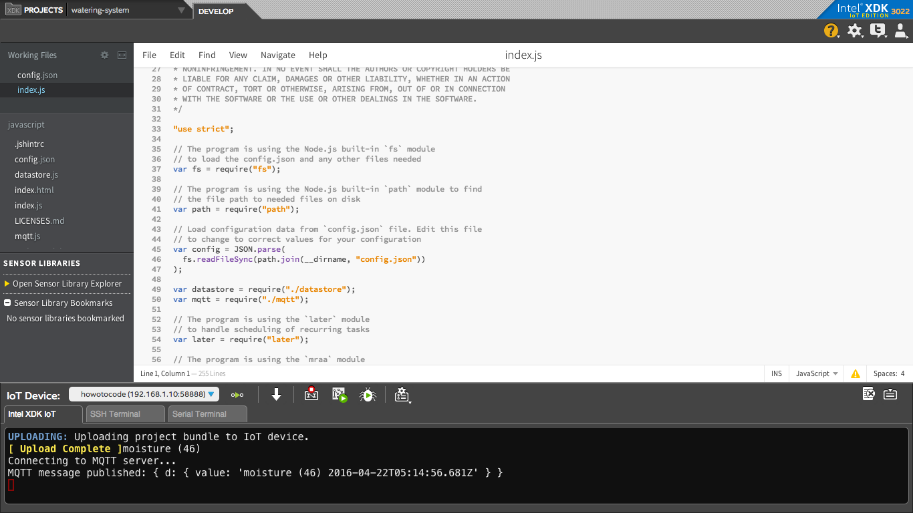
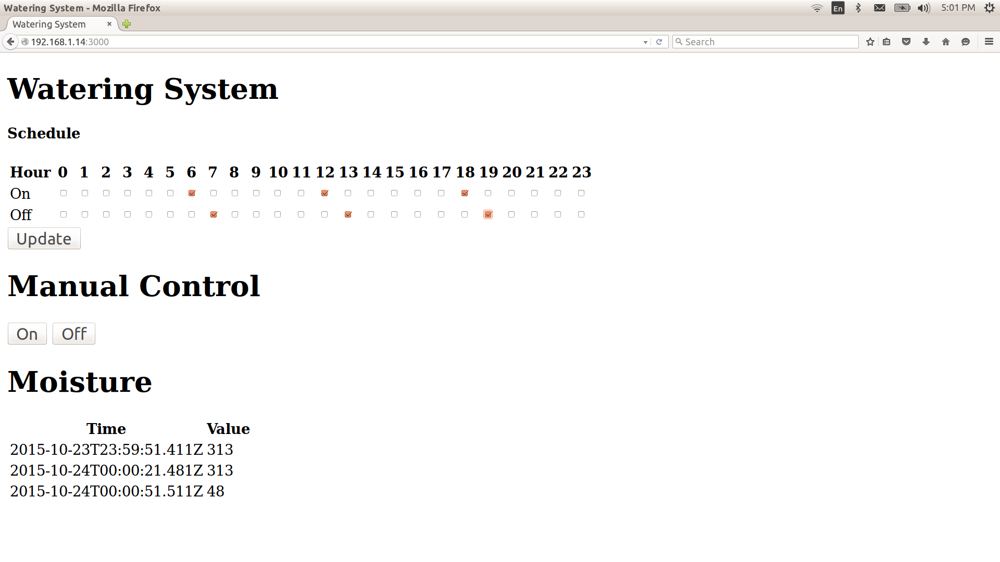

# Watering system in JavaScript*

## Introduction

This automatic watering system application is part of a series of how-to Intel® Internet of Things (IoT) code sample exercises using the Intel® IoT Developer Kit, Intel® Edison development platform, cloud platforms, APIs, and other technologies.

From this exercise, developers will learn how to:<br>
- Connect the Intel® Edison development platform, a computing platform designed for prototyping and producing IoT and wearable computing products.<br>
- Interface with the Intel® Edison platform IO and sensor repository using MRAA and UPM from the Intel® IoT Developer Kit, a complete hardware and software solution to help developers explore the IoT and implement innovative projects.<br>
- Run this code sample in Intel® XDK IoT Edition, an IDE for creating applications that interact with sensors and actuators, enabling a quick start for developing software for the Intel® Edison board or the Intel® Galileo board.<br>
- Set up a web application server to store watering system data using Azure Redis Cache\* from Microsoft\* Azure\*, Redis Store\* from IBM\* Bluemix\*, or ElastiCache\* using Redis\* from Amazon Web Services\* (AWS), different cloud services for connecting IoT solutions including data analysis, machine learning, and a variety of productivity tools to simplify the process of connecting your sensors to the cloud and getting your IoT project up and running quickly.
- Set up a MQTT-based server using IoT Hub from Microsoft\* Azure\*, IoT from IBM\* Bluemix\*, or IoT from Amazon Web Services\* (AWS), different cloud machine to machine messaging services based on the industry standard MQTT protocol.
- Invoke the services of the Twilio\* API for sending text messages.

## What it is

Using an Intel® Edison board, this project lets you create an automatic watering system that:<br>
- turns a water pump on or off based on a configurable schedule.<br>
- detects if the pumping occurs when expected, by using a water flow sensor.<br>
- can be accessed with your mobile phone via the built-in web interface to set the watering times;<br>
- keeps track of watering events, using cloud-based data storage.<br>
- sends text messages to alert recipients if the system is not working as expected.

## How it works

This watering system allows you to set the watering schedule via a web page served directly from Intel® Edison, by using your mobile phone.

It automatically checks moisture sensor data at periodic intervals, and displays this data on the web page.

If the water pump is supposed to be on but the water flow sensor does not detect that the pumping is talking place as expected, it sends a text message to a specified number through Twilio\* so the watering system can be repaired.

Optionally, it can also log watering system events using the Intel® IoT Examples Datastore or an MQTT server running in your own Microsoft\* Azure\*, IBM\* Bluemix\*, or AWS account.

## Hardware requirements

This sample can be used with either the Grove\* Environment & Agriculture Kit from Seeed Studio, or else the DFRobot\* Edison Starter Kit with some additional DFRobot\* parts.

Grove\* Environment & Agriculture Kit, containing:

1. Intel® Edison with an Arduino* breakout board
2. [Grove\* Moisture Sensor](http://iotdk.intel.com/docs/master/upm/node/classes/grovemoisture.html)
3. [Water Pump](http://www.seeedstudio.com/depot/6V-Mini-Water-Pump-p-1945.html)
4. [Water Flow Sensor](http://www.seeedstudio.com/depot/G18-Water-Flow-Sensor-p-1346.html)
5. [Grove\* Dry-Reed Relay](http://iotdk.intel.com/docs/master/upm/node/classes/groverelay.html)

DFRobot\* Starter Kit for Intel® Edison, containing:

1. Intel® Edison with an Arduino\* breakout board
2. [Moisture Sensor](http://www.dfrobot.com/index.php?route=product/product&product_id=599)
3. [Immersible Pump & Water Tube](http://www.dfrobot.com/index.php?route=product/product&keyword=water pump&product_id=667)
4. [Relay Module](http://www.dfrobot.com/index.php?route=product/product&product_id=64)
5. [I/O Expansion Shield](http://www.dfrobot.com/index.php?route=product/product&product_id=1009)

## Software requirements

1. Intel® XDK IoT Edition
2. Microsoft\* Azure\*, IBM\* Bluemix\*, or AWS account (optional)
3. Twilio\* account (optional)

### How to set up

To begin, clone the **How-To Intel IoT Code Samples** repository with Git\* on your computer as follows:

    $ git clone https://github.com/intel-iot-devkit/how-to-code-samples.git

To download a .zip file, in your web browser go to <a href="https://github.com/intel-iot-devkit/how-to-code-samples">https://github.com/intel-iot-devkit/how-to-code-samples</a> and click the **Download ZIP** button at the lower right. Once the .zip file is downloaded, uncompress it, and then use the files in the directory for this example.

## Adding the program to Intel® XDK IoT Edition

In Intel® XDK IoT Edition, select **Import Your Node.js Project**:


On the **New Project** screen, click on the folder icon:



Navigate to the directory where the example project exists and select it:


Choose a name for the project and click on the **Create** button. Then click on the **Continue** button to finish creating your project:



You need to connect to your Intel® Edison board from your computer to send code to it.


Click the **IoT Device** menu at the bottom left. If your Intel® Edison is automatically recognized, select it.


Otherwise, select **Add Manual Connection**.
In the **Address** field, type `192.168.2.15`.
In the **Port** field, type `58888`.
Click **Connect** to save your connection.

### Installing the program manually on the Intel® Edison board

Alternatively, you can set up the code manually on the Intel® Edison board.

Clone the **How-To Intel IoT Code Samples** repository to your Intel® Edison board after you establish an SSH connection to it, as follows:

    $ git clone https://github.com/intel-iot-devkit/how-to-code-samples.git

Then, navigate to the directory with this example.

To install Git\* on the Intel® Edison board, if you don’t have it yet, establish an SSH connection to the board and run the following command:

    $ opkg install git

### Connecting the Grove\* sensors


You need to have a Grove\* Shield connected to an Arduino\*-compatible breakout board to plug all the Grove\* devices into the Grove\* Shield. Make sure you have the tiny VCC switch on the Grove\* Shield set to **5V**.

You need to power the Intel® Edison board with the external power adapter that comes with your starter kit, or substitute it with an external 12V 1.5A power supply. You can also use an external battery, such as a 5V USB battery.

In addition, you need a breadboard and an extra 5V power supply to provide power to the pump. Note: you need a separate battery or power supply for the pump. You cannot use the same power supply for both the Intel® Edison board and the pump, so you need either 2 batteries or two power supplies in total.

You need to use the Grove\* Dry-Reed Relay board to connect the water pump.

1. Plug one end of a Grove\* cable into the Grove\* Dry-Reed Relay, and connect the other end to the D4 port on the Grove\* Shield.

2. Connect one wire from the pump to the 5V power source reserved for the pump.

3. Connect the other wire from the pump to one of the power connectors on the Grove\* Dry-Reed Relay board.

4. Connect the other power connector on the Grove\* Dry-Reed Relay board to the ground of the 5V power source reserved for the pump.

5. Connect the Water Flow Sensor by plugging the red wire into the 5V pin, the black wire into the GND pin, and the yellow wire into digital pin 2 on the Grove\* Shield.

6. Plug one end of a Grove\* cable into the Grove\* Moisture Sensor, and connect the other end to the A0 port on the Grove\* Shield.

### Connecting the DFRobot\* sensors



You need to have a I/O Expansion Shield connected to an Arduino\*-compatible breakout board to plug all the DFRobot\* devices into the I/O Expansion Shield.

In addition, you need a breadboard and an extra 5V power supply to provide power to the pump. Note: you need a separate battery or power supply for the pump. You cannot use the same power supply for both the Intel® Edison board and the pump.

You need to use the Relay Module to connect the water pump.

1. Plug one end of a DFRobot\* cable into the Relay Module, and connect the other end to the A2 port on the I/O Expansion Shield.

2. Connect one wire from the pump to the GND of the power source reserved for the pump.

3. Connect the other wire from the pump to the NC (Normally Closed) connector on the Relay Module.

4. Connect the COM (Common) connector on the Relay Module to the + of the 5V power source reserved for the pump.

5. Plug one end of a DFRobot\* cable into the Moisture Sensor, and connect the other end to the A1 port on the I/O Expansion Shield.

### Manual Intel® Edison setup

If you're running this code on your Intel® Edison manually, you need to install some dependencies.

To obtain the Node.js\* modules needed for this example to execute on Intel® Edison, run the following command:

```
npm install
```

### Intel® IoT Gateway setup

You can run this example using an Intel® IoT Gateway connected to an Arduino\*/Genuino\* 101.

Make sure your Intel® IoT Gateway is setup, by following the directions on the web site here:

https://software.intel.com/en-us/node/633284

You must install the Intel® XDK on the Intel® IoT Gateway, by following the directions on the above link, under the section "Connecting to the Intel® XDK".

The Arduino\*/Genuino\* 101 needs to have the Firmata\* firmware installed. If you have IMRAA installed on your gateway, this will be done automatically. Otherwise, install the StandardFirmata or ConfigurableFirmata sketch manully on to your Arduino\*/Genuino\* 101.

You will also need to configure the `config.json` in the example to use the Arduino*/Genuino* 101. See the section "Configuring the example" below.

### Twilio\* API key

To optionally send text messages, you need to register for an account and get an API key from the Twilio\* web site:

<a href="https://www.twilio.com">https://www.twilio.com</a>

You cannot send text messages without obtaining a Twilio\* API key first. You can still run the example, but without the text messages.

Pass your Twilio\* API key and authentication token to the sample program by modifying the `TWILIO_ACCT_SID` and `TWILIO_AUTH_TOKEN` keys in the `config.json` file as follows:

```
{
  "TWILIO_ACCT_SID": "YOURAPIKEY",
  "TWILIO_AUTH_TOKEN": "YOURTOKEN"
}
```

### Data store server setup

Optionally, you can store the data generated by this sample program in a back-end database deployed using Microsoft\* Azure\*, IBM\* Bluemix\*, or AWS, along with Node.js\*, and a Redis\* data store.

For information on how to set up your own cloud data server, go to:

[https://github.com/intel-iot-devkit/intel-iot-examples-datastore](https://github.com/intel-iot-devkit/intel-iot-examples-datastore)

### MQTT server setup

You can also optionally store the data generated by this sample program using MQTT, a machine-to-machine messaging server. You can use MQTT to connect to Microsoft\* Azure\*, IBM\* Bluemix\*, or AWS.

For information on how to connect to your own cloud MQTT messaging server, go to:

[https://github.com/intel-iot-devkit/intel-iot-examples-mqtt](https://github.com/intel-iot-devkit/intel-iot-examples-mqtt)

## Configuring the example

To configure the example for the Grove\* kit, just leave the `kit` key in the `config.json` set to `grove`. To configure the example for the DFRobot\* kit, change the `kit` key in the `config.json` to `dfrobot` as follows:

```
{
  "kit": "dfrobot"
}
```

To configure the example for the Arduino\*/Genuino\* 101, add a `platform` key with the value `firmata` to the `config.json`, as follows:

```
{
  "kit": "grove",
  "platform": "firmata"
}
```

The DFRobot\* variation of this example does not yet support the Arduino\*/Genuino\* 101.

To configure the example for sending optional text messages, obtain an API key from the Twilio\* website as explained above, and then change the `TWILIO_ACCT_SID` and `TWILIO_AUTH_TOKEN` keys in the `config.json` file as follows:

```
{
  "kit": "grove",
  "TWILIO_ACCT_SID": "YOURAPIKEY",
  "TWILIO_AUTH_TOKEN": "YOURTOKEN"
}
```

To configure the example for the optional Microsoft\* Azure\*, IBM\* Bluemix\*, or AWS data store, change the `SERVER` and `AUTH_TOKEN` keys in the `config.json` file as follows:

```
{
  "kit": "grove",
  "SERVER": "http://intel-examples.azurewebsites.net/logger/watering-system",
  "AUTH_TOKEN": "s3cr3t"
}
```

To configure the example for both the text messages and the Microsoft\* Azure\*, IBM\* Bluemix\*, or AWS data store, change the `TWILIO_ACCT_SID`, `TWILIO_AUTH_TOKEN`, `SERVER`, and `AUTH_TOKEN` keys in the `config.json` file as follows:

```
{
  "kit": "grove",
  "TWILIO_ACCT_SID": "YOURAPIKEY",
  "TWILIO_AUTH_TOKEN": "YOURTOKEN",
  "SERVER": "http://intel-examples.azurewebsites.net/logger/watering-system",
  "AUTH_TOKEN": "s3cr3t"
}
```

For information on how to configure the example for the optional Microsoft\* Azure\*, IBM\* Bluemix\*, or AWS MQTT messaging server, go to:

[https://github.com/intel-iot-devkit/intel-iot-examples-mqtt/](https://github.com/intel-iot-devkit/intel-iot-examples-mqtt/)

## Running the program using Intel® XDK IoT Edition

When you're ready to run the example, make sure you saved all the files.


Click the **Upload** icon to upload the files to the Intel® Edison board.


Click the **Run** icon at the bottom of Intel® XDK IoT Edition. This runs the code on Intel® Edison.


If you made changes to the code, click **Upload and Run**. This runs the latest code with your changes on Intel® Edison.



You will see output similar to the above when the program is running.

## Running the program manually

To run the example manually on Intel® Edison, establish an SSH connection to the board and execute the following command:

    node index.js

### Setting the watering schedule



The schedule for the watering system is set using a single-page web interface served from Intel® Edison while the sample program is running.

The web server runs on port `3000`, so if Intel® Edison is connected to WiFi\* on `192.168.1.13`, the address to browse to if you are on the same network is `http://192.168.1.13:3000`.

### Determining the Intel® Edison IP address

You can determine what IP address Intel® Edison is connected to by running the following command:

    ip addr show | grep wlan

You will see output similar to the following:

    3: wlan0: <BROADCAST,MULTICAST,UP,LOWER_UP> mtu 1500 qdisc pfifo_fast qlen 1000
        inet 192.168.1.13/24 brd 192.168.1.255 scope global wlan0

The IP address is shown next to `inet`. In the example above, the IP address is `192.168.1.13`.

IMPORTANT NOTICE: This software is sample software. It is not designed or intended for use in any medical, life-saving or life-sustaining systems, transportation systems, nuclear systems, or for any other mission-critical application in which the failure of the system could lead to critical injury or death. The software may not be fully tested and may contain bugs or errors; it may not be intended or suitable for commercial release. No regulatory approvals for the software have been obtained, and therefore software may not be certified for use in certain countries or environments.
